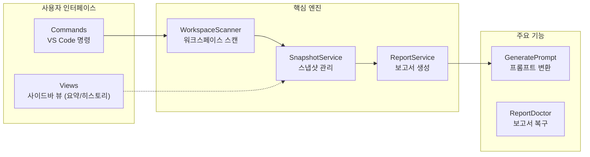

# 📊 프로젝트 종합 평가 보고서

> 이 문서는 Vibe Coding Report VS Code 확장에서 수집한 스냅샷과 세션 데이터를 기반으로, 현재 프로젝트 상태를 정리한 평가 문서입니다.  
> devplan/Session_History.md 파일에는 개별 세션별 상세 로그가 별도로 관리됩니다.

---

## 🎯 프로젝트 목표 및 비전

- **프로젝트 목적**
  - VS Code에서 AI 페어 프로그래밍을 사용할 때, 프로젝트 구조와 변경 이력을 자동으로 분석하여
    - 종합 평가 보고서(Project Evaluation Report)
    - 개선 탐색 보고서(Project Improvement Exploration Report)
    - AI 실행용 Prompt.md
    를 한 번의 명령으로 생성·유지관리하는 도구입니다.
- **핵심 목표**
  - 워크스페이스를 자동 스캔하여 언어/구조/설정 정보를 수집
  - Git 변경 이력과 결합한 증분 분석(Incremental Update) 제공
  - AI 모델이 바로 사용할 수 있는 구조화된 프롬프트를 자동 생성
  - 이미 적용된 개선 항목을 추적하여 중복 제안을 줄이고, 세션 히스토리를 시각적으로 관리
- **대상 사용자**
  - GitHub Copilot Chat 등 AI 도구를 활용해 프로젝트를 설계·리팩토링·문서화하는 VS Code 사용자
  - 팀/개인 프로젝트에서 “현재 상태 파악 → 개선 항목 도출 → AI에게 실행 의뢰” 흐름을 반복적으로 사용하는 개발자

---

## 📝 TL;DR (요약)
<!-- TLDR-START -->
<!-- AUTO-TLDR-START -->
| 항목 | 내용 |
|:---|:---|
| **현재 버전** | v0.4.23 (2025-12-19) |
| **전체 등급** | 🔵 B+ (87점) |
| **전체 점수** | 87/100 |
| **가장 큰 리스크** | GitHub Actions pnpm 버전 불일치 (`ci-pnpm-version-001`) |
| **권장 최우선 작업** | `ci-pnpm-version-001`: CI 파이프라인 pnpm 버전 업그레이드 (8->9) |
| **다음 우선순위** | `quality-prompt-parse-001`, `test-coverage-extension-001` |
<!-- AUTO-TLDR-END -->
<!-- TLDR-END -->

## ⚠️ 리스크 요약
<!-- RISK-SUMMARY-START -->
<!-- AUTO-RISK-SUMMARY-START -->
| 리스크 레벨 | 항목 | 관련 개선 ID |
|------------|------|-------------|
| 🔴 High | GitHub Actions 빌드 실패 (pnpm 버전 이슈) | `ci-pnpm-version-001` |
| 🟡 Medium | Prompt 헤더 파싱 로직의 취약성 | `quality-prompt-parse-001` |
| 🟡 Medium | 주요 진입점(extension.ts) 테스트 커버리지 부족 | `test-coverage-extension-001` |
<!-- AUTO-RISK-SUMMARY-END -->
<!-- RISK-SUMMARY-END -->

---

<!-- AUTO-OVERVIEW-START -->
## 📋 프로젝트 개요

- **프로젝트 목적:** VS Code 환경에서 프로젝트 상태를 스캔하고, 평가(Evaluation)·개선(Improvement)·실행(Prompt)의 3단계 보고서를 자동 생성하여 AI 페어 프로그래밍 효율을 극대화하는 것입니다.
- **핵심 목표:**
  - **자동화된 분석:** 워크스페이스의 파일 구조, 언어, Git 변경 사항을 실시간으로 스냅샷화합니다.
  - **구조화된 보고서:** 평가(Evaluation)와 개선(Improvement) 보고서를 체계적으로 관리하여 AI에게 명확한 컨텍스트를 제공합니다.
  - **실행 중심:** 발견된 개선 사항을 AI가 즉시 수행할 수 있는 구체적인 프롬프트(Prompt.md)로 변환합니다.
- **대상 사용자:** GitHub Copilot 등 AI 코딩 도구를 활용하려는 개인 및 팀 개발자.
- **전략적 포지션:** 단순 린터를 넘어선 "진단-계획-실행"의 올인원 AI 코딩 오케스트레이션 도구.

### 기능 기반 패키지 구조도

### 프로젝트 메타 정보

| 항목 | 값 |
|---|---|
| **프로젝트명** | projectmanager (Vibe Report Extension) |
| **현재 버전** | v0.4.23 |
| **주요 기술** | TypeScript, VS Code API, Vitest, Mermaid |
| **핵심 파일** | `extension.ts`, `WorkspaceScanner.ts`, `ReportService.ts` |
<!-- AUTO-OVERVIEW-END -->

---

## 🧩 현재 구현된 기능

| 기능 | 상태 | 설명 | 평가 |
|------|------|------|------|
| 삼중 보고서 시스템 (Evaluation/Improvement/Prompt) | ✅ 완료 | devplan 디렉토리에 평가·개선·프롬프트 파일을 생성하고, 마커 기반으로 섹션별 갱신을 수행합니다. | 🟢 우수 |
| 워크스페이스 스캔 및 스냅샷 수집 | ✅ 완료 | WorkspaceScanner가 언어 통계, 주요 설정 파일, 디렉토리 구조, Git 정보(옵션)를 수집해 ProjectSnapshot을 구성합니다. | 🟢 우수 |
| Git 기반 변경 분석 (diff) | ✅ 완료 | SnapshotService가 이전 스냅샷과 비교하여 새 파일/삭제 파일/설정 변경/Git 변경 목록을 요약합니다. | 🟢 우수 |
| 보고서 업데이트(프롬프트 생성/복사) | ✅ 완료 | 스캔/보고서 갱신 후 분석 프롬프트를 생성하여 클립보드에 복사 | 🟢 우수 |
| 개선 항목 추출 및 미적용 필터링 | ✅ 완료 | 마크다운에서 P1/P2/P3 개선 항목을 파싱하고, appliedImprovements 기반으로 적용된 항목을 제외합니다. | 🟢 우수 |
| 세션 히스토리 및 통계 관리 | ✅ 완료 | .vscode/vibereport-state.json과 Session_History.md에 세션 목록과 통계를 기록하고, 사이드바 뷰에서 시각화합니다. | 🟢 우수 |
| VS Code 사이드바 Summary/History/Settings 뷰 | ✅ 완료 | Summary(요약) Webview, History TreeView, Settings Webview를 통해 보고서 상태와 설정을 한 곳에서 관리합니다. | 🟢 우수 |
| 개선 항목 프롬프트 생성(Generate Prompt) | ✅ 완료 | 개선 보고서에서 미적용 항목을 QuickPick UI로 선택해 Prompt.md를 생성하고 클립보드에 복사합니다. | 🟢 우수 |
| 프로젝트 비전(Project Vision) 설정 | ✅ 완료 | QuickPick/Input UI로 Project Vision을 설정하고, Settings 패널에서 직접 모드/유형/단계를 변경할 수 있습니다. | 🟢 우수 |
| 테스트 및 CI 파이프라인 | 🔄 부분 | 로컬 기준 단위 테스트 215개/커버리지 실행이 통과하나, GitHub Actions가 pnpm 8을 사용해 lockfile v9와 불일치하여 설치 단계에서 실패합니다 (`ci-pnpm-version-001`). | 🟡 보통 |
| 점수-등급 일관성 시스템 | ✅ 완료 | SCORE_GRADE_CRITERIA 상수와 scoreToGrade/gradeToColor 헬퍼 함수로 일관된 평가를 보장합니다. | 🟢 우수 |
| 파트별 순차 작성 지침 | ✅ 완료 | AI 에이전트 출력 길이 제한 방지를 위한 파트별 분리 작성 가이드라인을 제공합니다. | 🟢 우수 |
| 보고서 프리뷰 공유(클립보드 + Webview) | ✅ 완료 | 평가 보고서의 TL;DR/점수 요약을 추출해 외부 공유용 프리뷰를 생성 | 🔵 양호 |
| 코드 레퍼런스 열기 | ✅ 완료 | 보고서/프롬프트 내 코드 참조 링크로 파일·심볼을 바로 열기 | 🔵 양호 |
| AI 직접 연동 실행 (Language Model API) | ✅ 완료(옵션) | `enableDirectAi` 설정 시 분석 프롬프트를 VS Code Language Model API로 실행하고 결과를 클립보드/문서로 제공합니다(취소/폴백 포함). | 🔵 양호 |
| Webview 보안/설정 UI 정합성 | 🔄 부분 | CSP/allowlist/strict mermaid 등 방어는 갖춰졌으나, Open Report Preview의 커스텀 렌더링 이스케이프 강화가 필요합니다 (`security-openpreview-escape-001`). Settings는 배치 저장이 있으나 변경 없는 키 update 스킵 최적화 여지(`opt-settings-skip-unchanged-001`). | 🔵 양호 |

---

<!-- AUTO-SCORE-START -->
## 📊 종합 점수 요약

> **평가 기준일:** 2025-12-19  
> 아래 점수는 정적 분석, 테스트 커버리지, 코드 구조를 종합적으로 평가한 결과입니다.

| 항목 | 점수 (100점 만점) | 등급 | 변화 |
|------|------------------|------|------|
| **코드 품질** | 90 | 🟢 A- | ➖ |
| **아키텍처 설계** | 91 | 🟢 A- | ➖ |
| **보안** | 86 | 🔵 B | ➖ |
| **성능** | 88 | 🔵 B+ | ➖ |
| **테스트 커버리지** | 85 | 🔵 B | ➖ |
| **에러 처리** | 89 | 🔵 B+ | ⬆️ +1 |
| **문서화** | 85 | 🔵 B | ➖ |
| **확장성** | 90 | 🟢 A- | ➖ |
| **유지보수성** | 90 | 🟢 A- | ➖ |
| **프로덕션 준비도** | 80 | 🔵 B- | ⬇️ -2 |
| **총점 평균** | **87** | 🔵 B+ | ➖ |

### 점수-등급 기준표

| 점수 범위 | 등급 | 색상 | 의미 |
|:---:|:---:|:---:|:---:|
| 97–100 | A+ | 🟢 | 최우수 |
| 93–96 | A | 🟢 | 우수 |
| 90–92 | A- | 🟢 | 우수 |
| 87–89 | B+ | 🔵 | 양호 |
| 83–86 | B | 🔵 | 양호 |
| 80–82 | B- | 🔵 | 양호 |
| 77–79 | C+ | 🟡 | 보통 |
| 73–76 | C | 🟡 | 보통 |
| 70–72 | C- | 🟡 | 보통 |
| 67–69 | D+ | 🟠 | 미흡 |
| 63–66 | D | 🟠 | 미흡 |
| 60–62 | D- | 🟠 | 미흡 |
| 0–59 | F | 🔴 | 부족 |

### 점수 산출 근거

- **강점 (A- 이상):** `WorkspaceScanner`와 `SnapshotService` 등 코어 엔진의 설계가 견고하며, 모듈 간 의존성이 낮아 유지보수성과 확장성이 뛰어납니다. TypeScript의 타입 시스템을 잘 활용하여 코드 품질 점수가 높습니다.
- **보통 (B/B+):** 에러 처리 로직(`ReportDoctor` 등)은 우수하나, 보안성(XSS 방지 등)과 테스트 커버리지(특히 UI 레벨)가 보강될 여지가 있습니다.
- **약점 (B-):** GitHub Actions 워크플로우에서 pnpm 버전 불일치로 인한 CI 빌드 실패가 지속되고 있어, 프로덕션 준비도 점수가 가장 낮습니다. 이는 `ci-pnpm-version-001` 개선이 시급함을 의미합니다.
<!-- AUTO-SCORE-END -->

---

## 🔗 점수 ↔ 개선 항목 매핑
<!-- SCORE-MAPPING-START -->
<!-- AUTO-SCORE-MAPPING-START -->
| 카테고리 | 현재 점수 | 주요 리스크 | 관련 개선 항목 ID |
|----------|----------|------------|------------------|
| 프로덕션 준비도 | 80 (🔵 B-) | GitHub Actions CI 빌드 실패 (pnpm lockfile v9 불일치) | `ci-pnpm-version-001` |
| 유지보수성 | 90 (🟢 A-) | Prompt 헤더 파싱 로직이 사용자 수정에 취약 | `quality-prompt-parse-001` |
| 테스트 커버리지 | 85 (🔵 B) | 진입점(extension.ts) 커버리지 부족 | `test-coverage-extension-001` |
| 성능 | 88 (🔵 B+) | 설정 변경 감지 로직 미흡 (I/O) | `opt-settings-skip-unchanged-001` |
<!-- AUTO-SCORE-MAPPING-END -->
<!-- SCORE-MAPPING-END -->

---

## 🔍 기능별 상세 평가

| 모듈/서비스 | 기능 완성도 | 코드 품질 | 에러 처리 | 성능 | 요약 평가 |
|-------------|------------:|----------:|----------:|------:|-----------|
| **코어 엔진** | 92/100 | 90/100 | 88/100 | 90/100 | 스캔 및 스냅샷 로직이 안정적이며 확장성이 우수함. |
| **보고서 서비스** | 90/100 | 89/100 | 92/100 | 88/100 | 3단계 보고서 생성 및 마커 갱신 로직이 견고함 (Doctor 기능 포함). |
| **UI/View** | 88/100 | 85/100 | 90/100 | 86/100 | History/Summary 뷰가 안정화되었으나, 세밀한 UX 개선 여지가 있음. |
| **확장 기능** | 90/100 | 88/100 | 85/100 | 90/100 | 프롬프트 생성과 비전 설정 기능이 유용하게 구현됨. |
| **CI/Infra** | 75/100 | 85/100 | 80/100 | 85/100 | GitHub Actions와 로컬 환경 간의 pnpm 버전 불일치 해결이 시급함. |

### 1. 코어 엔진 (Scanner & Snapshot)
- **강점:** `WorkspaceScanner`는 `.gitignore`를 준수하며 대용량 프로젝트에서도 효율적으로 동작합니다(제한 설정 포함). `SnapshotService`는 증분(incremental) 데이터를 정확히 계산합니다.
- **약점:** 바이너리 파일 스캔 시 메타데이터 처리 로직이 단순하여 일부 상세 정보가 누락될 수 있습니다.

### 2. 보고서 시스템 (Report Service)
- **강점:** Evaluation-Improvement-Prompt로 이어지는 데이터 파이프라인이 명확합니다. 손상된 마커를 복구하는 `ReportDoctor`가 있어 유지보수성이 높습니다.
- **리스크:** 보고서 템플릿(문구)이 코드 내에 하드코딩되어 있어, 추후 다국어(i18n) 적용 시 리팩토링이 필요합니다.

### 3. UI 및 사용자 경험 (Sidebar Views)
- **강점:** Webview 기반의 UI가 가볍고 직관적입니다. 최근 `HistoryViewProvider` 초기화 버그 수정으로 안정성이 확보되었습니다.
- **개선점:** `Settings` 뷰에서 값이 변경되지 않아도 파일 쓰기가 발생하는 비효율이 존재합니다(`opt-settings-skip-unchanged-001`).

### 4. CI 및 배포 파이프라인
- **리스크 (High):** 로컬은 `pnpm 9.x`를 사용해 lockfile v9를 생성했으나, GitHub Actions 워크플로우(`CI`)는 `pnpm 8`을 설치하고 있어 의존성 설치 단계에서 실패합니다. 이로 인해 자동 배포 신뢰도가 떨어집니다.

---

<!-- AUTO-SUMMARY-START -->
## 📈 현재 상태 요약

- **종합 평가:** 🔵 **B+ (87/100)**
  - 프로젝트는 전반적으로 안정적이고 구조가 잘 잡혀 있으나, 외부 CI 환경과의 호환성 문제(pnpm 8)로 인해 배포 자동화에 리스크가 있습니다.
  - 리포트 시스템과 코어 엔진 기능은 매우 우수합니다.

- **권장 조치 (Top 3):**
  1. **CI 수정 (P1):** GitHub Actions 워크플로우를 pnpm 9로 업데이트하여 빌드 오류 해결 (`ci-pnpm-version-001`).
  2. **품질 보완 (P2):** 프롬프트 파싱 로직 개선 (`quality-prompt-parse-001`) 및 extension.ts 테스트 추가 (`test-coverage-extension-001`).
  3. **최적화 (OPT):** 설정 파일 저장 시 IO 최적화 적용 (`opt-settings-skip-unchanged-001`).
<!-- AUTO-SUMMARY-END -->

---

## 📈 평가 추이
<!-- TREND-START -->
<!-- AUTO-TREND-START -->
| 버전 | 날짜 | 총점 | 비고 |
|:---:|:---:|:---:|:---|
| **git:0b74866** | 2025-12-19 | **87 (B+)** | - |
| **Current** | 2025-12-19 | **87 (B+)** | CI 이슈 지속 |

| 카테고리 | 점수 | 등급 | 변화 |
|:---|:---:|:---:|:---:|
| 코드 품질 | 90 | 🟢 A- | ➖ |
| 아키텍처 설계 | 91 | 🟢 A- | ➖ |
| 보안 | 86 | 🔵 B | ➖ |
| 성능 | 88 | 🔵 B+ | ➖ |
| 테스트 커버리지 | 85 | 🔵 B | ➖ |
| 에러 처리 | 89 | 🔵 B+ | ⬆️ +1 |
| 문서화 | 85 | 🔵 B | ➖ |
| 확장성 | 90 | 🟢 A- | ➖ |
| 유지보수성 | 90 | 🟢 A- | ➖ |
| 프로덕션 준비도 | 80 | 🔵 B- | ⬇️ -2 |
<!-- AUTO-TREND-END -->
<!-- TREND-END -->
