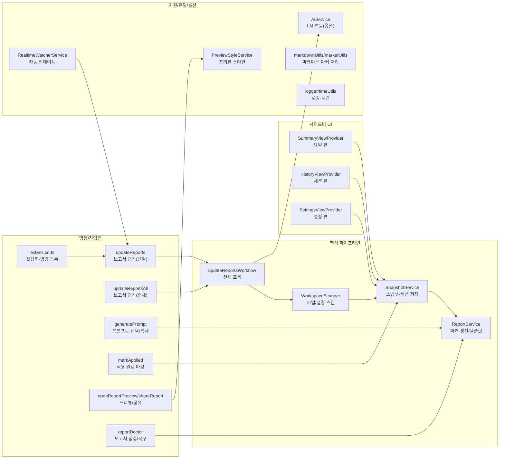

# 📊 프로젝트 종합 평가 보고서

> 이 문서는 Vibe Coding Report VS Code 확장에서 수집한 스냅샷과 세션 데이터를 기반으로, 현재 프로젝트 상태를 정리한 평가 문서입니다.  
> devplan/Session_History.md 파일에는 개별 세션별 상세 로그가 별도로 관리됩니다.

---

## 🎯 프로젝트 목표 및 비전

- **프로젝트 목적**
  - VS Code에서 AI 페어 프로그래밍을 사용할 때, 프로젝트 구조와 변경 이력을 자동으로 분석하여
    - 종합 평가 보고서(Project Evaluation Report)
    - 개선 탐색 보고서(Project Improvement Exploration Report)
    - AI 실행용 Prompt.md
    를 한 번의 명령으로 생성·유지관리하는 도구입니다.
- **핵심 목표**
  - 워크스페이스를 자동 스캔하여 언어/구조/설정 정보를 수집
  - Git 변경 이력과 결합한 증분 분석(Incremental Update) 제공
  - AI 모델이 바로 사용할 수 있는 구조화된 프롬프트를 자동 생성
  - 이미 적용된 개선 항목을 추적하여 중복 제안을 줄이고, 세션 히스토리를 시각적으로 관리
- **대상 사용자**
  - GitHub Copilot Chat 등 AI 도구를 활용해 프로젝트를 설계·리팩토링·문서화하는 VS Code 사용자
  - 팀/개인 프로젝트에서 “현재 상태 파악 → 개선 항목 도출 → AI에게 실행 의뢰” 흐름을 반복적으로 사용하는 개발자

---

## 📝 TL;DR (요약)
<!-- TLDR-START -->
<!-- AUTO-TLDR-START -->
| 항목 | 내용 |
|:---|:---|
| **현재 버전** | v0.4.17 (2025-12-19) |
| **전체 등급** | 🔵 B+ (87점) |
| **전체 점수** | 87/100 |
| **가장 큰 리스크** | GitHub Actions CI가 pnpm 8 ↔ lockfile v9 불일치로 설치 단계에서 실패 (`ci-pnpm-version-001`) |
| **권장 최우선 작업** | `ci-pnpm-version-001` (GitHub Actions의 pnpm 버전을 lockfile(v9)에 맞춰 정렬) |
| **다음 우선순위** | `security-openpreview-escape-001`, `quality-prompt-parse-001`, `test-coverage-extension-001`, `feat-evalhistory-version-001`, `opt-settings-skip-unchanged-001` |
<!-- AUTO-TLDR-END -->
<!-- TLDR-END -->

## ⚠️ 리스크 요약
<!-- RISK-SUMMARY-START -->
<!-- AUTO-RISK-SUMMARY-START -->
| 리스크 레벨 | 항목 | 관련 개선 ID |
|------------|------|-------------|
| 🔴 High | GitHub Actions CI가 pnpm 8을 사용해 lockfile v9와 호환되지 않아 실패 | ci-pnpm-version-001 |
| 🟡 Medium | Open Report Preview 마크다운 렌더링의 이스케이프/링크 속성 처리 미비로 XSS/레이아웃 깨짐 가능 | security-openpreview-escape-001 |
| 🟡 Medium | Prompt.md 체크리스트 헤딩 포맷 차이(이모지 포함/미포함)로 파싱 실패 가능 | quality-prompt-parse-001 |
| 🟡 Medium | extension.ts 등 핵심 엔트리의 미커버 분기 존재로 회귀 위험 | test-coverage-extension-001 |
| 🟢 Low | 평가 추이 버전 라벨이 unknown으로 남아 비교 효용 저하 | feat-evalhistory-version-001 |
| 🟢 Low | Settings 배치 저장 시 변경 없는 키까지 update 되는 미세 성능 낭비 | opt-settings-skip-unchanged-001 |
<!-- AUTO-RISK-SUMMARY-END -->
<!-- RISK-SUMMARY-END -->

---

<!-- AUTO-OVERVIEW-START -->
## 📋 프로젝트 개요

- **프로젝트 목적:** VS Code 내부에서 프로젝트 구조/변경 이력을 분석해 평가 보고서·개선 보고서·Prompt.md를 자동 생성하는 확장입니다.
- **핵심 목표:** ① 워크스페이스 스캔 및 스냅샷화 ② 평가/리스크/개선 항목 구조화 ③ AI 실행 프롬프트 자동 생성 ④ 마커 기반 증분 업데이트로 반복 실행 비용 최소화.
- **대상 사용자:** AI 페어 프로그래밍을 활용해 “상태 파악 → 개선 도출 → 실행” 루프를 빠르게 반복하려는 개인/팀 개발자.
- **대표 시나리오:** 릴리즈 전 회귀 점검, 신규 기여자 온보딩, 기술 부채 상시 관리, 보고서/프롬프트 자동 갱신.
- **전략적 포지션:** IDE 내부에서 작업 분해·우선순위화·개선 실행을 연결하는 Planning 레이어로, 외부 문서화와 리뷰 비용을 절감합니다.
- **코드베이스 스냅샷(2025-12-19, node_modules/.git/coverage/out 제외):** 121개 파일 · 21개 디렉터리 / TS 78 · MD 13 · JSON 9 · JS 3 · YAML 2 · 기타(ps1/yml/sh/css) 등.
- **품질 게이트(2025-12-19 실행):** `pnpm -C vibereport-extension run compile` ✅ / `lint` ✅ / `test:run` ✅ (총 215 테스트) / `test:coverage` ✅ (Lines 73.5%, Branch 52.49%).

### 기능 기반 패키지 구조도 (상위)

### 프로젝트 메타 정보

| 항목 | 값 |
|------|-----|
| **프로젝트명** | projectmanager (Vibe Coding Report) |
| **패키지 유형** | VS Code Extension |
| **현재 버전** | v0.4.17 |
| **분석 기준일** | 2025-12-19 |
| **주요 기술** | TypeScript, VS Code API, Vitest, ESLint, Mermaid(로컬 번들), jsonc-parser, simple-git |
| **주요 명령(핵심)** | `vibereport.updateReports`, `vibereport.updateReportsAll`, `vibereport.generatePrompt`, `vibereport.reportDoctor`, `vibereport.openReportPreview`, `vibereport.shareReport` |
| **테스트/정적 검사** | 2025-12-19 기준 `compile/lint/test:run/test:coverage` 모두 통과(테스트 215개, Lines 73.5%, Branch 52.49%). |
| **차별점** | 마커 기반 부분 갱신 + 리포트 닥터 + (옵션) 직접 AI/자동 업데이트 + 적용 항목 추적 |
<!-- AUTO-OVERVIEW-END -->

---

## 🧩 현재 구현된 기능

| 기능 | 상태 | 설명 | 평가 |
|------|------|------|------|
| 삼중 보고서 시스템 (Evaluation/Improvement/Prompt) | ✅ 완료 | devplan 디렉토리에 평가·개선·프롬프트 파일을 생성하고, 마커 기반으로 섹션별 갱신을 수행합니다. | 🟢 우수 |
| 워크스페이스 스캔 및 스냅샷 수집 | ✅ 완료 | WorkspaceScanner가 언어 통계, 주요 설정 파일, 디렉토리 구조, Git 정보(옵션)를 수집해 ProjectSnapshot을 구성합니다. | 🟢 우수 |
| Git 기반 변경 분석 (diff) | ✅ 완료 | SnapshotService가 이전 스냅샷과 비교하여 새 파일/삭제 파일/설정 변경/Git 변경 목록을 요약합니다. | 🟢 우수 |
| 보고서 업데이트(프롬프트 생성/복사) | ✅ 완료 | 스캔/보고서 갱신 후 분석 프롬프트를 생성하여 클립보드에 복사 | 🟢 우수 |
| 개선 항목 추출 및 미적용 필터링 | ✅ 완료 | 마크다운에서 P1/P2/P3 개선 항목을 파싱하고, appliedImprovements 기반으로 적용된 항목을 제외합니다. | 🟢 우수 |
| 세션 히스토리 및 통계 관리 | ✅ 완료 | .vscode/vibereport-state.json과 Session_History.md에 세션 목록과 통계를 기록하고, 사이드바 뷰에서 시각화합니다. | 🟢 우수 |
| VS Code 사이드바 Summary/History/Settings 뷰 | ✅ 완료 | Summary(요약) Webview, History TreeView, Settings Webview를 통해 보고서 상태와 설정을 한 곳에서 관리합니다. | 🟢 우수 |
| 개선 항목 프롬프트 생성(Generate Prompt) | ✅ 완료 | 개선 보고서에서 미적용 항목을 QuickPick UI로 선택해 Prompt.md를 생성하고 클립보드에 복사합니다. | 🟢 우수 |
| 프로젝트 비전(Project Vision) 설정 | ✅ 완료 | QuickPick/Input UI로 Project Vision을 설정하고, Settings 패널에서 직접 모드/유형/단계를 변경할 수 있습니다. | 🟢 우수 |
| 테스트 및 CI 파이프라인 | 🔄 부분 | 로컬 기준 단위 테스트 215개/커버리지 실행이 통과하나, GitHub Actions가 pnpm 8을 사용해 lockfile v9와 불일치하여 설치 단계에서 실패합니다 (`ci-pnpm-version-001`). | 🟡 보통 |
| 점수-등급 일관성 시스템 | ✅ 완료 | SCORE_GRADE_CRITERIA 상수와 scoreToGrade/gradeToColor 헬퍼 함수로 일관된 평가를 보장합니다. | 🟢 우수 |
| 파트별 순차 작성 지침 | ✅ 완료 | AI 에이전트 출력 길이 제한 방지를 위한 파트별 분리 작성 가이드라인을 제공합니다. | 🟢 우수 |
| 보고서 프리뷰 공유(클립보드 + Webview) | ✅ 완료 | 평가 보고서의 TL;DR/점수 요약을 추출해 외부 공유용 프리뷰를 생성 | 🔵 양호 |
| 코드 레퍼런스 열기 | ✅ 완료 | 보고서/프롬프트 내 코드 참조 링크로 파일·심볼을 바로 열기 | 🔵 양호 |
| AI 직접 연동 실행 (Language Model API) | ✅ 완료(옵션) | `enableDirectAi` 설정 시 분석 프롬프트를 VS Code Language Model API로 실행하고 결과를 클립보드/문서로 제공합니다(취소/폴백 포함). | 🔵 양호 |
| Webview 보안/설정 UI 정합성 | 🔄 부분 | CSP/allowlist/strict mermaid 등 방어는 갖춰졌으나, Open Report Preview의 커스텀 렌더링 이스케이프 강화가 필요합니다 (`security-openpreview-escape-001`). Settings는 배치 저장이 있으나 변경 없는 키 update 스킵 최적화 여지(`opt-settings-skip-unchanged-001`). | 🔵 양호 |

---

<!-- AUTO-SCORE-START -->
## 📊 종합 점수 요약

> 아래 점수는 **2025-12-19 기준** 코드 정적 리뷰 + 로컬 검증(`compile/lint/test:run/test:coverage`) 결과를 함께 반영했습니다.

| 항목 | 점수 (100점 만점) | 등급 | 변화 |
|------|------------------|------|------|
| **코드 품질** | 90 | 🟢 A- | ⬆️ +2 |
| **아키텍처 설계** | 91 | 🟢 A- | ⬆️ +1 |
| **보안** | 85 | 🔵 B | ⬇️ -1 |
| **성능** | 86 | 🔵 B | ⬆️ +2 |
| **테스트 커버리지** | 84 | 🔵 B | ⬇️ -1 |
| **에러 처리** | 88 | 🔵 B+ | ⬆️ +2 |
| **문서화** | 82 | 🔵 B- | ⬆️ +4 |
| **확장성** | 89 | 🔵 B+ | ⬆️ +1 |
| **유지보수성** | 89 | 🔵 B+ | ⬆️ +2 |
| **프로덕션 준비도** | 82 | 🔵 B- | — |
| **총점 평균** | **87** | 🔵 B+ | ⬆️ +1 |

### 점수-등급 기준표

| 점수 범위 | 등급 | 색상 | 의미 |
|:---:|:---:|:---:|:---:|
| 97–100 | A+ | 🟢 | 최우수 |
| 93–96 | A | 🟢 | 우수 |
| 90–92 | A- | 🟢 | 우수 |
| 87–89 | B+ | 🔵 | 양호 |
| 83–86 | B | 🔵 | 양호 |
| 80–82 | B- | 🔵 | 양호 |
| 77–79 | C+ | 🟡 | 보통 |
| 73–76 | C | 🟡 | 보통 |
| 70–72 | C- | 🟡 | 보통 |
| 67–69 | D+ | 🟠 | 미흡 |
| 63–66 | D | 🟠 | 미흡 |
| 60–62 | D- | 🟠 | 미흡 |
| 0–59 | F | 🔴 | 부족 |

### 점수 산출 근거 요약

- **검증 결과:** `compile/lint/test:run/test:coverage` 모두 통과(테스트 215개, Lines 73.5% / Branch 52.49%).
- **CI 리스크:** GitHub Actions가 pnpm 8을 사용하고 있어 lockfile v9와 호환되지 않아 설치 단계에서 실패합니다(`ci-pnpm-version-001`).
- **프리뷰 보안/안정성:** Open Report Preview의 커스텀 마크다운 렌더러에서 인라인 코드/링크 속성 이스케이프가 충분하지 않아 XSS/레이아웃 깨짐 리스크가 남아 있습니다(`security-openpreview-escape-001`).
- **프롬프트 파싱 견고성:** `Execution Checklist` 헤딩 포맷(이모지 포함/미포함) 차이에서 파싱 실패 가능성이 있어 도구 체인이 취약합니다(`quality-prompt-parse-001`).
- **커버리지 관점:** 테스트 수는 많지만 전체 라인 커버리지 73.5%로, 핵심 엔트리/명령 일부의 미커버 경로가 남아 있습니다(`test-coverage-extension-001`).
<!-- AUTO-SCORE-END -->

---

## 🔗 점수 ↔ 개선 항목 매핑
<!-- SCORE-MAPPING-START -->
<!-- AUTO-SCORE-MAPPING-START -->
| 카테고리 | 현재 점수 | 주요 리스크 | 관련 개선 항목 ID |
|----------|----------|------------|------------------|
| 프로덕션 준비도 | 82 (🔵 B-) | CI install/test 단계 실패(pnpm↔lockfile) | `ci-pnpm-version-001` |
| 보안 | 85 (🔵 B) | Open Report Preview 커스텀 렌더링 이스케이프/링크 속성 처리 미비 | `security-openpreview-escape-001` |
| 테스트 커버리지 | 84 (🔵 B) | 핵심 엔트리/명령 분기 미커버로 회귀 방어 약화 | `test-coverage-extension-001` |
| 유지보수성 | 89 (🔵 B+) | Prompt 체크리스트 포맷 의존(파싱 취약) | `quality-prompt-parse-001` |
| 아키텍처 설계 | 91 (🟢 A-) | 평가 추이의 버전 라벨 unknown(비교 효용 저하) | `feat-evalhistory-version-001` |
| 성능 | 86 (🔵 B) | Settings 저장 경로의 불필요 update로 이벤트/갱신 비용 | `opt-settings-skip-unchanged-001` |
<!-- AUTO-SCORE-MAPPING-END -->
<!-- SCORE-MAPPING-END -->

---

## 🔍 기능별 상세 평가

| 모듈/서비스 | 기능 완성도 | 코드 품질 | 에러 처리 | 성능 | 요약 평가 |
|-------------|------------:|----------:|----------:|------:|-----------|
| **명령/워크플로우** (`commands/*`, `updateReportsWorkflow.ts`) | 90/100 | 90/100 | 88/100 | 86/100 | 파이프라인 견고. 버전 라벨/파싱 견고성 개선 여지(`feat-evalhistory-version-001`, `quality-prompt-parse-001`). |
| **워크스페이스 스캔** (`WorkspaceScanner`) | 88/100 | 88/100 | 86/100 | 87/100 | excludePatterns 포함 캐시/구조 요약 안정적. |
| **상태/스냅샷** (`SnapshotService`) | 89/100 | 88/100 | 88/100 | 86/100 | 상태 스키마 호환/정리 로직이 견고. |
| **보고서 갱신/진단** (`ReportService`, `reportDoctor*`) | 91/100 | 89/100 | 88/100 | 86/100 | 마커 기반 증분 갱신 + Doctor 진단이 강점. |
| **프롬프트 선택/복사** (`GeneratePromptCommand`) | 88/100 | 86/100 | 86/100 | 85/100 | 체크리스트 헤딩 포맷 변형에 취약(`quality-prompt-parse-001`). |
| **프리뷰/공유** (`OpenReportPreviewCommand`, `ShareReportCommand`) | 87/100 | 85/100 | 85/100 | 84/100 | 커스텀 렌더러 이스케이프 강화 필요(`security-openpreview-escape-001`). |
| **사이드바 뷰/설정** (`Summary/History/Settings`) | 89/100 | 87/100 | 86/100 | 86/100 | 배치 저장은 구현됨. 불필요 update 스킵 최적화 여지(`opt-settings-skip-unchanged-001`). |
| **CI/품질 게이트** (`.github/workflows/ci.yml`, `vitest.config.ts`) | 80/100 | 84/100 | 80/100 | 85/100 | lockfile v9 ↔ pnpm 8 불일치로 CI 실패 위험(`ci-pnpm-version-001`). |
| **(옵션) 직접 AI** (`AiService`) | 85/100 | 87/100 | 86/100 | 86/100 | 폴백/취소 흐름은 안정적. |

### 1. 명령/워크플로우(보고서 업데이트)
- **기능 완성도:** `updateReports/updateReportsAll`로 단일·다중 워크스페이스 실행 경로가 제공되며, 스캔→스냅샷→보고서 갱신→프롬프트 생성 흐름이 일관됩니다.
- **코드 품질:** Workflow deps/에러 타입 분리로 테스트/모킹이 용이합니다.
- **에러 처리:** `UpdateReportsWorkflowError`로 단계별 원인을 구분하고 사용자 메시지로 안전하게 폴백합니다.
- **성능:** 진행률 표시 + TTL 캐시로 반복 실행 비용을 낮춥니다.
- **강점:** 세션/평가 추이(최근 5개) 저장, appliedImprovements 정리 등 운영 루프가 내장되어 있습니다.
- **약점 / 리스크:** 분석 루트에 `package.json`이 없으면 평가 추이의 `version`이 `unknown`으로 남아 비교 효용이 떨어집니다(`feat-evalhistory-version-001`).

### 2. 프롬프트 선택/복사(GeneratePromptCommand)
- **기능 완성도:** Prompt/OPT 항목을 QuickPick(다중 선택)으로 골라 클립보드에 합쳐 복사할 수 있습니다.
- **코드 품질:** 정규식 기반 파싱 로직이 단일 책임으로 모여 있으나, 포맷 변형에 취약합니다.
- **에러 처리:** Prompt.md 부재/항목 부재 시 명확한 사용자 안내가 제공됩니다.
- **성능:** 파일 1회 읽기 + 파싱으로 충분히 가볍습니다.
- **강점:** 완료(done) 항목을 기본적으로 숨겨 “남은 작업”에 집중할 수 있습니다.
- **약점 / 리스크:** `## 📋 Execution Checklist` 등 헤딩 포맷(이모지 포함/미포함)에 따라 파싱이 실패할 수 있어 도구 체인이 깨질 수 있습니다(`quality-prompt-parse-001`).

### 3. 워크스페이스 스캔(WorkspaceScanner)
- **기능 완성도:** 파일 목록/언어 통계/구조 요약/옵션 Git 정보를 수집해 스냅샷 비교 기반을 제공합니다.
- **코드 품질:** JSONC 파서와 타입 기반 요약(PackageJson/TsConfig 등)로 결과 형태가 안정적입니다.
- **에러 처리:** 설정 파일 누락/파싱 오류를 허용하고 best-effort로 진행합니다.
- **성능:** 30초 TTL 캐시 + excludePatterns 정규화/캐시 키 반영으로 반복 실행이 빠릅니다.
- **강점:** 설정(`maxFilesToScan`, `excludePatterns`)이 명확히 분리되어 운영 조정이 쉽습니다.
- **약점 / 리스크:** 대규모 레포에서 구조 요약/다이어그램 생성 비용이 증가할 수 있어 추가 지표화(시간/파일 수 기준) 여지가 있습니다.

### 4. 상태/스냅샷(SnapshotService)
- **기능 완성도:** `.vscode/vibereport-state.json`에 스냅샷/세션/적용 항목/평가 추이를 일관된 스키마로 저장합니다.
- **코드 품질:** 기본값/호환성 보강 로직이 있어 점진적 스키마 확장이 가능합니다.
- **에러 처리:** ENOENT 등 파일 부재를 정상 케이스로 처리하고 방어적으로 복구합니다.
- **성능:** 상태 누적 완화를 위한 정리/슬라이싱(최근 N개) 전략이 있습니다.
- **강점:** “중복 개선 제안 방지” 기능의 핵심 기반입니다.
- **약점 / 리스크:** 적용 항목 마킹이 실제 개발 흐름에서 얼마나 사용되는지(UX/인센티브) 측면의 추가 관찰 여지.

### 5. 보고서 갱신/진단(ReportService/Report Doctor)
- **기능 완성도:** 마커 기반 증분 업데이트, Doctor 기반 검증/복구가 통합되어 있습니다.
- **코드 품질:** 마커 치환 유틸이 테스트로 고정되어 문서 템플릿 변경에 강합니다.
- **에러 처리:** 마커 손상/섹션 누락을 감지해 복구 가이드를 제공합니다.
- **성능:** 전체 파일 재작성 대신 섹션 단위 치환으로 비용을 최소화합니다.
- **강점:** “계획 문서 3종 자동 생성”이라는 제품 가치를 직접 구현합니다.
- **약점 / 리스크:** 프롬프트 체크리스트 포맷 변경 시 일부 정규식 기반 로직이 깨질 수 있어 견고성 보강이 필요합니다(`quality-prompt-parse-001`).

### 6. 프리뷰/공유(OpenReportPreview/ShareReport)
- **기능 완성도:** Mermaid 지원 프리뷰(Webview)와 TL;DR 기반 공유 프리뷰를 제공합니다.
- **코드 품질:** CSP/allowlist/mermaid `securityLevel: strict` 등 방어적 설계가 포함됩니다.
- **에러 처리:** 에디터 부재/비마크다운 문서 등 입력 오류를 메시지로 안내합니다.
- **성능:** 문자열 변환 중심 렌더링으로 대형 문서에서 비용 증가 여지가 있습니다(현재는 허용 범위).
- **강점:** 로컬 Mermaid 번들링으로 오프라인에서도 일관된 프리뷰가 가능합니다.
- **약점 / 리스크:** 커스텀 마크다운 렌더링에서 인라인 코드/링크 속성의 이스케이프가 불충분해 XSS/레이아웃 깨짐 리스크가 남아 있습니다(`security-openpreview-escape-001`).

### 7. 사이드바 뷰/설정(Summary/History/Settings)
- **기능 완성도:** Summary(Webview)/History(TreeView)/Settings(Webview)로 상태·세션·설정을 통합 관리합니다.
- **코드 품질:** 설정 키 allowlist/값 검증/배치 업데이트 경로가 있어 안정성이 높습니다.
- **에러 처리:** 잘못된 키/타입 입력을 차단하고 사용자 메시지를 제공합니다.
- **성능:** Settings 저장 시 “변경 없는 키”까지 update 되면 불필요한 갱신이 발생할 수 있어 미세 최적화 여지가 있습니다(`opt-settings-skip-unchanged-001`).
- **강점:** 설정 UI가 확장 설정 키를 폭넓게 커버하며 테스트로 방어됩니다.
- **약점 / 리스크:** 자동 업데이트(파일 감지)와 결합 시 갱신 이벤트 폭증이 없는지 모니터링이 유효합니다.

### 8. CI/테스트/커버리지
- **현황:** 로컬 기준 `compile/lint/test:run/test:coverage`는 통과하지만, CI는 pnpm 버전 불일치로 설치 단계에서 실패합니다(`ci-pnpm-version-001`).
- **커버리지:** 전체 라인 73.5%로 “핵심 엔트리/명령의 분기 경로”에 미커버 구간이 남아 있습니다(`test-coverage-extension-001`).

### 9. (옵션) 직접 AI(AiService)
- **기능 완성도:** VS Code Language Model API 기반 모델 선택/취소/폴백 흐름이 구현되어 있습니다.
- **코드 품질:** 스트리밍 누적·상한 처리 등 경계 케이스 대응이 포함됩니다.
- **에러 처리:** API 미지원/모델 없음/취소 시 안전하게 폴백합니다.
- **성능:** 응답 길이 상한과 트렁케이션으로 메모리 스파이크를 방어합니다.
- **강점:** enableDirectAi 토글로 보수적으로 도입할 수 있습니다.
- **약점 / 리스크:** 모델/요금/개인정보 정책 등 운영 가이드 문서화 보강 여지.

---

<!-- AUTO-SUMMARY-START -->
## 📈 현재 상태 요약

- **종합 평가:** 🔵 **B+ (87/100)**
  핵심 파이프라인(스캔→스냅샷→보고서→프리뷰/공유→(옵션) 직접 AI)이 구조적으로 잘 연결되어 있고, 로컬 기준 `compile/lint/test:run/test:coverage`가 모두 통과했습니다. 다만 CI의 pnpm 버전 불일치, 프리뷰 렌더링 이스케이프, Prompt 파싱 견고성은 운영 완성도에 직접 영향을 줍니다.

- **메인 강점:**
  1) 마커 기반 증분 갱신 + Report Doctor로 문서 유지관리 비용 절감
  2) 테스트/커버리지/린트가 갖춰진 TypeScript 기반 확장 구조(35 테스트 파일, 215 테스트)
  3) Webview CSP + 로컬 Mermaid 번들링으로 프리뷰 보안/일관성 확보

- **즉시 권장 조치(Top 3):**
  1) `ci-pnpm-version-001`: CI pnpm 버전(lockfile v9) 정렬로 파이프라인 복구
  2) `security-openpreview-escape-001`: Open Report Preview 렌더링 이스케이프/링크 속성 하드닝
  3) `quality-prompt-parse-001`: Prompt.md 체크리스트 헤딩 포맷 변형 허용(파싱 견고성)

- **추가 권장 조치:**
  `test-coverage-extension-001`, `feat-evalhistory-version-001`, `opt-settings-skip-unchanged-001`
<!-- AUTO-SUMMARY-END -->

---

## 📈 평가 추이
<!-- TREND-START -->
<!-- AUTO-TREND-START -->
| 버전 | 날짜 | 총점 | 비고 |
|:---:|:---:|:---:|:---|
| **unknown** | 2025-12-17 | **88 (B+)** | - |
| **unknown** | 2025-12-17 | **90 (A-)** | - |
| **unknown** | 2025-12-19 | **89 (B+)** | - |
| **unknown** | 2025-12-19 | **86 (B)** | - |
| **unknown** | 2025-12-19 | **87 (B+)** | 로컬 검증 반영 재평가 |

- 참고: 버전 라벨이 `unknown`으로 남는 케이스가 있어 개선이 필요합니다(`feat-evalhistory-version-001`).

| 카테고리 | 점수 | 등급 | 변화 |
|:---|:---:|:---:|:---:|
| 코드 품질 | 90 | 🟢 A- | ⬆️ +2 |
| 아키텍처 설계 | 91 | 🟢 A- | ⬆️ +1 |
| 보안 | 85 | 🔵 B | ⬇️ -1 |
| 성능 | 86 | 🔵 B | ⬆️ +2 |
| 테스트 커버리지 | 84 | 🔵 B | ⬇️ -1 |
| 에러 처리 | 88 | 🔵 B+ | ⬆️ +2 |
| 문서화 | 82 | 🔵 B- | ⬆️ +4 |
| 확장성 | 89 | 🔵 B+ | ⬆️ +1 |
| 유지보수성 | 89 | 🔵 B+ | ⬆️ +2 |
| 프로덕션 준비도 | 82 | 🔵 B- | — |
<!-- AUTO-TREND-END -->
<!-- TREND-END -->
