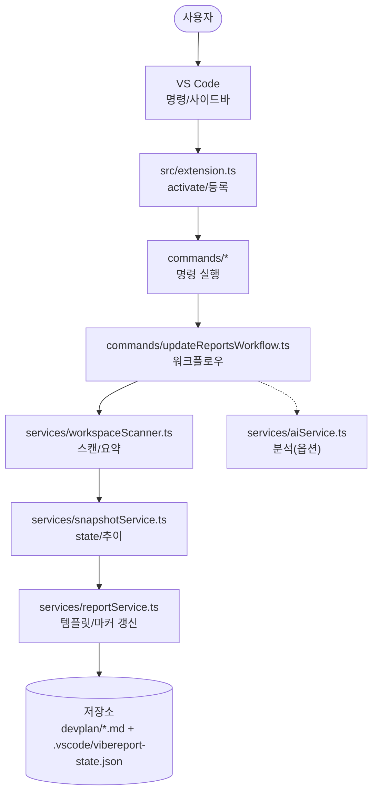
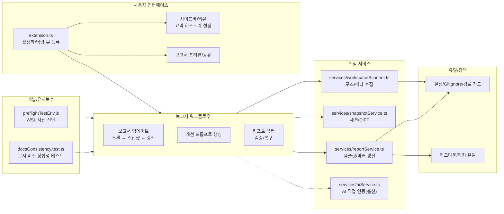

# 📊 프로젝트 종합 평가 보고서

> 이 문서는 Vibe Coding Report VS Code 확장에서 수집한 스냅샷과 세션 데이터를 기반으로, 현재 프로젝트 상태를 정리한 평가 문서입니다.  
> devplan/Session_History.md 파일에는 개별 세션별 상세 로그가 별도로 관리됩니다.

---

## 🎯 프로젝트 목표 및 비전

- **프로젝트 목적**
  - VS Code에서 AI 페어 프로그래밍을 사용할 때, 프로젝트 구조와 변경 이력을 자동으로 분석하여
    - 종합 평가 보고서(프로젝트 종합 평가 보고서)
    - 개선 탐색 보고서(프로젝트 개선 탐색 보고서)
    - AI 실행용 Prompt.md
    를 한 번의 명령으로 생성·유지관리하는 도구입니다.
- **핵심 목표**
  - 워크스페이스를 자동 스캔하여 언어/구조/설정 정보를 수집
  - Git 변경 이력과 결합한 증분 분석 제공
  - AI 모델이 바로 사용할 수 있는 구조화된 프롬프트를 자동 생성
  - 이미 적용된 개선 항목을 추적하여 중복 제안을 줄이고, 세션 히스토리를 시각적으로 관리
- **대상 사용자**
  - GitHub Copilot Chat 등 AI 도구를 활용해 프로젝트를 설계·리팩토링·문서화하는 VS Code 사용자
  - 팀/개인 프로젝트에서 “현재 상태 파악 → 개선 항목 도출 → AI에게 실행 의뢰” 흐름을 반복적으로 사용하는 개발자

---

## 📝 요약(한눈에)
<!-- TLDR-START -->
<!-- AUTO-TLDR-START -->
| 항목 | 내용 |
|:---|:---|
| **현재 버전** | v0.4.40 (2026-01-06 기준) |
| **전체 등급** | 🟢 A- (90점) |
| **전체 점수** | 90/100 |
| **가장 큰 리스크** | 경로 기반 설정(`reportDirectory`, `snapshotFile`) 검증이 약해, 잘못된 설정 시 의도치 않은 위치에 파일이 기록될 수 있음 |
| **권장 최우선 작업** | `security-path-traversal-001`: 보고서/스냅샷 경로 설정 검증 및 안전 폴백(서브패스 강제) |
| **다음 우선순위** | `security-custom-instructions-redaction-001`, `quality-sensitive-path-detection-001`, `quality-share-preview-metadata-parsing-001`, `feat-copy-all-prompts-001`, `opt-structure-summary-cap-001` |
<!-- AUTO-TLDR-END -->
<!-- TLDR-END -->

## ⚠️ 리스크 요약
<!-- RISK-SUMMARY-START -->
<!-- AUTO-RISK-SUMMARY-START -->
| 리스크 레벨 | 항목 | 관련 개선 ID |
|------------|------|-------------|
| 🔴 high | 경로 기반 설정(`reportDirectory`, `snapshotFile`) 검증이 약해 잘못된 설정 시 의도치 않은 위치에 파일 기록 가능 | `security-path-traversal-001` |
| 🟡 medium | 사용자 설정(`vibereport.ai.customInstructions`)에 토큰/키 형태 문자열이 포함될 경우 분석 프롬프트로 우발 노출 가능 | `security-custom-instructions-redaction-001` |
| 🟡 medium | 분석 프롬프트 템플릿의 민감 파일 판별 로직 중복으로 과탐지/누락 가능(분석 품질 변동) | `quality-sensitive-path-detection-001` |
| 🟢 low | 공유 프리뷰 메타(버전/총점) 추출이 정규식 의존 구간이 있어 포맷 변화 시 깨질 수 있음 | `quality-share-preview-metadata-parsing-001` |
| 🟢 low | 대형 워크스페이스에서 구조 요약 생성 비용 및 프롬프트 비대화 가능 | `opt-structure-summary-cap-001` |
| 🟢 low | 프롬프트/OPT 항목을 “순서대로 일괄 복사”하는 동선이 부족해 작업 누락/순서 혼선 가능 | `feat-copy-all-prompts-001` |
<!-- AUTO-RISK-SUMMARY-END -->
<!-- RISK-SUMMARY-END -->

---

<!-- AUTO-OVERVIEW-START -->
## 🎯 프로젝트 목표 및 비전

- **프로젝트 목적:** VS Code 워크스페이스를 스캔해 근거 데이터를 수집하고, **평가(점수) → 미적용 개선 백로그 → 실행 프롬프트(Prompt.md)**를 표준 형식으로 생성·유지관리하여 “진단→계획→실행” 루프를 자동화합니다.
- **주요 목표:** (1) 스캔/스냅샷 수집 (2) Git 변경 요약(옵션) 및 diff (3) 평가/개선/프롬프트 문서 자동 갱신 (4) 프리뷰/공유/번들 내보내기로 운영 동선 단축 (5) `Report Doctor`로 문서 규칙/정합성 검증·복구.
- **대상 사용자:** Copilot Chat 등 AI 도구를 활용하는 개발자/팀(프로젝트 품질 점검, 개선 항목 도출, AI 실행 의뢰를 반복하는 워크플로우).
- **주요 사용 시나리오:** (A) 주기적 상태 점검 및 보고서 갱신 (B) 변경 영향 파악(스냅샷 비교) (C) 미적용 개선 항목을 Prompt로 변환해 순차 적용 (D) 외부 공유용 프리뷰/번들 생성(레드액션) (E) 보고서 규칙 검증/복구 자동화.
- **전략적 포지션:** “AI가 코드를 쓰게 하는 도구”가 아니라, **AI가 안전하게 작업할 수 있도록 근거 데이터·정책·표준 문서·검증 도구를 제공**하는 프로젝트 운영용 VS Code 확장입니다.

### 프로젝트 메타 정보

| 항목 | 값 |
|---|---|
| **리포지토리** | `Stankjedi/projectmanager` (git: `32f9563@main`) |
| **확장 버전** | v0.4.40 (`vibereport-extension/package.json`) |
| **분석 기준일** | 2026-01-06 |
| **루트 `package.json`** | 없음(확장 패키지는 `vibereport-extension/package.json`) |
| **프로젝트 규모(스냅샷)** | 175개 파일 / 30개 디렉토리 (`.vscode/vibereport-state.json:lastSnapshot`) |
| **프로젝트 규모(git 추적)** | 269개 파일 / 44개 디렉토리 (`git ls-files`) |
| **주요 구성** | `vibereport-extension/`(VS Code 확장) · `devplan/`(평가/개선/프롬프트) |
| **주요 진입점(엔트리)** | `vibereport-extension/src/extension.ts`, `vibereport-extension/src/commands/updateReports.ts`, `vibereport-extension/src/commands/updateReportsWorkflow.ts` |
| **주요 진입점(명령)** | `vibereport.updateReports`, `vibereport.generatePrompt`, `vibereport.reportDoctor`, `vibereport.shareReport`, `vibereport.exportReportBundle`, `vibereport.openReportPreview` |
| **주요 기술** | TypeScript · VS Code API · Vitest · ESLint · Mermaid · simple-git · ignore · jsonc-parser |
| **CI 파이프라인** | `.github/workflows/ci.yml`: `pnpm install` → `compile` → `lint` → `bundle` → `test:run` → `test:coverage` |
| **로컬 검증(본 환경)** | `pnpm -C vibereport-extension run compile` ✅ / `pnpm -C vibereport-extension run lint` ✅ / `pnpm -C vibereport-extension run test:run` ✅ / `pnpm -C vibereport-extension run doctor:check` ✅ (2026-01-06) |
| **민감 파일 주의** | 워크스페이스 루트에 `vsctoken.txt` 존재(내용 미열람, 보고서/프롬프트에 값 포함 금지) |

### 🔄 실행 흐름(런타임) 다이어그램

<!-- AUTO-OVERVIEW-END -->

---

<!-- AUTO-STRUCTURE-START -->
## 📐 기능 기반 패키지 구조도

<!-- AUTO-STRUCTURE-END -->

---

## 🧩 현재 구현된 기능

| 기능 | 상태 | 설명 | 평가 |
|------|------|------|------|
| 삼중 보고서 시스템(평가/개선/프롬프트) | ✅ 완료 | devplan 디렉토리에 평가·개선·프롬프트 파일을 생성하고, 마커 기반으로 섹션별 갱신을 수행합니다. | 🟢 우수 |
| 워크스페이스 스캔 및 스냅샷 수집 | ✅ 완료 | WorkspaceScanner가 언어 통계, 주요 설정 파일, 디렉토리 구조, Git 정보(옵션)를 수집해 ProjectSnapshot을 구성합니다. | 🟢 우수 |
| Git 기반 변경 분석 (diff) | ✅ 완료 | SnapshotService가 이전 스냅샷과 비교하여 새 파일/삭제 파일/설정 변경/Git 변경 목록을 요약합니다. | 🟢 우수 |
| 보고서 업데이트(프롬프트 생성/복사) | ✅ 완료 | 스캔/보고서 갱신 후 분석 프롬프트를 생성하여 클립보드에 복사 | 🟢 우수 |
| 개선 항목 추출 및 미적용 필터링 | ✅ 완료 | 마크다운에서 P1/P2/P3 개선 항목을 파싱하고, appliedImprovements 기반으로 적용된 항목을 제외합니다. | 🟢 우수 |
| 세션 히스토리 및 통계 관리 | ✅ 완료 | .vscode/vibereport-state.json과 Session_History.md에 세션 목록과 통계를 기록하고, 사이드바 뷰에서 시각화합니다. | 🟢 우수 |
| VS Code 사이드바 요약/히스토리/설정 뷰 | ✅ 완료 | 요약 웹뷰, 히스토리 트리뷰, 설정 웹뷰로 보고서 상태와 설정을 한 곳에서 관리합니다. | 🟢 우수 |
| 개선 항목 프롬프트 생성 | ✅ 완료 | 개선 보고서에서 미적용 항목을 선택하여 Prompt.md를 생성하고 클립보드에 복사합니다. | 🟢 우수 |
| 프로젝트 비전 설정 | ✅ 완료 | 선택/입력 UI로 프로젝트 비전을 설정하고, 설정 패널에서 직접 모드/유형/단계를 변경할 수 있습니다. | 🟢 우수 |
| 테스트 및 CI 파이프라인 | ✅ 완료 | 단위 테스트/커버리지 실행 및 CI(compile/lint/test/coverage)가 구성되어 있고, 문서 정합성(docsConsistency)까지 테스트로 강제됩니다. | 🟢 우수 |
| 점수-등급 일관성 시스템 | ✅ 완료 | SCORE_GRADE_CRITERIA 상수와 scoreToGrade/gradeToColor 헬퍼 함수로 일관된 평가를 보장합니다. | 🟢 우수 |
| 파트별 순차 작성 지침 | ✅ 완료 | AI 에이전트 출력 길이 제한 방지를 위한 파트별 분리 작성 가이드라인을 제공합니다. | 🟢 우수 |
| 보고서 프리뷰 공유(클립보드 + 웹뷰) | ✅ 완료 | 평가 보고서의 요약(한눈에)/점수 요약을 추출해 외부 공유용 프리뷰를 생성 | 🔵 양호 |
| 보고서 번들 내보내기 | ✅ 완료 | 평가/개선/프롬프트 + 공유 프리뷰를 타임스탬프 폴더로 내보내 공유·아카이브를 지원 | 🔵 양호 |
| 코드 레퍼런스 열기 | ✅ 완료 | 보고서/프롬프트 내 코드 참조 링크로 파일·심볼을 바로 열기 | 🔵 양호 |
| AI 직접 연동 실행(언어 모델 API) | ✅ 완료(옵션) | `enableDirectAi` 설정 시 분석 프롬프트를 VS Code 언어 모델 API로 실행하고 결과를 클립보드/문서로 제공합니다(취소/폴백 포함). | 🔵 양호 |
| 웹뷰 보안/설정 UI 정합성 | ✅ 완료 | 웹뷰 CSP/nonce, escapeHtml 기반 이스케이프, 링크 허용 목록 등 기본 방어가 적용되어 있습니다. 설정 저장은 변경 감지(깊은 비교) 후 업데이트하여 불필요 I/O를 줄였습니다. | 🔵 양호 |

---

<!-- AUTO-SCORE-START -->
## 📊 종합 점수 요약

> **평가 기준일:** 2026-01-06  
> 점수는 (1) 코드 구조/타입 안정성 (2) 운영 기능(마커/닥터/프리뷰/공유/번들) (3) 보안/공유 안전성(경로 경계/레드액션/웹뷰/번들 산출물) (4) 테스트 자산/실행 가능성 (5) 문서/개발자 경험을 종합해 산정했습니다.  
> **검증 결과(본 환경):** `pnpm -C vibereport-extension run compile` ✅ / `pnpm -C vibereport-extension run lint` ✅ / `pnpm -C vibereport-extension run test:run` ✅(테스트 파일 55개/테스트 417개) / `pnpm -C vibereport-extension run doctor:check` ✅ (2026-01-06).  
> **변화(Δ):** 직전 평가(`git:e94c7ac@main`, 2026-01-02) 대비이며, 핵심 카테고리 점수는 **Δ 0(유지)** 입니다.

### 점수 ↔ 등급 기준표

| 점수 범위 | 등급 | 색상 | 의미 |
|:---:|:---:|:---:|:---:|
| 97–100 | A+ | 🟢 | 최우수 |
| 93–96 | A | 🟢 | 우수 |
| 90–92 | A- | 🟢 | 우수 |
| 87–89 | B+ | 🔵 | 양호 |
| 83–86 | B | 🔵 | 양호 |
| 80–82 | B- | 🔵 | 양호 |
| 77–79 | C+ | 🟡 | 보통 |
| 73–76 | C | 🟡 | 보통 |
| 70–72 | C- | 🟡 | 보통 |
| 67–69 | D+ | 🟠 | 미흡 |
| 63–66 | D | 🟠 | 미흡 |
| 60–62 | D- | 🟠 | 미흡 |
| 0–59 | F | 🔴 | 부족 |

### 전역 점수표

| 항목 | 점수 (100점 만점) | 등급 | 변화 |
|------|------------------|------|------|
| **코드 품질** | 92 | 🟢 A- | ↔ 0 |
| **아키텍처 설계** | 91 | 🟢 A- | ↔ 0 |
| **보안** | 90 | 🟢 A- | ↔ 0 |
| **성능** | 88 | 🔵 B+ | ↔ 0 |
| **테스트 커버리지** | 90 | 🟢 A- | ↔ 0 |
| **에러 처리** | 89 | 🔵 B+ | ↔ 0 |
| **문서화** | 88 | 🔵 B+ | ↔ 0 |
| **확장성** | 89 | 🔵 B+ | ↔ 0 |
| **유지보수성** | 90 | 🟢 A- | ↔ 0 |
| **프로덕션 준비도** | 89 | 🔵 B+ | ↔ 0 |
| **총점 평균** | **90** | 🟢 A- | ↔ 0 |

### 점수 산출 메모 (요약)

- **운영 기능(상):** 마커 기반 증분 갱신(히스토리 보존) + `Report Doctor` + 프리뷰/공유/번들 내보내기까지 “운영 루프”가 닫힌 형태로 구현되어 있습니다.
- **테스트/품질 게이트(상):** 로컬에서 `pnpm -C vibereport-extension run test:run` 기준 테스트 파일 55개/테스트 417개가 통과했고, CI에서도 `compile`/`lint`/`bundle`/`test:run`/`test:coverage`를 수행합니다.
- **보안/안전한 기본값(개선 여지):** 경로 기반 설정(`reportDirectory`, `snapshotFile`)이 “워크스페이스 하위 경로”임을 보장하는 검증이 약해, 잘못된 설정 시 의도치 않은 위치에 파일이 기록될 수 있습니다 → `security-path-traversal-001`.
- **민감 정보 노출(개선 여지):** 사용자 설정(`vibereport.ai.customInstructions`)이 분석 프롬프트에 그대로 포함되어, 토큰/키 형태 문자열이 섞이면 우발 노출로 이어질 수 있습니다 → `security-custom-instructions-redaction-001`.
- **정확성/품질(개선 여지):** 분석 프롬프트 템플릿의 민감 파일 판별 로직이 별도 구현으로 중복되어(키워드 기반 과탐지 가능) 분석 품질이 흔들릴 수 있습니다 → `quality-sensitive-path-detection-001`.
- **프리뷰 견고성(개선 여지):** 공유 프리뷰에서 버전/총점 추출이 정규식에 의존하는 구간이 남아 있어, 보고서 테이블 포맷 변화에 취약할 수 있습니다 → `quality-share-preview-metadata-parsing-001`.
- **성능/프롬프트 크기(개선 여지):** 구조 요약(`buildStructureSummary`)이 디렉토리 엔트리 수 제한 없이 생성되어, 대형 워크스페이스에서 체감 지연/프롬프트 비대화가 발생할 수 있습니다 → `opt-structure-summary-cap-001`.
<!-- AUTO-SCORE-END -->

---

## 🔗 점수 ↔ 개선 항목 매핑
<!-- SCORE-MAPPING-START -->
<!-- AUTO-SCORE-MAPPING-START -->
| 카테고리 | 현재 점수 | 주요 리스크 | 관련 개선 항목 ID |
|----------|----------|------------|------------------|
| 보안 | 90 (🟢 A-) | 경로 기반 설정 검증 부족 + 사용자 지침(`ai.customInstructions`)의 민감 문자열 우발 노출 가능 | `security-path-traversal-001`, `security-custom-instructions-redaction-001` |
| 프로덕션 준비도 | 89 (🔵 B+) | 설정 경로 검증/폴백 미흡, 프리뷰 메타(버전/총점) 파싱 취약 구간 존재 | `security-path-traversal-001`, `quality-share-preview-metadata-parsing-001` |
| 유지보수성 | 90 (🟢 A-) | 민감 파일 판별 로직 중복으로 과탐지/누락 가능, 프리뷰 파싱 결합도 잔존 | `quality-sensitive-path-detection-001`, `quality-share-preview-metadata-parsing-001` |
| 성능 | 88 (🔵 B+) | 구조 요약 생성 비용 및 프롬프트 비대화 가능(대형 워크스페이스) | `opt-structure-summary-cap-001` |
<!-- AUTO-SCORE-MAPPING-END -->
<!-- SCORE-MAPPING-END -->

---

<!-- AUTO-DETAIL-START -->
## 🔍 기능별 상세 평가

> **관찰 근거:** 주요 소스/테스트/설정 파일 리뷰 + `pnpm -C vibereport-extension run compile` ✅ / `pnpm -C vibereport-extension run lint` ✅ / `pnpm -C vibereport-extension run test:run` ✅(테스트 파일 55개/테스트 417개) / `pnpm -C vibereport-extension run doctor:check` ✅ (2026-01-06).

### 1) 확장 진입점/명령 레이어 (`vibereport-extension/src/extension.ts`, `vibereport-extension/src/commands/*`)
- **기능 완성도:** 보고서 업데이트/프롬프트 생성/프리뷰/닥터/번들 내보내기까지 “운영 루프”가 폭넓게 구현되어 있습니다.
- **코드 품질:** 명령·서비스·뷰 레이어가 분리되어 있고, 단위 테스트로 주요 흐름이 보호됩니다(`src/extension.test.ts`, `src/commands/__tests__/*`).
- **에러 처리:** 사용자 메시지 + OutputChannel 로그가 비교적 일관적이며, 취소/폴백 경로(`enableDirectAi` 옵션 포함)도 준비되어 있습니다.
- **성능:** 스캔/캐시 설계로 반복 실행 비용을 낮추는 구조입니다.
- **강점:** VS Code 안에서 “진단→계획→실행→기록” 흐름이 닫힌 루프로 연결됩니다.
- **약점 / 리스크:** 경로 기반 설정(`reportDirectory`, `snapshotFile`)이 의도한 “워크스페이스 하위 경로”임을 강제하는 검증이 약해, 잘못된 설정 시 예상치 못한 위치에 파일이 기록될 수 있습니다 → `security-path-traversal-001`.

### 2) 워크스페이스 스캔/스냅샷 (`vibereport-extension/src/services/workspaceScanner.ts`, `.../fileCollector.ts`, `.../todoFixmeScanner.ts`, `snapshotService.ts`)
- **기능 완성도:** 언어 통계/구조 요약/설정 파일 탐지/Git 변경 요약/TODO·FIXME 스캔 등 근거 데이터를 폭넓게 제공합니다.
- **코드 품질:** 수집/필터/캐시 로직이 분리되어 있고, 핵심 동작이 단위 테스트로 보호됩니다.
- **에러 처리:** 취소 토큰/파일 I/O 방어/민감 파일 제외 정책(`vibereport-extension/src/utils/sensitiveFilesUtils.ts`)이 포함되어 있습니다.
- **성능:** 목록 캐시와 `maxFilesToScan`로 반복 실행 비용을 절감하며, TODO/FIXME 스캔은 I/O 병렬화(동시성 제한) 및 토큰 패턴 레드액션이 적용되어 있습니다(`.../todoFixmeScanner.ts`, `utils/redactionUtils.ts`).
- **약점 / 리스크(정확성):** 분석 프롬프트 템플릿(`src/utils/analysisPromptTemplate.ts`)의 민감 파일 판별 로직이 별도 구현으로 중복되어, 키워드 과탐지로 분석 품질이 흔들릴 수 있습니다 → `quality-sensitive-path-detection-001`.
- **약점 / 리스크(성능/크기):** 디렉토리 구조 요약(`buildStructureSummary`)은 엔트리 수 제한 없이 생성되어 대형 워크스페이스에서 지연 및 프롬프트 비대화가 발생할 수 있습니다 → `opt-structure-summary-cap-001`.

### 3) 보고서 생성/마커 기반 갱신 (`vibereport-extension/src/services/reportService.ts`, `.../reportTemplates.ts`, `src/utils/markerUtils.ts`, `src/utils/markdownUtils/*`)
- **기능 완성도:** 마커 기반 섹션 갱신으로 히스토리를 보존하면서 최신 섹션만 업데이트하는 운영 방식이 강점입니다.
- **코드 품질:** 템플릿/포맷팅/쓰기(변경 감지 기반) 로직이 분리되어 있고, `src/utils/markdownUtils/` 하위로 단계적 모듈화가 진행되어 변경 영향이 줄었습니다.
- **에러 처리:** 마커 손상/누락을 닥터로 검증/복구할 수 있는 안전 장치가 있습니다.
- **성능:** 문서가 커질수록 후처리 비용이 증가할 수 있어, 측정 기반 최적화가 유리합니다.
- **강점:** 마커 유틸(`markerUtils.ts`)을 기반으로 다수 섹션을 안전하게 갱신하며, 보고서 포맷을 표준화하기 쉽습니다.
- **약점 / 리스크:** 경로 기반 설정의 검증(보고서 디렉토리/스냅샷 파일)이 보고서 생성/저장 단계의 안정성과 직결됩니다 → `security-path-traversal-001`.

### 4) 리포트 닥터/검증 도구 (`vibereport-extension/src/commands/reportDoctor.ts`, `vibereport-extension/src/utils/reportDoctorUtils.ts`, `vibereport-extension/src/scripts/doctorCli.ts`)
- **기능 완성도:** 마커/테이블/프롬프트 규칙/문서 정합성 등 운영 규칙을 “검증→조치”로 연결합니다.
- **코드 품질:** 규칙/유틸이 분리되어 있고, CLI(`doctor:check`)로 CI/로컬 진단 경로를 제공하는 점이 강점입니다.
- **에러 처리:** 문제 요약과 위치를 제공해 “어디가 깨졌는지”를 빠르게 찾을 수 있습니다.
- **약점 / 리스크:** 규칙이 늘어날수록 “문서 포맷 변화(언어/헤더/테이블)”에 대한 회귀 테스트를 꾸준히 보강해야 합니다(운영 안정성 관점).

### 5) 프리뷰/번들/공유 (`vibereport-extension/src/commands/shareReport.ts`, `vibereport-extension/src/commands/exportReportBundle.ts`, `vibereport-extension/src/commands/shareReportPreview.ts`)
- **기능 완성도:** 평가 보고서의 마커 섹션을 기반으로 프리뷰를 생성하고, 공유/아카이브를 위한 번들 내보내기를 제공합니다.
- **코드 품질:** 마커 기반 추출(`extractBetweenMarkersLines`)과 레드액션(`redactForSharing`)이 적용되어 공유 안전성이 높습니다.
- **에러 처리:** 파일 미존재/워크스페이스 미선택 등 예외 케이스가 사용자 메시지로 처리됩니다.
- **약점 / 리스크(정확성):** 프리뷰에서 일부 메타(버전/총점)가 정규식에 의존해 추출되어, 테이블 포맷 변화 시 깨질 수 있습니다 → `quality-share-preview-metadata-parsing-001`.

### 6) UI(뷰)/설정/자동 업데이트 (`vibereport-extension/src/views/*`, `vibereport-extension/src/services/realtimeWatcherService.ts`)
- **기능 완성도:** 요약/히스토리/설정 3축 UI + 파일 변경 감지 기반 자동 업데이트 옵션으로 운영 편의성이 높습니다.
- **코드 품질:** 뷰 제공자와 서비스가 분리되어 있으며, 웹뷰 보안(CSP/이스케이프) 기본 방어가 적용되어 있습니다.
- **에러 처리:** 자동 업데이트는 설정 기반으로 토글되며, 워크스페이스 미오픈 등 예외 케이스가 테스트로 보호됩니다.
- **약점 / 리스크:** 설정 경로(보고서/스냅샷)가 잘못 입력될 때의 방어(검증/오류 메시지/폴백)가 보강되면 프로덕션 안정성이 더 높아집니다 → `security-path-traversal-001`.
<!-- AUTO-DETAIL-END -->

---

<!-- AUTO-SUMMARY-START -->
## 📈 현재 상태 요약

- **기준일:** 2026-01-06
- **종합 준비도:** 🟢 **A- (90/100)**
  - 로컬 기준 `compile`/`lint`/`test:run`(테스트 417개)/`doctor:check`가 모두 통과하여 기본 품질 게이트는 안정적입니다.
  - VS Code 안에서 “스캔 → 보고서 갱신 → 프롬프트 생성 → 히스토리 기록/프리뷰/공유/번들” 운영 루프가 닫힌 형태로 구성되어 있습니다.

- **강점(상위 3개):**
  1. **운영 루프 완성도:** 마커 기반 증분 갱신 + 닥터 + 프리뷰/공유/번들 내보내기로 운영 산출물 관리가 용이합니다.
  2. **테스트/CI 품질 게이트:** `.github/workflows/ci.yml`과 `vitest.config.ts` 커버리지 임계치로 회귀 탐지력이 높습니다.
  3. **구조/유틸 모듈화:** `src/utils/markdownUtils/` 분리 등으로 유지보수성이 개선되었습니다.

- **즉시 권장 조치(상위 3개):**
  1. **P1 경로 설정 방어:** `reportDirectory`/`snapshotFile`을 워크스페이스 하위 경로로 강제하고, 잘못된 값에 대해 안전 폴백/명확한 오류를 제공 (`security-path-traversal-001`).
  2. **P2 민감 정보 안전성:** 사용자 커스텀 지침에 대한 토큰/키 패턴 레드액션 및 경고/옵션 제공 (`security-custom-instructions-redaction-001`).
  3. **P2/OPT 정확성·성능:** 민감 파일 판별 로직 단일화 + 구조 요약 생성량 제한으로 과탐지/프롬프트 비대화를 완화 (`quality-sensitive-path-detection-001`, `opt-structure-summary-cap-001`).
<!-- AUTO-SUMMARY-END -->

---

## 📈 평가 추이
<!-- TREND-START -->
<!-- AUTO-TREND-START -->
> **데이터 출처:** `.vscode/vibereport-state.json:evaluationHistory` (최근 5회)

| 버전 | 날짜(UTC) | 총점 | 비고 |
|:---:|:---:|:---:|:---|
| **git:d61d602@main** | 2026-01-02 06:47Z | **85 (B)** | - |
| **git:e94c7ac@main** | 2026-01-02 11:34Z | **89 (B+)** | - |
| **git:e94c7ac@main** | 2026-01-02 13:35Z | **86 (B)** | - |
| **git:e94c7ac@main** | 2026-01-02 15:39Z | **90 (A-)** | - |
| **git:32f9563@main** | 2026-01-06 06:17Z | **90 (A-)** | - |

| 카테고리 | 시작→현재 | Δ | 추세 |
|:---|:---:|:---:|:---:|
| 코드 품질 | 91→92 | ⬆️ +1 | 개선 |
| 아키텍처 설계 | 90→91 | ⬆️ +1 | 개선 |
| 보안 | 92→90 | ⬇️ -2 | 하락 |
| 성능 | 88→88 | ➡️ 0 | 유지 |
| 테스트 커버리지 | 85→90 | ⬆️ +5 | 개선 |
| 에러 처리 | 88→89 | ⬆️ +1 | 개선 |
| 문서화 | 72→88 | ⬆️ +16 | 개선 |
| 확장성 | 90→89 | ⬇️ -1 | 하락 |
| 유지보수성 | 88→90 | ⬆️ +2 | 개선 |
| 프로덕션 준비도 | 70→89 | ⬆️ +19 | 개선 |
<!-- AUTO-TREND-END -->
<!-- TREND-END -->
