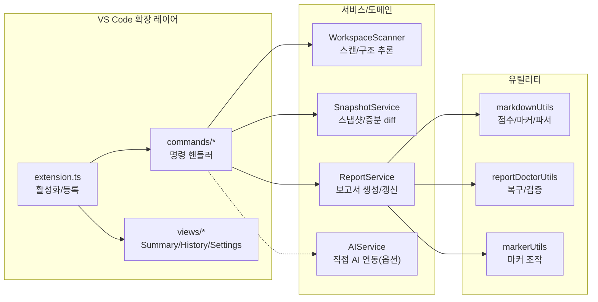

# 📊 프로젝트 종합 평가 보고서

> 이 문서는 Vibe Coding Report VS Code 확장에서 수집한 스냅샷과 세션 데이터를 기반으로, 현재 프로젝트 상태를 정리한 평가 문서입니다.  
> devplan/Session_History.md 파일에는 개별 세션별 상세 로그가 별도로 관리됩니다.

---

## 🎯 프로젝트 목표 및 비전

- **프로젝트 목적**
  - VS Code에서 AI 페어 프로그래밍을 사용할 때, 프로젝트 구조와 변경 이력을 자동으로 분석하여
    - 종합 평가 보고서(Project Evaluation Report)
    - 개선 탐색 보고서(Project Improvement Exploration Report)
    - AI 실행용 Prompt.md
    를 한 번의 명령으로 생성·유지관리하는 도구입니다.
- **핵심 목표**
  - 워크스페이스를 자동 스캔하여 언어/구조/설정 정보를 수집
  - Git 변경 이력과 결합한 증분 분석(Incremental Update) 제공
  - AI 모델이 바로 사용할 수 있는 구조화된 프롬프트를 자동 생성
  - 이미 적용된 개선 항목을 추적하여 중복 제안을 줄이고, 세션 히스토리를 시각적으로 관리
- **대상 사용자**
  - GitHub Copilot Chat 등 AI 도구를 활용해 프로젝트를 설계·리팩토링·문서화하는 VS Code 사용자
  - 팀/개인 프로젝트에서 “현재 상태 파악 → 개선 항목 도출 → AI에게 실행 의뢰” 흐름을 반복적으로 사용하는 개발자

---

## 📝 TL;DR (요약)
<!-- TLDR-START -->
<!-- AUTO-TLDR-START -->
| 항목 | 내용 |
|:---|:---|
| **현재 버전** | v0.4.27 (2025-12-20) |
| **전체 등급** | 🔵 B+ (88점) |
| **전체 점수** | 88/100 |
| **가장 큰 리스크** | 상태 파일(`.vscode/vibereport-state.json`) 레포 추적로 인한 정보 노출/변경 노이즈 |
| **권장 최우선 작업** | `security-statefile-tracking-001`: 상태 파일 추적 중단 및 ignore 처리 |
| **다음 우선순위** | `ci-workflow-location-001`, `test-branch-coverage-001`, `refactor-reportservice-modularize-001` |
<!-- AUTO-TLDR-END -->
<!-- TLDR-END -->

## ⚠️ 리스크 요약
<!-- RISK-SUMMARY-START -->
<!-- AUTO-RISK-SUMMARY-START -->
| 리스크 레벨 | 항목 | 관련 개선 ID |
|------------|------|-------------|
| 🔴 High | 상태 파일(`.vscode/vibereport-state.json`) 레포 추적(경로/세션 정보 포함) | `security-statefile-tracking-001` |
| 🟡 Medium | CI 워크플로우가 레포 루트가 아닌 경로에 있어 GitHub Actions 미동작 가능 | `ci-workflow-location-001` |
| 🟡 Medium | 브랜치 커버리지 54%대로 분기/예외 경로 회귀 탐지 한계 | `test-branch-coverage-001` |
| 🟢 Low | 보고서 업데이트 시 내용 변경 없음에도 파일 write로 변경 노이즈/I/O 발생 | `opt-report-write-skip-001` |
<!-- AUTO-RISK-SUMMARY-END -->
<!-- RISK-SUMMARY-END -->

---

<!-- AUTO-OVERVIEW-START -->
## 📋 프로젝트 개요

- **프로젝트 목적:** VS Code에서 프로젝트 상태를 자동 분석하고, **평가 → 개선 백로그 → 실행 프롬프트**로 이어지는 문서 파이프라인을 제공하여 AI 페어 프로그래밍의 생산성과 일관성을 높입니다.
- **핵심 목표:** (1) 워크스페이스 스캔/스냅샷 기반의 근거 있는 진단, (2) 마커 기반 증분 업데이트로 히스토리 보존, (3) AI가 “바로 실행” 가능한 프롬프트 산출.
- **대상 사용자:** Copilot Chat 등 AI 코딩 도구로 설계/리팩토링/문서화를 반복하는 개인·팀 개발자.
- **주요 사용 시나리오:** 정기 점검(스코어/리스크), PR 전후 변경 영향 확인(diff), 개선 백로그를 Prompt로 변환해 순차 실행.
- **전략적 포지션:** 린트/포맷 수준을 넘어, **프로젝트 운영(진단-계획-실행) 자동화**에 초점을 둔 VS Code 확장.

### 기능 기반 패키지 구조도

### 프로젝트 메타 정보

| 항목 | 값 |
|---|---|
| **레포지토리** | `Stankjedi/projectmanager` (`git:4c7949b@main`) |
| **확장 버전** | v0.4.27 |
| **분석 기준일** | 2025-12-20 |
| **주요 기술** | TypeScript · VS Code API · Vitest · Mermaid · simple-git |
| **구성(추적 파일 기준)** | 파일 122개 / 디렉토리 22개 |
| **언어 구성(추적 파일 기준)** | TS 80 · MD 11 · JSON 9 · JS 4 · YAML 2 |
| **로컬 검증 결과** | `compile`/`lint`/`test:run` 통과, 커버리지 Lines 73.68% / Branch 54.10% |
<!-- AUTO-OVERVIEW-END -->

---

## 🧩 현재 구현된 기능

| 기능 | 상태 | 설명 | 평가 |
|------|------|------|------|
| 삼중 보고서 시스템 (Evaluation/Improvement/Prompt) | ✅ 완료 | devplan 디렉토리에 평가·개선·프롬프트 파일을 생성하고, 마커 기반으로 섹션별 갱신을 수행합니다. | 🟢 우수 |
| 워크스페이스 스캔 및 스냅샷 수집 | ✅ 완료 | WorkspaceScanner가 언어 통계, 주요 설정 파일, 디렉토리 구조, Git 정보(옵션)를 수집해 ProjectSnapshot을 구성합니다. | 🟢 우수 |
| Git 기반 변경 분석 (diff) | ✅ 완료 | SnapshotService가 이전 스냅샷과 비교하여 새 파일/삭제 파일/설정 변경/Git 변경 목록을 요약합니다. | 🟢 우수 |
| 보고서 업데이트(프롬프트 생성/복사) | ✅ 완료 | 스캔/보고서 갱신 후 분석 프롬프트를 생성하여 클립보드에 복사 | 🟢 우수 |
| 개선 항목 추출 및 미적용 필터링 | ✅ 완료 | 마크다운에서 P1/P2/P3 개선 항목을 파싱하고, appliedImprovements 기반으로 적용된 항목을 제외합니다. | 🟢 우수 |
| 세션 히스토리 및 통계 관리 | ✅ 완료 | .vscode/vibereport-state.json과 Session_History.md에 세션 목록과 통계를 기록하고, 사이드바 뷰에서 시각화합니다. | 🟢 우수 |
| VS Code 사이드바 Summary/History/Settings 뷰 | ✅ 완료 | Summary(요약) Webview, History TreeView, Settings Webview를 통해 보고서 상태와 설정을 한 곳에서 관리합니다. | 🟢 우수 |
| 개선 항목 프롬프트 생성(Generate Prompt) | ✅ 완료 | 개선 보고서에서 미적용 항목을 QuickPick UI로 선택해 Prompt.md를 생성하고 클립보드에 복사합니다. | 🟢 우수 |
| 프로젝트 비전(Project Vision) 설정 | ✅ 완료 | QuickPick/Input UI로 Project Vision을 설정하고, Settings 패널에서 직접 모드/유형/단계를 변경할 수 있습니다. | 🟢 우수 |
| 테스트 및 CI 파이프라인 | 🔄 부분 | 로컬 기준 단위 테스트 231개/커버리지 실행이 통과합니다. 다만 CI 워크플로우가 레포 루트 경로가 아니라 GitHub Actions 자동 실행이 누락될 수 있습니다 (`ci-workflow-location-001`). | 🟡 보통 |
| 점수-등급 일관성 시스템 | ✅ 완료 | SCORE_GRADE_CRITERIA 상수와 scoreToGrade/gradeToColor 헬퍼 함수로 일관된 평가를 보장합니다. | 🟢 우수 |
| 파트별 순차 작성 지침 | ✅ 완료 | AI 에이전트 출력 길이 제한 방지를 위한 파트별 분리 작성 가이드라인을 제공합니다. | 🟢 우수 |
| 보고서 프리뷰 공유(클립보드 + Webview) | ✅ 완료 | 평가 보고서의 TL;DR/점수 요약을 추출해 외부 공유용 프리뷰를 생성 | 🔵 양호 |
| 코드 레퍼런스 열기 | ✅ 완료 | 보고서/프롬프트 내 코드 참조 링크로 파일·심볼을 바로 열기 | 🔵 양호 |
| AI 직접 연동 실행 (Language Model API) | ✅ 완료(옵션) | `enableDirectAi` 설정 시 분석 프롬프트를 VS Code Language Model API로 실행하고 결과를 클립보드/문서로 제공합니다(취소/폴백 포함). | 🔵 양호 |
| Webview 보안/설정 UI 정합성 | ✅ 완료 | Webview CSP/nonce, escapeHtml 기반 이스케이프, 링크 허용 목록 등 기본 방어가 적용되어 있습니다. Settings 저장은 변경 감지(딥이퀄) 후 update로 불필요 I/O를 줄였습니다. | 🔵 양호 |

---

<!-- AUTO-SCORE-START -->
## 📊 종합 점수 요약

> **평가 기준일:** 2025-12-20  
> 아래 점수는 로컬 검증(`compile`/`lint`/`test:run`/`test:coverage`) 결과, 코드 구조(모듈 분리/응집도), Webview 보안(CSP/이스케이프), 문서/배포 준비도를 종합하여 산정했습니다.

### 점수 ↔ 등급 기준표

| 점수 범위 | 등급 | 색상 | 의미 |
|:---:|:---:|:---:|:---:|
| 97–100 | A+ | 🟢 | 최우수 |
| 93–96 | A | 🟢 | 우수 |
| 90–92 | A- | 🟢 | 우수 |
| 87–89 | B+ | 🔵 | 양호 |
| 83–86 | B | 🔵 | 양호 |
| 80–82 | B- | 🔵 | 양호 |
| 77–79 | C+ | 🟡 | 보통 |
| 73–76 | C | 🟡 | 보통 |
| 70–72 | C- | 🟡 | 보통 |
| 67–69 | D+ | 🟠 | 미흡 |
| 63–66 | D | 🟠 | 미흡 |
| 60–62 | D- | 🟠 | 미흡 |
| 0–59 | F | 🔴 | 부족 |

### 전역 점수표

| 항목 | 점수 (100점 만점) | 등급 | 변화 |
|------|------------------|------|------|
| **코드 품질** | 90 | 🟢 A- | ➖ |
| **아키텍처 설계** | 91 | 🟢 A- | ➖ |
| **보안** | 86 | 🔵 B | ➖ |
| **성능** | 88 | 🔵 B+ | ➖ |
| **테스트 커버리지** | 85 | 🔵 B | ➖ |
| **에러 처리** | 89 | 🔵 B+ | ➖ |
| **문서화** | 86 | 🔵 B | ⬆️ +1 |
| **확장성** | 90 | 🟢 A- | ➖ |
| **유지보수성** | 90 | 🟢 A- | ➖ |
| **프로덕션 준비도** | 85 | 🔵 B | ⬆️ +5 |
| **총점 평균** | **88** | 🔵 B+ | ⬆️ +1 |

### 점수 산출 메모 (요약)

- **코드 품질/아키텍처(상):** `commands/`, `services/`, `views/`, `utils/`로 책임이 분리되어 있으며, TypeScript + ESLint 기반으로 기본 품질이 안정적입니다.
- **테스트 커버리지(중상):** Lines **73.68%**, Branch **54.10%**로 회귀 방지 기반은 갖췄으나, 분기/에러 경로에 대한 보강 여지가 있습니다.
- **프로덕션 준비도(중상):** 컴파일/번들/패키징 스크립트가 갖춰져 있으나, CI 워크플로우 파일이 레포 루트가 아닌 경로(`vibereport-extension/.github/workflows/ci.yml`)에 있어 자동 검증이 누락될 수 있습니다.
- **보안(중상):** Webview CSP/nonce 및 HTML 이스케이프/허용 목록을 적용했으나, 운영 관점(상태 파일 추적, 공유 프리뷰)에서 정책 정비가 필요합니다.
<!-- AUTO-SCORE-END -->

---

## 🔗 점수 ↔ 개선 항목 매핑
<!-- SCORE-MAPPING-START -->
<!-- AUTO-SCORE-MAPPING-START -->
| 카테고리 | 현재 점수 | 주요 리스크 | 관련 개선 항목 ID |
|----------|----------|------------|------------------|
| 보안 | 86 (🔵 B) | 상태 파일 레포 추적으로 인한 정보 노출/운영 리스크 | `security-statefile-tracking-001` |
| 프로덕션 준비도 | 85 (🔵 B) | CI 워크플로우 위치 비표준으로 자동 검증 누락 가능 | `ci-workflow-location-001` |
| 테스트 커버리지 | 85 (🔵 B) | Branch 54%대로 분기/예외 경로 회귀 탐지 한계 | `test-branch-coverage-001` |
| 유지보수성 | 90 (🟢 A-) | `reportService.ts` 등 대형 파일로 변경 영향 범위 확대 | `refactor-reportservice-modularize-001` |
| 성능 | 88 (🔵 B+) | 내용 변경 없음에도 보고서 파일 write로 I/O/노이즈 발생 | `opt-report-write-skip-001` |
<!-- AUTO-SCORE-MAPPING-END -->
<!-- SCORE-MAPPING-END -->

---

## 🔍 기능별 상세 평가

| 모듈/서비스 | 기능 완성도 | 코드 품질 | 에러 처리 | 성능 | 요약 평가 |
|-------------|------------:|----------:|----------:|------:|-----------|
| **확장 진입점/명령** | 90/100 | 87/100 | 88/100 | 87/100 | 기능 범위는 넓고 테스트가 존재하나, 대형 파일(진입점/워크플로우)로 유지보수 리스크가 남아있음. |
| **스캔/스냅샷** | 92/100 | 88/100 | 88/100 | 86/100 | 언어/구조/설정/Git 정보를 근거로 보고서를 구성. 대형 레포에서는 성능 상한 관리가 중요. |
| **보고서 생성/복구** | 91/100 | 85/100 | 90/100 | 84/100 | 마커 기반 갱신과 Doctor가 강점. `reportService.ts` 비대 및 무조건 write로 개선 여지. |
| **프리뷰(mermaid) 렌더러** | 89/100 | 86/100 | 86/100 | 86/100 | CSP/escape/sanitize 적용. 커스텀 파서 유지보수 비용 및 엣지 케이스 리스크. |
| **UI(Views)/설정** | 88/100 | 84/100 | 87/100 | 86/100 | 3종 뷰 제공. Settings 검증/딥이퀄로 안정적이나 파일 규모가 큼. |
| **AI 연동(옵션)** | 85/100 | 87/100 | 86/100 | 86/100 | 직접 실행/폴백/테스트가 있음. 모델/권한 의존성이 운영 리스크. |

### 1) 확장 진입점/명령 레이어 (`vibereport-extension/src/extension.ts`, `vibereport-extension/src/commands/*`)
- **기능 완성도:** 보고서 업데이트/전체 워크스페이스 업데이트/프롬프트 생성/프리뷰/Doctor 등 핵심 명령 구성이 폭넓게 구현되어 있습니다.
- **코드 품질:** 단위 테스트(231개)와 명령 등록 스모크 테스트가 존재하나, `extension.ts`의 라인 커버리지가 **42%대**로 낮습니다.
- **에러 처리:** 사용자 메시지 + OutputChannel 로그는 일관적이나, 예외 경로/경계 케이스 테스트 보강 여지가 있습니다(`test-branch-coverage-001`).
- **성능:** 자동 업데이트(디바운스) 지원으로 과도한 실행을 억제합니다.
- **약점/리스크:** `updateReportsWorkflow.ts`(851L)에 책임이 집중되어 변경 범위가 커질 수 있습니다(단계적 분리 권장).

### 2) 워크스페이스 스캔/스냅샷 (`vibereport-extension/src/services/workspaceScanner.ts`, `vibereport-extension/src/services/snapshotService.ts`)
- **기능 완성도:** 언어 통계, 주요 설정파일 탐지, Git 정보/변경 요약을 생성해 보고서의 근거 데이터를 제공합니다.
- **코드 품질:** 타입 정의(`vibereport-extension/src/models/types.ts`) 기반으로 구조가 명확합니다.
- **에러 처리:** 설정/JSON 파싱 방어 로직이 존재하나, I/O 실패/권한 오류 등 실제 런타임 예외 케이스 테스트는 추가 여지가 있습니다(`test-branch-coverage-001`).
- **성능:** exclude/maxFiles로 상한을 두었지만 대형 모노레포에서는 스캔 비용이 커질 수 있어 장기적으로 캐시/증분 전략 강화가 유효합니다.

### 3) 보고서 생성/마커 갱신/복구 (`vibereport-extension/src/services/reportService.ts`, `vibereport-extension/src/utils/*`)
- **기능 완성도:** 마커 기반 섹션 갱신과 Doctor 기반 복구로 운영 친화적입니다.
- **코드 품질:** `reportService.ts`가 **1641L**로 비대하여 응집도 저하/변경 리스크가 큽니다(`refactor-reportservice-modularize-001`).
- **에러 처리:** 마커 누락/손상 시 복구 경로가 존재합니다.
- **성능:** 내용 변경 여부와 무관하게 파일 write가 발생해 불필요 I/O 및 Git 노이즈를 유발할 수 있습니다(`opt-report-write-skip-001`).

### 4) 프리뷰/마크다운 렌더링 (`vibereport-extension/src/commands/openReportPreview.ts`, `vibereport-extension/media/*`)
- **기능 완성도:** Mermaid 렌더링, 테이블/코드블록 지원, 테마 감지 등 UX가 좋습니다.
- **코드 품질:** 커스텀 파서가 길고 복잡해 향후 기능 추가 시 회귀 가능성이 있어, 회귀 테스트 유지가 중요합니다.
- **보안/에러 처리:** CSP/nonce, escapeHtml, 링크 허용 목록으로 방어합니다. 다만 레포에 상태 파일이 추적되는 운영 리스크는 별도 정비가 필요합니다(`security-statefile-tracking-001`).

### 5) UI(Views)/설정 (`vibereport-extension/src/views/*`)
- **기능 완성도:** Summary(Webview)·History(Tree)·Settings(Webview) 3축 UI를 제공합니다.
- **코드 품질:** Settings는 키 검증/디폴트/딥이퀄로 안정적이나, `SettingsViewProvider.ts`가 **946L**로 커져 분리 여지가 큽니다.
- **성능:** 변경 없는 설정 update 스킵 등 최적화가 반영되어 있으며(추가 최적화는 선택), Webview 메시지 처리의 예외 경로 테스트는 확장 가능합니다.

### 6) 배포/운영 준비도(Repo 레벨)
- **현 상태:** 번들(esbuild)·패키징(vsce)·테스트/커버리지 스크립트는 갖춰져 있습니다.
- **리스크:** GitHub Actions 워크플로우가 레포 루트가 아닌 경로에 있어 CI가 실행되지 않을 수 있습니다(`ci-workflow-location-001`).

---

<!-- AUTO-SUMMARY-START -->
## 📈 현재 상태 요약

- **종합 준비도:** 🔵 **B+ (88/100)**
  - 로컬 기준(`compile`/`lint`/`test:run`)은 안정적으로 통과하며, 3종 보고서 파이프라인(평가/개선/프롬프트)이 실제 사용 가능한 수준으로 정착했습니다.
  - 다만 운영/배포 관점에서 **CI 자동 검증 활성화**와 **상태 파일 추적 정비**가 남아있습니다.

- **강점 (Top 3):**
  1. **마커 기반 증분 업데이트:** devplan 문서의 특정 섹션만 갱신하여 히스토리를 보존합니다.
  2. **명확한 레이어링:** `commands/` → `services/` → `utils/` 중심으로 책임이 분리되어 확장성이 좋습니다.
  3. **테스트 기반:** 231개 테스트 + 커버리지 리포트(라인 73.68%)로 회귀 방지 기반을 확보했습니다.

- **즉시 권장 조치 (Top 3):**
  1. **보안/운영 (P1):** 상태 파일 추적 중단 및 ignore 처리 (`security-statefile-tracking-001`).
  2. **프로덕션 준비도 (P2):** CI 워크플로우를 레포 루트로 정리해 자동 검증 활성화 (`ci-workflow-location-001`).
  3. **품질/유지보수 (P2):** 브랜치 커버리지 보강 + 대형 파일 단계적 분리 (`test-branch-coverage-001`, `refactor-reportservice-modularize-001`).
<!-- AUTO-SUMMARY-END -->

---

## 📈 평가 추이
<!-- TREND-START -->
<!-- AUTO-TREND-START -->
| 버전 | 날짜 | 총점 | 비고 |
|:---:|:---:|:---:|:---|
| **unknown** | 2025-12-19 | **86 (B)** | - |
| **git:0b74866@main** | 2025-12-19 | **87 (B+)** | - |
| **git:7cbf7bd@main** | 2025-12-19 | **87 (B+)** | - |
| **git:4c7949b@main** | 2025-12-20 | **87 (B+)** | - |
| **git:4c7949b@main** | 2025-12-20 | **88 (B+)** | - |

| 카테고리 | 점수 | 등급 | 변화 |
|:---|:---:|:---:|:---:|
| 코드 품질 | 90 | 🟢 A- | - |
| 아키텍처 설계 | 91 | 🟢 A- | - |
| 보안 | 86 | 🔵 B | - |
| 성능 | 88 | 🔵 B+ | - |
| 테스트 커버리지 | 85 | 🔵 B | - |
| 에러 처리 | 89 | 🔵 B+ | - |
| 문서화 | 86 | 🔵 B | ⬆️ +1 |
| 확장성 | 90 | 🟢 A- | - |
| 유지보수성 | 90 | 🟢 A- | - |
| 프로덕션 준비도 | 85 | 🔵 B | ⬆️ +5 |

### 추세 해석(최근 5회)
- 총점은 86 → 88로 **완만한 개선** 흐름입니다.
- 문서화/프로덕션 준비도가 개선(+1, +5)되었고, 나머지 카테고리는 **대체로 안정**(변화 없음)합니다.
<!-- AUTO-TREND-END -->
<!-- TREND-END -->
