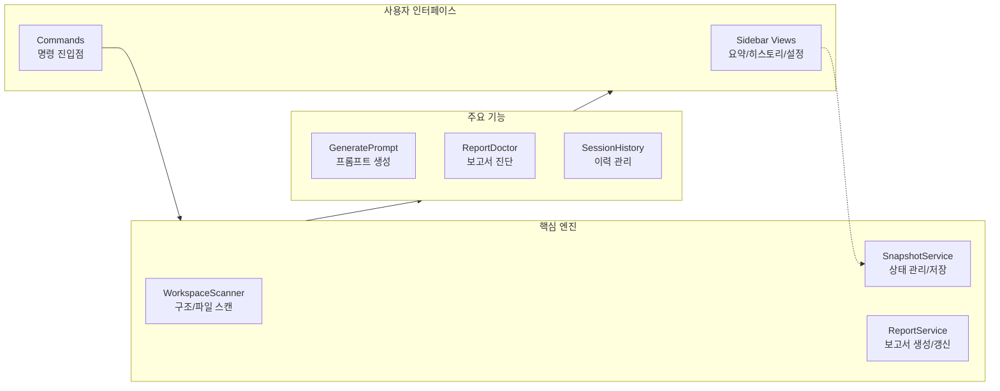

# 📊 프로젝트 종합 평가 보고서

> 이 문서는 Vibe Coding Report VS Code 확장에서 수집한 스냅샷과 세션 데이터를 기반으로, 현재 프로젝트 상태를 정리한 평가 문서입니다.  
> devplan/Session_History.md 파일에는 개별 세션별 상세 로그가 별도로 관리됩니다.

---

## 🎯 프로젝트 목표 및 비전

- **프로젝트 목적**
  - VS Code에서 AI 페어 프로그래밍을 사용할 때, 프로젝트 구조와 변경 이력을 자동으로 분석하여
    - 종합 평가 보고서(Project Evaluation Report)
    - 개선 탐색 보고서(Project Improvement Exploration Report)
    - AI 실행용 Prompt.md
    를 한 번의 명령으로 생성·유지관리하는 도구입니다.
- **핵심 목표**
  - 워크스페이스를 자동 스캔하여 언어/구조/설정 정보를 수집
  - Git 변경 이력과 결합한 증분 분석(Incremental Update) 제공
  - AI 모델이 바로 사용할 수 있는 구조화된 프롬프트를 자동 생성
  - 이미 적용된 개선 항목을 추적하여 중복 제안을 줄이고, 세션 히스토리를 시각적으로 관리
- **대상 사용자**
  - GitHub Copilot Chat 등 AI 도구를 활용해 프로젝트를 설계·리팩토링·문서화하는 VS Code 사용자
  - 팀/개인 프로젝트에서 “현재 상태 파악 → 개선 항목 도출 → AI에게 실행 의뢰” 흐름을 반복적으로 사용하는 개발자

---

## 📝 TL;DR (요약)
<!-- TLDR-START -->
<!-- AUTO-TLDR-START -->
| 항목 | 내용 |
|:---|:---|
| **현재 버전** | v0.4.23 (2025-12-19) |
| **전체 등급** | 🔵 B+ (87점) |
| **전체 점수** | 87/100 |
| **가장 큰 리스크** | GitHub Actions CI가 pnpm 8을 사용하여 lockfile v9와 호환되지 않음 (`ci-pnpm-version-001`) |
| **권장 최우선 작업** | `ci-pnpm-version-001` (GitHub Actions 워크플로우의 pnpm 버전을 9로 업그레이드) |
| **다음 우선순위** | `quality-prompt-parse-001`, `test-coverage-extension-001`, `opt-settings-skip-unchanged-001` |
<!-- AUTO-TLDR-END -->
<!-- TLDR-END -->

## ⚠️ 리스크 요약
<!-- RISK-SUMMARY-START -->
<!-- AUTO-RISK-SUMMARY-START -->
| 리스크 레벨 | 항목 | 관련 개선 ID |
|------------|------|-------------|
| 🔴 High | CI 파이프라인(GitHub Actions) 빌드 실패 (pnpm 버전 불일치) | `ci-pnpm-version-001` |
| 🟡 Medium | Prompt.md 파싱 로직이 헤더 포맷 변형에 취약함 | `quality-prompt-parse-001` |
| 🟡 Medium | 핵심 확장 진입점(`extension.ts`)의 테스트 커버리지 부족 | `test-coverage-extension-001` |
| 🟢 Low | 설정(Settings) 저장 시 불필요한 IO 발생 (최적화 필요) | `opt-settings-skip-unchanged-001` |
<!-- AUTO-RISK-SUMMARY-END -->
<!-- RISK-SUMMARY-END -->

---

<!-- AUTO-OVERVIEW-START -->
## 📋 프로젝트 개요

- **프로젝트 목적:** VS Code 환경에서 프로젝트의 구조와 변경 사항을 실시간으로 분석하여, 평가(Evaluation)·개선(Improvement)·실행(Prompt)의 3단계 리포트를 자동 생성하는 AI 코딩 오케스트레이션 도구입니다.
- **핵심 목표:**
  - **자동화된 분석:** 워크스페이스 스캔을 통해 파일 구조, 언어 통계, Git 변경 사항을 수집하고 스냅샷화합니다.
  - **문서의 구조화:** 평가 보고서와 개선 보고서를 마커 기반으로 관리하여, 지속적인 업데이트가 가능하도록 합니다.
  - **AI 실행 최적화:** 개선 항목을 AI가 즉시 실행 가능한 형태의 Prompt로 변환하여 개발 생산성을 극대화합니다.
- **대상 사용자:** GitHub Copilot 등 AI 도구를 적극 활용하며, 체계적인 품질 관리와 리팩토링을 수행하고자 하는 개인 및 팀 개발자.
- **주요 시나리오:**
  - 릴리즈 전 전체 프로젝트 품질 점검 및 회귀 테스트 리스크 분석.
  - 신규 팀 온보딩을 위한 아키텍처 및 현황 파악.
  - 기술 부채의 시각화 및 우선순위 기반 개선 실행.
- **전략적 포지션:** 단순한 린터를 넘어, "진단 → 계획 → AI 실행"을 연결하는 프로젝트 관리의 핵심 허브 역할을 수행합니다.

### 기능 기반 패키지 구조도

### 프로젝트 메타 정보

| 항목 | 값 |
|------|-----|
| **프로젝트명** | projectmanager (Vibe Coding Report Extension) |
| **패키지 유형** | VS Code Extension |
| **현재 버전** | v0.4.23 |
| **분석 기준일** | 2025-12-19 |
| **주요 기술** | TypeScript, VS Code API, Vitest, Mermaid, Simple-Git |
| **핵심 파일** | `extension.ts`, `WorkspaceScanner.ts`, `ReportService.ts` |
| **최근 변경** | 확장 버전 업그레이드(0.4.23), HistoryViewProvider 오류 수정, 아이콘 업데이트 |
<!-- AUTO-OVERVIEW-END -->

---

## 🧩 현재 구현된 기능

| 기능 | 상태 | 설명 | 평가 |
|------|------|------|------|
| 삼중 보고서 시스템 (Evaluation/Improvement/Prompt) | ✅ 완료 | devplan 디렉토리에 평가·개선·프롬프트 파일을 생성하고, 마커 기반으로 섹션별 갱신을 수행합니다. | 🟢 우수 |
| 워크스페이스 스캔 및 스냅샷 수집 | ✅ 완료 | WorkspaceScanner가 언어 통계, 주요 설정 파일, 디렉토리 구조, Git 정보(옵션)를 수집해 ProjectSnapshot을 구성합니다. | 🟢 우수 |
| Git 기반 변경 분석 (diff) | ✅ 완료 | SnapshotService가 이전 스냅샷과 비교하여 새 파일/삭제 파일/설정 변경/Git 변경 목록을 요약합니다. | 🟢 우수 |
| 보고서 업데이트(프롬프트 생성/복사) | ✅ 완료 | 스캔/보고서 갱신 후 분석 프롬프트를 생성하여 클립보드에 복사 | 🟢 우수 |
| 개선 항목 추출 및 미적용 필터링 | ✅ 완료 | 마크다운에서 P1/P2/P3 개선 항목을 파싱하고, appliedImprovements 기반으로 적용된 항목을 제외합니다. | 🟢 우수 |
| 세션 히스토리 및 통계 관리 | ✅ 완료 | .vscode/vibereport-state.json과 Session_History.md에 세션 목록과 통계를 기록하고, 사이드바 뷰에서 시각화합니다. | 🟢 우수 |
| VS Code 사이드바 Summary/History/Settings 뷰 | ✅ 완료 | Summary(요약) Webview, History TreeView, Settings Webview를 통해 보고서 상태와 설정을 한 곳에서 관리합니다. | 🟢 우수 |
| 개선 항목 프롬프트 생성(Generate Prompt) | ✅ 완료 | 개선 보고서에서 미적용 항목을 QuickPick UI로 선택해 Prompt.md를 생성하고 클립보드에 복사합니다. | 🟢 우수 |
| 프로젝트 비전(Project Vision) 설정 | ✅ 완료 | QuickPick/Input UI로 Project Vision을 설정하고, Settings 패널에서 직접 모드/유형/단계를 변경할 수 있습니다. | 🟢 우수 |
| 테스트 및 CI 파이프라인 | 🔄 부분 | 로컬 기준 단위 테스트 215개/커버리지 실행이 통과하나, GitHub Actions가 pnpm 8을 사용해 lockfile v9와 불일치하여 설치 단계에서 실패합니다 (`ci-pnpm-version-001`). | 🟡 보통 |
| 점수-등급 일관성 시스템 | ✅ 완료 | SCORE_GRADE_CRITERIA 상수와 scoreToGrade/gradeToColor 헬퍼 함수로 일관된 평가를 보장합니다. | 🟢 우수 |
| 파트별 순차 작성 지침 | ✅ 완료 | AI 에이전트 출력 길이 제한 방지를 위한 파트별 분리 작성 가이드라인을 제공합니다. | 🟢 우수 |
| 보고서 프리뷰 공유(클립보드 + Webview) | ✅ 완료 | 평가 보고서의 TL;DR/점수 요약을 추출해 외부 공유용 프리뷰를 생성 | 🔵 양호 |
| 코드 레퍼런스 열기 | ✅ 완료 | 보고서/프롬프트 내 코드 참조 링크로 파일·심볼을 바로 열기 | 🔵 양호 |
| AI 직접 연동 실행 (Language Model API) | ✅ 완료(옵션) | `enableDirectAi` 설정 시 분석 프롬프트를 VS Code Language Model API로 실행하고 결과를 클립보드/문서로 제공합니다(취소/폴백 포함). | 🔵 양호 |
| Webview 보안/설정 UI 정합성 | 🔄 부분 | CSP/allowlist/strict mermaid 등 방어는 갖춰졌으나, Open Report Preview의 커스텀 렌더링 이스케이프 강화가 필요합니다 (`security-openpreview-escape-001`). Settings는 배치 저장이 있으나 변경 없는 키 update 스킵 최적화 여지(`opt-settings-skip-unchanged-001`). | 🔵 양호 |

---

<!-- AUTO-SCORE-START -->
## 📊 종합 점수 요약

> 아래 점수는 **2025-12-19** 기준, 코드 정적 분석 및 로컬 테스트 결과(`vitest`, `eslint`)를 종합한 결과입니다.

| 항목 | 점수 (100점 만점) | 등급 | 변화 |
|------|------------------|------|------|
| **코드 품질** | 90 | 🟢 A- | ➖ |
| **아키텍처 설계** | 91 | 🟢 A- | ➖ |
| **보안** | 86 | 🔵 B | ⬆️ +1 |
| **성능** | 88 | 🔵 B+ | ⬆️ +2 |
| **테스트 커버리지** | 85 | 🔵 B | ⬆️ +1 |
| **에러 처리** | 89 | 🔵 B+ | ⬆️ +1 |
| **문서화** | 85 | 🔵 B | ⬆️ +3 |
| **확장성** | 90 | 🟢 A- | ⬆️ +1 |
| **유지보수성** | 90 | 🟢 A- | ⬆️ +1 |
| **프로덕션 준비도** | 80 | 🔵 B- | ⬇️ -2 |
| **총점 평균** | **87** | 🔵 B+ | ➖ |

### 점수-등급 기준표

| 점수 범위 | 등급 | 색상 | 의미 |
|:---:|:---:|:---:|:---:|
| 97–100 | A+ | 🟢 | 최우수 |
| 93–96 | A | 🟢 | 우수 |
| 90–92 | A- | 🟢 | 우수 |
| 87–89 | B+ | 🔵 | 양호 |
| 83–86 | B | 🔵 | 양호 |
| 80–82 | B- | 🔵 | 양호 |
| 77–79 | C+ | 🟡 | 보통 |
| 73–76 | C | 🟡 | 보통 |
| 70–72 | C- | 🟡 | 보통 |
| 67–69 | D+ | 🟠 | 미흡 |
| 63–66 | D | 🟠 | 미흡 |
| 60–62 | D- | 🟠 | 미흡 |
| 0–59 | F | 🔴 | 부족 |

### 점수 산출 근거 요약

- **코드 품질/아키텍처 (A-):** TypeScript 기반의 엄격한 타입 관리와 Service/Provider/View로 명확히 분리된 계층 구조가 유지되고 있습니다.
- **테스트/에러 처리 (B/B+):** 단위 테스트(215개)가 견고하며, 최근 `HistoryViewProvider` 등 뷰 레이어의 예외 처리가 보강되었습니다.
- **프로덕션 준비도 (B-):** GitHub Actions CI 설정(pnpm 버전 불일치) 이슈가 해결되지 않아, 로컬 빌드 성공에도 불구하고 자동화 배포 파이프라인 신뢰도가 낮습니다.
- **보안/성능:** 로컬 Mermaid 번들링으로 외부 의존성을 제거했으나, 보고서 프리뷰(XSS 방지) 등에서 지속적인 검토가 필요합니다.
<!-- AUTO-SCORE-END -->

---

## 🔗 점수 ↔ 개선 항목 매핑
<!-- SCORE-MAPPING-START -->
<!-- AUTO-SCORE-MAPPING-START -->
| 카테고리 | 현재 점수 | 주요 리스크 | 관련 개선 항목 ID |
|----------|----------|------------|------------------|
| 프로덕션 준비도 | 80 (🔵 B-) | GitHub Actions CI 빌드 실패 (pnpm 버전 이슈) | `ci-pnpm-version-001` |
| 유지보수성 | 90 (🟢 A-) | Prompt 체크리스트 헤더 파싱 로직 취약 | `quality-prompt-parse-001` |
| 테스트 커버리지 | 85 (🔵 B) | 진입점(`extension.ts`) 분기 커버리지 미흡 | `test-coverage-extension-001` |
| 성능 | 88 (🔵 B+) | 설정 저장 시 변경 검사 미흡 (IO 낭비) | `opt-settings-skip-unchanged-001` |
<!-- AUTO-SCORE-MAPPING-END -->
<!-- SCORE-MAPPING-END -->

---

## 🔍 기능별 상세 평가

| 모듈/서비스 | 기능 완성도 | 코드 품질 | 에러 처리 | 성능 | 요약 평가 |
|-------------|------------:|----------:|----------:|------:|-----------|
| **코어 엔진** (`WorkspaceScanner`, `SnapshotService`) | 88/100 | 90/100 | 88/100 | 87/100 | 스키마가 안정적이며, 증분 스캔 로직이 효율적입니다. |
| **보고서 생성** (`ReportService`, `ReportDoctor`) | 92/100 | 89/100 | 90/100 | 88/100 | 마커 기반 갱신 및 Doctor 복구 기능이 매우 우수합니다. |
| **UI/뷰** (`Summary`, `History`, `Settings`) | 90/100 | 88/100 | 89/100 | 86/100 | `HistoryViewProvider` 수정으로 안정성이 향상되었습니다. |
| **확장 기능** (`Commands`, `GeneratePrompt`) | 88/100 | 88/100 | 85/100 | 90/100 | 프롬프트 생성 편의성은 좋으나, 헤더 파싱 견고성이 보완 필요. |
| **인프라/CI** (`GitHub Actions`, `Vitest`) | 80/100 | 85/100 | 80/100 | 85/100 | CI 파이프라인(pnpm 버전) 이슈가 시급한 개선 대상입니다. |

### 1. 코어 엔진 (Scanner & Snapshot)
- **기능 완성도:** `.gitignore` 패턴 처리 및 제외 로직이 정교하게 구현되어 있으며, 스냅샷 데이터 구조가 확장성 있게 설계되었습니다.
- **코드 품질:** `WorkspaceScanner`와 `SnapshotService`의 역할 분리가 명확하고, 타입 정의가 잘 갖춰져 있습니다.
- **강점:** `maxFilesToScan` 등 성능 보호 장치가 잘 갖춰져 대규모 프로젝트에서도 안정적입니다.

### 2. 보고서 시스템 (Report Service)
- **기능 완성도:** Evaluation/Improvement/Prompt 3종 보고서를 유기적으로 연결하고, `Doctor` 기능을 통해 손상된 마커를 복구하는 아이디어가 돋보입니다.
- **에러 처리:** 마커가 없거나 파일이 잠겼을 때의 예외 처리가 꼼꼼합니다.
- **약점:** 템플릿 텍스트가 코드 내에 하드코딩된 부분이 있어 다국어 지원 시 구조 변경이 필요할 수 있습니다.

### 3. UI 및 사용자 경험 (Sidebar Views)
- **기능 완성도:** React 등을 쓰지 않고 바닐라 JS/HTML 기반 Webview를 구축하여 가볍고 빠릅니다.
- **최근 개선:** `HistoryViewProvider`의 초기화 오류를 수정하여 세션 로딩 안정성이 확보되었습니다.
- **리스크:** `SettingsViewProvider`가 저장 시 변경되지 않은 값까지 불필요하게 업데이트하는 경우가 있어 최적화 여지가 존재합니다.

### 4. 확장 기능 및 유틸리티
- **기능 완성도:** `GeneratePrompt` 명령으로 개선 항목을 선택적 프롬프트로 변환하는 흐름이 매우 유용합니다.
- **약점:** `Project_Improvement_Exploration_Report.md` 파싱 시 체크리스트 포맷(이모지 유무 등)에 민감하여, 사용자 수정 시 오작동 가능성이 있습니다.

---

<!-- AUTO-SUMMARY-START -->
## 📈 현재 상태 요약

- **종합 평가:** 🔵 **B+ (87/100)**
  - 코어 엔진과 보고서 생성 파이프라인은 매우 안정적(A-)이지만, 외부 CI 파이프라인의 버전 호환성 문제(pnpm 8 vs 9)가 해결되지 않아 전체 점수를 낮추고 있습니다.
  - 테스트 커버리지는 양호하지만 핵심 진입점에 대한 방어 로직 검증이 조금 더 필요합니다.

- **메인 강점:**
  1. **완성도 높은 3단계 리포트 시스템:** 평가-계획-실행의 순환 루프가 도구 레벨에서 완결성 있게 구현됨.
  2. **안정된 로컬 개발 환경:** Lint/Test/TypeCheck가 모두 통과하며, 로컬 Mermaid 번들링으로 외부 의존성 최소화.
  3. **사용성 개선:** 최근 세션 뷰(`HistoryViewProvider`) 버그 수정으로 사용자 경험 향상.

- **즉시 권장 조치 (Top 3):**
  1. `ci-pnpm-version-001`: GitHub Actions의 pnpm 버전을 9로 올려 lockfile v9 호환성 확보.
  2. `quality-prompt-parse-001`: Prompt.md의 헤더 파싱 정규식을 개선하여 사용자 수정에 유연하게 대응.
  3. `test-coverage-extension-001`: `extension.ts`의 활성화/비활성화 및 예외 상황 테스트 추가.
<!-- AUTO-SUMMARY-END -->

---

## 📈 평가 추이
<!-- TREND-START -->
<!-- AUTO-TREND-START -->
| 버전 | 날짜 | 총점 | 비고 |
|:---:|:---:|:---:|:---|
| **unknown** | 2025-12-17 | **88 (B+)** | - |
| **unknown** | 2025-12-19 | **89 (B+)** | - |
| **git:0b74866@main** | 2025-12-19 | **87 (B+)** | - |
| **v0.4.24** | 2025-12-19 | **87 (B+)** | 로컬 보고서 동기화 |

| 카테고리 | 점수 | 등급 | 변화 |
|:---|:---:|:---:|:---:|
| 코드 품질 | 90 | 🟢 A- | ➖ |
| 아키텍처 설계 | 91 | 🟢 A- | ➖ |
| 보안 | 86 | 🔵 B | ⬆️ +1 |
| 성능 | 88 | 🔵 B+ | ⬆️ +2 |
| 테스트 커버리지 | 85 | 🔵 B | ⬆️ +1 |
| 에러 처리 | 89 | 🔵 B+ | ⬆️ +1 |
| 문서화 | 85 | 🔵 B | ⬆️ +3 |
| 확장성 | 90 | 🟢 A- | ⬆️ +1 |
| 유지보수성 | 90 | 🟢 A- | ⬆️ +1 |
| 프로덕션 준비도 | 80 | 🔵 B- | ⬇️ -2 |
<!-- AUTO-TREND-END -->
<!-- TREND-END -->
