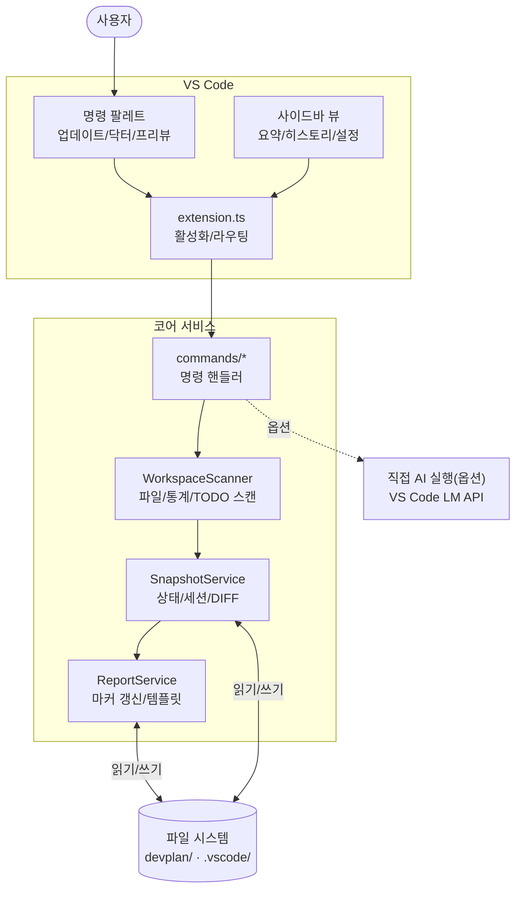
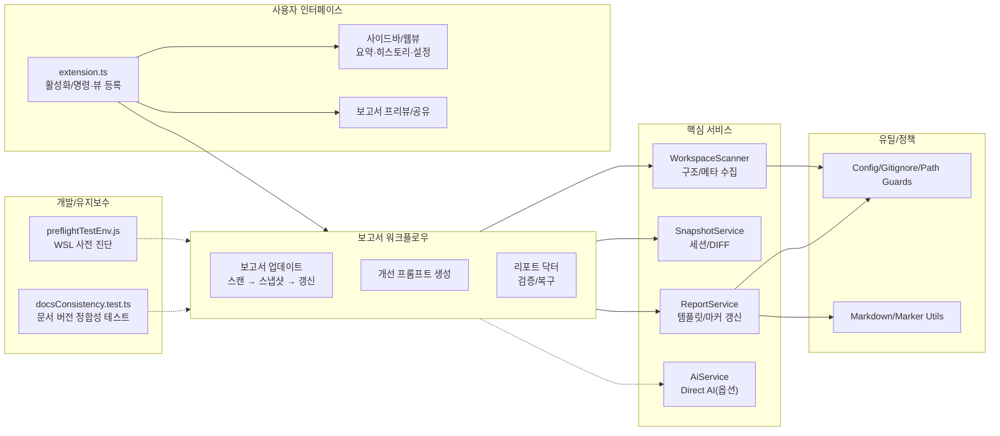

# 📊 프로젝트 종합 평가 보고서

> 이 문서는 Vibe Coding Report VS Code 확장에서 수집한 스냅샷과 세션 데이터를 기반으로, 현재 프로젝트 상태를 정리한 평가 문서입니다.  
> devplan/Session_History.md 파일에는 개별 세션별 상세 로그가 별도로 관리됩니다.

---

## 🎯 프로젝트 목표 및 비전

- **프로젝트 목적**
  - VS Code에서 AI 페어 프로그래밍을 사용할 때, 프로젝트 구조와 변경 이력을 자동으로 분석하여
    - 종합 평가 보고서(프로젝트 종합 평가 보고서)
    - 개선 탐색 보고서(프로젝트 개선 탐색 보고서)
    - AI 실행용 Prompt.md
    를 한 번의 명령으로 생성·유지관리하는 도구입니다.
- **핵심 목표**
  - 워크스페이스를 자동 스캔하여 언어/구조/설정 정보를 수집
  - Git 변경 이력과 결합한 증분 분석 제공
  - AI 모델이 바로 사용할 수 있는 구조화된 프롬프트를 자동 생성
  - 이미 적용된 개선 항목을 추적하여 중복 제안을 줄이고, 세션 히스토리를 시각적으로 관리
- **대상 사용자**
  - GitHub Copilot Chat 등 AI 도구를 활용해 프로젝트를 설계·리팩토링·문서화하는 VS Code 사용자
  - 팀/개인 프로젝트에서 “현재 상태 파악 → 개선 항목 도출 → AI에게 실행 의뢰” 흐름을 반복적으로 사용하는 개발자

---

## 📝 요약(한눈에)
<!-- TLDR-START -->
<!-- AUTO-TLDR-START -->
| 항목 | 내용 |
|:---|:---|
| **현재 버전** | v0.4.35 (2026-01-02 기준) |
| **전체 등급** | 🔵 B+ (89점) |
| **전체 점수** | 89/100 |
| **가장 큰 리스크** | 워크스페이스 내 민감 파일(토큰/키/.env 등) 존재 시 스캔/프리뷰/공유 과정에서 의도치 않은 노출 위험 |
| **권장 최우선 작업** | `sec-sensitive-files-001`: 리포트 닥터에 민감 파일 점검/차단/제외 패턴 제안 등 안전 조치 추가 |
| **다음 우선순위** | `test-docs-marketplace-001`, `test-doctor-docs-fix-newlines-001`, `feat-doctor-fix-all-001`, `feat-snapshot-storage-mode-001`, `opt-markdown-utils-modularize-001` |
<!-- AUTO-TLDR-END -->
<!-- TLDR-END -->

## ⚠️ 리스크 요약
<!-- RISK-SUMMARY-START -->
<!-- AUTO-RISK-SUMMARY-START -->
| 리스크 레벨 | 항목 | 관련 개선 ID |
|------------|------|-------------|
| 🔴 높음 | 워크스페이스 내 민감 파일(토큰/키/.env 등) 존재 시 스캔/프리뷰/공유 과정에서 의도치 않은 노출 위험 | `sec-sensitive-files-001` |
| 🟡 중간 | 스냅샷/상태 파일 저장이 리포지토리 내(.vscode) 경로에 고정되면 팀 환경에서 실수 커밋/공유·노이즈(디프) 리스크 증가 | `feat-snapshot-storage-mode-001` |
| 🟡 중간 | 마켓플레이스 링크/배지/설치 예시가 문서로만 관리되면 드리프트가 재발할 수 있어 테스트로 고정 권장 | `test-docs-marketplace-001` |
| 🟡 중간 | 닥터 액션이 늘어날수록 사용자가 우선순위를 판단하기 어려워져 운영 실수 가능성 증가 | `feat-doctor-fix-all-001` |
| 🟡 중간 | 자동 수정 로직의 줄바꿈(LF/CRLF) 보존 회귀 시 불필요한 디프/리뷰 비용 증가 | `test-doctor-docs-fix-newlines-001` |
| 🟢 낮음 | `src/utils/markdownUtils.ts` 등 대형 유틸 파일의 유지보수 비용 상승(변경 영향 확대) | `opt-markdown-utils-modularize-001` |
<!-- AUTO-RISK-SUMMARY-END -->
<!-- RISK-SUMMARY-END -->

---

<!-- AUTO-OVERVIEW-START -->
## 🎯 프로젝트 목표 및 비전

- **프로젝트 목적:** VS Code 워크스페이스를 스캔해 근거 데이터를 수집하고, **평가(점수) → 미적용 개선 백로그 → 실행 프롬프트(Prompt.md)**를 표준 형식으로 생성·유지관리하여 “진단→계획→실행” 루프를 자동화합니다.
- **주요 목표:** (1) 워크스페이스 스캔/스냅샷 수집 (2) Git 변경 요약(옵션) (3) 평가/개선/프롬프트 문서 자동 갱신 (4) 닥터/프리뷰/공유/번들로 운영 동선 단축 (5) *(옵션)* Direct AI 실행으로 분석 자동화 확장.
- **대상 사용자:** Copilot Chat/Claude/ChatGPT 등 AI 페어 프로그래밍을 실무에 적용하는 개발자/팀, VS Code 안에서 운영 산출물(평가·개선·프롬프트)을 표준화하려는 사용자.
- **주요 사용 시나리오:** (A) 주기적 상태 점검 및 보고서 갱신 (B) 변경 영향 파악(스냅샷 diff) (C) 미적용 개선 항목을 Prompt로 변환해 순차 적용 (D) 프리뷰/공유 프리뷰 생성(레드액션) (E) 리포트 닥터로 규칙/정합성 검증 및 복구.
- **전략적 포지션:** “AI가 코드를 쓰게 하는 도구”가 아니라, **AI가 안전하게 실행할 수 있도록 근거 데이터와 표준 문서를 자동 생성·검증·배포**하는 프로젝트 운영용 VS Code 확장입니다.

### 프로젝트 메타 정보

| 항목 | 값 |
|---|---|
| **리포지토리** | `Stankjedi/projectmanager` (git: `d61d602`) |
| **확장 버전** | v0.4.35 |
| **분석 기준일** | 2026-01-02 |
| **프로젝트 규모** | 159 files / 28 dirs (주요: ts 116, md 12, json 8, js 5, yaml 2) |
| **주요 구성** | `vibereport-extension/`(VS Code 확장) · `devplan/`(평가/개선/프롬프트) |
| **주요 기술** | TypeScript · VS Code API · Vitest · ESLint · Mermaid · simple-git · ignore · jsonc-parser |
| **CI 파이프라인** | GitHub Actions(ubuntu-latest, Node 20, pnpm 9)에서 compile/lint/test/coverage 실행 |
| **테스트/커버리지(최근 산출물)** | statements 86.75% / branches 71.11% / functions 85.44% / lines 88.41% |
| **로컬 검증(본 환경)** | 2026-01-02 기준 `pnpm -C vibereport-extension run compile`/`lint`/`test:run`/`test:coverage` 통과 |

### 🔄 실행 흐름(런타임) 다이어그램

<!-- AUTO-OVERVIEW-END -->

---

<!-- AUTO-STRUCTURE-START -->
## 📐 기능 기반 패키지 구조도

<!-- AUTO-STRUCTURE-END -->

---

## 🧩 현재 구현된 기능

| 기능 | 상태 | 설명 | 평가 |
|------|------|------|------|
| 삼중 보고서 시스템(평가/개선/프롬프트) | ✅ 완료 | devplan 디렉토리에 평가·개선·프롬프트 파일을 생성하고, 마커 기반으로 섹션별 갱신을 수행합니다. | 🟢 우수 |
| 워크스페이스 스캔 및 스냅샷 수집 | ✅ 완료 | WorkspaceScanner가 언어 통계, 주요 설정 파일, 디렉토리 구조, Git 정보(옵션)를 수집해 ProjectSnapshot을 구성합니다. | 🟢 우수 |
| Git 기반 변경 분석 (diff) | ✅ 완료 | SnapshotService가 이전 스냅샷과 비교하여 새 파일/삭제 파일/설정 변경/Git 변경 목록을 요약합니다. | 🟢 우수 |
| 보고서 업데이트(프롬프트 생성/복사) | ✅ 완료 | 스캔/보고서 갱신 후 분석 프롬프트를 생성하여 클립보드에 복사 | 🟢 우수 |
| 개선 항목 추출 및 미적용 필터링 | ✅ 완료 | 마크다운에서 P1/P2/P3 개선 항목을 파싱하고, appliedImprovements 기반으로 적용된 항목을 제외합니다. | 🟢 우수 |
| 세션 히스토리 및 통계 관리 | ✅ 완료 | .vscode/vibereport-state.json과 Session_History.md에 세션 목록과 통계를 기록하고, 사이드바 뷰에서 시각화합니다. | 🟢 우수 |
| VS Code 사이드바 요약/히스토리/설정 뷰 | ✅ 완료 | 요약 웹뷰, 히스토리 트리뷰, 설정 웹뷰로 보고서 상태와 설정을 한 곳에서 관리합니다. | 🟢 우수 |
| 개선 항목 프롬프트 생성 | ✅ 완료 | 개선 보고서에서 미적용 항목을 선택하여 Prompt.md를 생성하고 클립보드에 복사합니다. | 🟢 우수 |
| 프로젝트 비전 설정 | ✅ 완료 | 선택/입력 UI로 프로젝트 비전을 설정하고, 설정 패널에서 직접 모드/유형/단계를 변경할 수 있습니다. | 🟢 우수 |
| 테스트 및 CI 파이프라인 | ✅ 완료 | 단위 테스트/커버리지 실행 및 CI(compile/lint/test/coverage)가 구성되어 있고, 문서 정합성(docsConsistency)까지 테스트로 강제됩니다. | 🟢 우수 |
| 점수-등급 일관성 시스템 | ✅ 완료 | SCORE_GRADE_CRITERIA 상수와 scoreToGrade/gradeToColor 헬퍼 함수로 일관된 평가를 보장합니다. | 🟢 우수 |
| 파트별 순차 작성 지침 | ✅ 완료 | AI 에이전트 출력 길이 제한 방지를 위한 파트별 분리 작성 가이드라인을 제공합니다. | 🟢 우수 |
| 보고서 프리뷰 공유(클립보드 + 웹뷰) | ✅ 완료 | 평가 보고서의 요약(한눈에)/점수 요약을 추출해 외부 공유용 프리뷰를 생성 | 🔵 양호 |
| 보고서 번들 내보내기 | ✅ 완료 | 평가/개선/프롬프트 + 공유 프리뷰를 타임스탬프 폴더로 내보내 공유·아카이브를 지원 | 🔵 양호 |
| 코드 레퍼런스 열기 | ✅ 완료 | 보고서/프롬프트 내 코드 참조 링크로 파일·심볼을 바로 열기 | 🔵 양호 |
| AI 직접 연동 실행(언어 모델 API) | ✅ 완료(옵션) | `enableDirectAi` 설정 시 분석 프롬프트를 VS Code 언어 모델 API로 실행하고 결과를 클립보드/문서로 제공합니다(취소/폴백 포함). | 🔵 양호 |
| 웹뷰 보안/설정 UI 정합성 | ✅ 완료 | 웹뷰 CSP/nonce, escapeHtml 기반 이스케이프, 링크 허용 목록 등 기본 방어가 적용되어 있습니다. 설정 저장은 변경 감지(깊은 비교) 후 업데이트하여 불필요 I/O를 줄였습니다. | 🔵 양호 |

---

<!-- AUTO-SCORE-START -->
## 📊 종합 점수 요약

> **평가 기준일:** 2026-01-02  
> 점수는 (1) 코드 구조/타입 안정성 (2) 운영 기능(마커/닥터/프리뷰/공유/번들) (3) 보안(경로 경계/레드액션/웹뷰) (4) 테스트 자산/실행 가능성 (5) 문서/개발자 경험을 종합해 산정했습니다.  
> **검증 결과(본 환경):** `pnpm -C vibereport-extension run compile`/`lint`/`test:run`/`test:coverage` 통과(2026-01-02).  
> **변화(Δ):** `.vscode/vibereport-state.json`의 마지막 평가 기록 대비 변화(상태 파일은 확장 명령 실행 시 갱신).

### 점수 ↔ 등급 기준표

| 점수 범위 | 등급 | 색상 | 의미 |
|:---:|:---:|:---:|:---:|
| 97–100 | A+ | 🟢 | 최우수 |
| 93–96 | A | 🟢 | 우수 |
| 90–92 | A- | 🟢 | 우수 |
| 87–89 | B+ | 🔵 | 양호 |
| 83–86 | B | 🔵 | 양호 |
| 80–82 | B- | 🔵 | 양호 |
| 77–79 | C+ | 🟡 | 보통 |
| 73–76 | C | 🟡 | 보통 |
| 70–72 | C- | 🟡 | 보통 |
| 67–69 | D+ | 🟠 | 미흡 |
| 63–66 | D | 🟠 | 미흡 |
| 60–62 | D- | 🟠 | 미흡 |
| 0–59 | F | 🔴 | 부족 |

### 전역 점수표

| 항목 | 점수 (100점 만점) | 등급 | 변화 |
|------|------------------|------|------|
| **코드 품질** | 91 | 🟢 A- | — |
| **아키텍처 설계** | 90 | 🟢 A- | — |
| **보안** | 92 | 🟢 A- | — |
| **성능** | 88 | 🔵 B+ | — |
| **테스트 커버리지** | 88 | 🔵 B+ | ⬆️ +3 |
| **에러 처리** | 88 | 🔵 B+ | — |
| **문서화** | 86 | 🔵 B | ⬆️ +14 |
| **확장성** | 90 | 🟢 A- | — |
| **유지보수성** | 89 | 🔵 B+ | ⬆️ +1 |
| **프로덕션 준비도** | 84 | 🔵 B | ⬆️ +14 |
| **총점 평균** | **89** | 🔵 B+ | ⬆️ +4 |

### 점수 산출 메모 (요약)

- **운영 기능(상):** 마커 기반 증분 갱신(히스토리 보존) + 닥터 + Mermaid 프리뷰/공유(레드액션) + 번들 내보내기까지 “운영 루프”가 완성되어 있습니다.
- **문서화/배포 신뢰도(개선 반영):** 문서 버전/마켓플레이스/VSIX 예시 정합성 및 재발 방지(테스트/닥터)가 강화되어 사용자 혼선과 CI 차단 가능성이 낮아졌습니다.
- **테스트/품질 게이트(강화):** docsConsistency 검증 강화 및 커버리지 thresholds 상향으로 회귀 탐지력이 개선되었습니다.
- **잔여 리스크(요약):** (1) 민감 파일(토큰/키 등) 워크스페이스 존재 시 스캔/공유 과정에서 노출될 수 있어 닥터 기반 점검/차단 강화 필요 (2) 마켓플레이스 링크/배지 드리프트는 재발 가능성이 있어 테스트로 고정 권장 (3) 대형 유틸 파일(예: `src/utils/markdownUtils.ts`)은 유지보수 비용 상승 요인이므로 단계적 모듈화가 유리합니다.
<!-- AUTO-SCORE-END -->

---

## 🔗 점수 ↔ 개선 항목 매핑
<!-- SCORE-MAPPING-START -->
<!-- AUTO-SCORE-MAPPING-START -->
| 카테고리 | 현재 점수 | 주요 리스크 | 관련 개선 항목 ID |
|----------|----------|------------|------------------|
| 보안 | 92 (🟢 A-) | 민감 파일(토큰/키/.env 등) 존재 시 스캔/프리뷰/공유 과정에서 노출 위험 | `sec-sensitive-files-001` |
| 문서화 | 86 (🔵 B) | 마켓플레이스 링크/배지/설치 예시 드리프트 및 자동 수정 줄바꿈 보존 회귀 | `test-docs-marketplace-001`, `test-doctor-docs-fix-newlines-001` |
| 프로덕션 준비도 | 84 (🔵 B) | 스냅샷/상태 파일 저장 위치 및 닥터 액션 증가로 운영 노이즈/실수 가능성 증가 | `feat-snapshot-storage-mode-001`, `feat-doctor-fix-all-001` |
| 유지보수성 | 89 (🔵 B+) | 대형 유틸 파일(예: `src/utils/markdownUtils.ts`)의 변경 영향 확대 | `opt-markdown-utils-modularize-001` |
<!-- AUTO-SCORE-MAPPING-END -->
<!-- SCORE-MAPPING-END -->

---

<!-- AUTO-DETAIL-START -->
## 🔍 기능별 상세 평가

> **관찰 근거:** 2026-01-02 기준 `pnpm -C vibereport-extension run compile`/`lint`/`test:run`/`test:coverage` 통과 + 주요 소스/테스트/설정 파일 리뷰.

### 1) 확장 진입점/명령 레이어 (`vibereport-extension/src/extension.ts`, `vibereport-extension/src/commands/*`)
- **기능 완성도:** 보고서 업데이트/프롬프트 생성/프리뷰/닥터/번들 내보내기까지 “운영 루프”가 폭넓게 구현되어 있습니다.
- **코드 품질:** 명령(Commands)·서비스(Services)·뷰(Views) 레이어가 분리되어 있고 테스트 자산도 풍부합니다.
- **에러 처리:** 사용자 메시지 + OutputChannel 로그가 비교적 일관적이며, 취소/폴백 경로(Direct AI 옵션 포함)도 준비되어 있습니다.
- **성능:** 스캔/캐시 설계로 반복 실행 비용을 낮추는 구조입니다.
- **강점:** VS Code 안에서 “진단→계획→실행→기록” 흐름이 닫힌 루프로 연결됩니다.
- **약점 / 리스크:** 닥터 액션이 늘어날수록 사용자가 우선순위를 판단하기 어려워질 수 있어, 안전한 항목의 묶음 실행이 유리합니다 → `feat-doctor-fix-all-001`.

### 2) 워크스페이스 스캔/스냅샷 (`vibereport-extension/src/services/workspaceScanner.ts`, `.../fileCollector.ts`, `snapshotService.ts`)
- **기능 완성도:** 언어 통계/구조 요약/설정 파일 탐지/Git 변경 요약/TODO·FIXME 스캔 등 근거 데이터를 폭넓게 제공합니다.
- **코드 품질:** 수집/필터/캐시 로직이 분리되어 있고, 핵심 동작이 단위 테스트로 보호됩니다.
- **에러 처리:** 취소 토큰/파일 I/O 방어/민감 파일 제외 정책이 포함되어 있습니다.
- **성능:** 목록 캐시와 `maxFilesToScan`로 반복 실행 비용을 절감합니다.
- **약점 / 리스크:** 워크스페이스에 토큰/키 등 민감 파일이 존재하면 스캔/프리뷰/공유 과정에서 노출 리스크가 커질 수 있어 닥터 기반 점검/차단 강화가 필요합니다 → `sec-sensitive-files-001`.

### 3) 보고서 생성/마커 기반 갱신 (`vibereport-extension/src/services/reportService.ts`, `.../reportTemplates.ts`, `src/utils/markerUtils.ts`, `src/utils/markdownUtils.ts`)
- **기능 완성도:** 마커 기반 섹션 갱신으로 히스토리를 보존하면서 최신 섹션만 업데이트하는 운영 방식이 강점입니다.
- **코드 품질:** 템플릿/포맷팅/쓰기(write-if-changed) 로직이 분리되어 있습니다.
- **에러 처리:** 마커 손상/누락을 닥터로 검증/복구할 수 있는 안전 장치가 있습니다.
- **성능:** 문서가 커질수록 후처리 비용이 증가할 수 있어, 측정 기반 최적화가 유리합니다.
- **약점 / 리스크:** 대형 유틸 파일(예: `src/utils/markdownUtils.ts`)은 변경 영향이 커질 수 있으므로 단계적 모듈화가 필요합니다 → `opt-markdown-utils-modularize-001`.

### 4) 리포트 닥터/검증 도구 (`vibereport-extension/src/commands/reportDoctor.ts`, `vibereport-extension/src/utils/reportDoctorUtils.ts`)
- **기능 완성도:** 마커/테이블/프롬프트 규칙/문서 정합성 등 운영 규칙을 “검증→조치”로 연결합니다.
- **코드 품질:** 이슈 분류 및 사용자 상호작용(QuickPick/모달) 흐름이 비교적 일관됩니다.
- **약점 / 리스크:** (1) “안전한 항목 묶음 실행” 제공 필요 → `feat-doctor-fix-all-001` (2) 민감 파일 안전 점검 항목 제공 필요 → `sec-sensitive-files-001`.

### 5) 문서/릴리즈/품질 게이트 (`README.md`, `vibereport-extension/README.md`, `vibereport-extension/CHANGELOG.md`, `vibereport-extension/src/docsConsistency.test.ts`)
- **기능 완성도:** 문서 버전/VSIX/릴리즈 URL 드리프트를 테스트로 차단하고, 닥터에서 자동 수정으로 운영 비용을 줄였습니다.
- **약점 / 리스크:** 마켓플레이스 링크/배지/설치 예시의 드리프트는 재발 가능성이 있어 docsConsistency 검증 범위 확장이 유리합니다 → `test-docs-marketplace-001`.
- **약점 / 리스크(추가):** 자동 수정 로직의 줄바꿈(LF/CRLF) 보존은 회귀 시 디프/리뷰 비용을 키울 수 있어, 테스트로 보장하는 것이 좋습니다 → `test-doctor-docs-fix-newlines-001`.

### 6) UI(Views)/설정 (`vibereport-extension/src/views/*`)
- **기능 완성도:** 요약/히스토리/설정 3축 UI로 상태 확인 및 운영 동선이 좋습니다.
- **약점 / 리스크:** 설정 항목이 늘어날수록 설명/가이드가 분산될 수 있어, 설정 도움말/문서 연계를 강화하는 것이 좋습니다(중장기 개선 항목).
<!-- AUTO-DETAIL-END -->

---

<!-- AUTO-SUMMARY-START -->
## 📈 현재 상태 요약

- **종합 준비도:** 🔵 **B+ (89/100)**
  - 2026-01-02 기준 `pnpm -C vibereport-extension run compile`/`lint`/`test:run`/`test:coverage` 통과로 기본 품질 게이트가 양호합니다.
  - 문서/배포 정합성은 테스트(docsConsistency) 및 닥터 자동 수정으로 재발 가능성이 낮아졌습니다.

- **강점 (Top 3):**
  1. **운영 루프 완성도:** 업데이트/프리뷰/공유/번들/닥터까지 VS Code 안에서 닫힌 실행 흐름이 갖춰져 있습니다.
  2. **보안/프라이버시 기본값:** 민감 파일 기본 제외 + 레드액션 + 경로 경계 차단으로 외부 공유 리스크를 줄입니다.
  3. **테스트/품질 게이트:** CI/로컬에서 compile/lint/test/coverage를 강제하고, 닥터가 보고서/프롬프트 규칙 및 문서 정합성(버전/예시)까지 검증합니다.

- **즉시 권장 조치 (Top 3):**
  1. **P1 보안 안전망 강화:** 민감 파일 존재/설정 상태를 닥터에서 점검하고 안전 조치를 제공 (`sec-sensitive-files-001`).
  2. **P2 문서 정합성 가드 강화:** 마켓플레이스 링크/배지 및 자동 수정 줄바꿈 보존을 테스트로 고정 (`test-docs-marketplace-001`, `test-doctor-docs-fix-newlines-001`).
  3. **P3/OPT 운영·유지보수성 개선:** 닥터 “안전 항목 묶음 실행” 제공 및 스냅샷 저장 모드 옵션화, 대형 유틸 모듈화 (`feat-doctor-fix-all-001`, `feat-snapshot-storage-mode-001`, `opt-markdown-utils-modularize-001`).
<!-- AUTO-SUMMARY-END -->

---

## 📈 평가 추이
<!-- TREND-START -->
<!-- AUTO-TREND-START -->
> 평가 점수 이력은 `.vscode/vibereport-state.json`의 `evaluationHistory`에 최대 N개로 저장됩니다. 아래는 최근 5회 기록입니다.  
> 참고: 본 보고서의 “📊 종합 점수 요약”은 최신 코드/문서 상태를 반영해 재평가한 값이며, 다음 보고서 업데이트 실행 시 이력에도 반영됩니다.

### 최근 5회 기록(저장된 이력)

| 날짜(UTC) | 버전 | 총점 | 등급 |
|:---:|:---:|:---:|:---:|
| 2025-12-23 | git:0bff686@main | 90 | 🟢 A- |
| 2025-12-23 | git:0bff686@main | 89 | 🔵 B+ |
| 2025-12-24 | git:0bff686@main | 89 | 🔵 B+ |
| 2026-01-02 | git:d61d602@main | 89 | 🔵 B+ |
| 2026-01-02 | git:d61d602@main | 85 | 🔵 B |

### 카테고리 추이(마지막 기록 → 현재 재평가)

| 카테고리 | 마지막 기록 | 현재(재평가) | 추이 | 비고 |
|:---|:---:|:---:|:---:|:---|
| 코드 품질 | 91 | 91 | ➡️ 유지 | - |
| 아키텍처 설계 | 90 | 90 | ➡️ 유지 | - |
| 보안 | 92 | 92 | ➡️ 유지 | 민감 파일 안전망은 운영 리스크로 별도 개선 권장(`sec-sensitive-files-001`) |
| 성능 | 88 | 88 | ➡️ 유지 | - |
| 테스트 커버리지 | 85 | 88 | ⬆️ 개선 | 회귀 탐지 강화(문서/커버리지 품질 게이트) |
| 에러 처리 | 88 | 88 | ➡️ 유지 | - |
| 문서화 | 72 | 86 | ⬆️ 개선 | 버전/예시 정합성 및 재발 방지 강화 |
| 확장성 | 90 | 90 | ➡️ 유지 | - |
| 유지보수성 | 88 | 89 | ⬆️ 개선 | 대형 유틸 모듈화는 중장기 과제(`opt-markdown-utils-modularize-001`) |
| 프로덕션 준비도 | 70 | 84 | ⬆️ 개선 | 운영 자동화/저장 모드 개선 여지(`feat-doctor-fix-all-001`, `feat-snapshot-storage-mode-001`) |
<!-- AUTO-TREND-END -->
<!-- TREND-END -->
