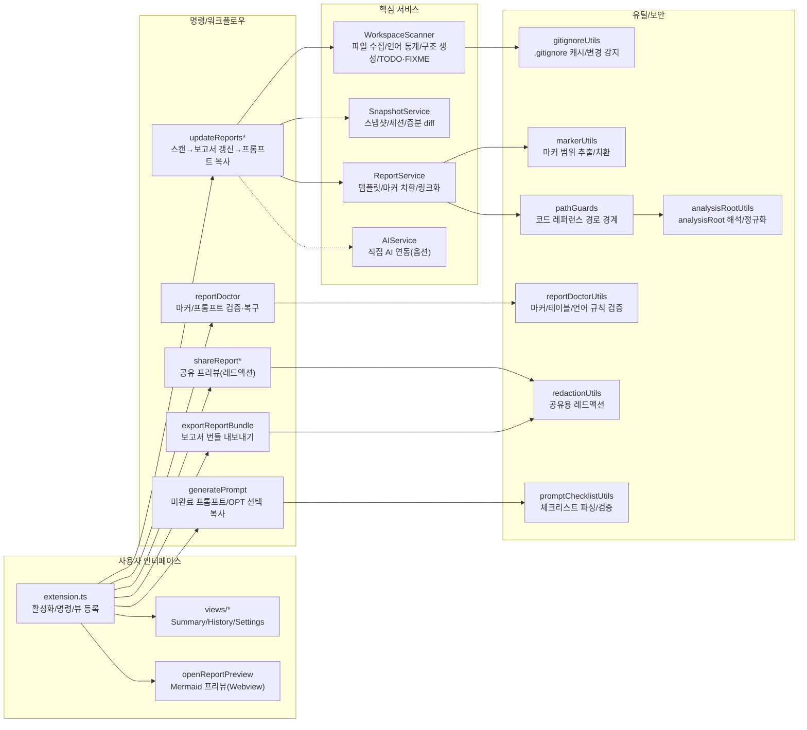

# 📊 프로젝트 종합 평가 보고서

> 이 문서는 Vibe Coding Report VS Code 확장에서 수집한 스냅샷과 세션 데이터를 기반으로, 현재 프로젝트 상태를 정리한 평가 문서입니다.  
> devplan/Session_History.md 파일에는 개별 세션별 상세 로그가 별도로 관리됩니다.

---

## 🎯 프로젝트 목표 및 비전

- **프로젝트 목적**
  - VS Code에서 AI 페어 프로그래밍을 사용할 때, 프로젝트 구조와 변경 이력을 자동으로 분석하여
    - 종합 평가 보고서(프로젝트 종합 평가 보고서)
    - 개선 탐색 보고서(프로젝트 개선 탐색 보고서)
    - AI 실행용 Prompt.md
    를 한 번의 명령으로 생성·유지관리하는 도구입니다.
- **핵심 목표**
  - 워크스페이스를 자동 스캔하여 언어/구조/설정 정보를 수집
  - Git 변경 이력과 결합한 증분 분석 제공
  - AI 모델이 바로 사용할 수 있는 구조화된 프롬프트를 자동 생성
  - 이미 적용된 개선 항목을 추적하여 중복 제안을 줄이고, 세션 히스토리를 시각적으로 관리
- **대상 사용자**
  - GitHub Copilot Chat 등 AI 도구를 활용해 프로젝트를 설계·리팩토링·문서화하는 VS Code 사용자
  - 팀/개인 프로젝트에서 “현재 상태 파악 → 개선 항목 도출 → AI에게 실행 의뢰” 흐름을 반복적으로 사용하는 개발자

---

## 📝 요약(한눈에)
<!-- TLDR-START -->
<!-- AUTO-TLDR-START -->
| 항목 | 내용 |
|:---|:---|
| **현재 버전** | v0.4.28 (2025-12-22) |
| **전체 등급** | 🟢 A- (91점) |
| **전체 점수** | 91/100 |
| **가장 큰 리스크** | 모노레포 구조에서 기능 기반 구조도/엔트리포인트 탐지가 부정확해 리포트 신뢰도가 저하될 수 있음 |
| **권장 최우선 작업** | `scan-structure-001`: 기능 기반 구조도/엔트리포인트 탐지 로직을 모노레포 구조까지 정확히 지원 |
| **다음 우선순위** | `security-sensitive-scan-001`, `config-exclude-001`, `feat-analysisroot-wizard-001`, `opt-gitinfo-cache-001` |
<!-- AUTO-TLDR-END -->
<!-- TLDR-END -->

## ⚠️ 리스크 요약
<!-- RISK-SUMMARY-START -->
<!-- AUTO-RISK-SUMMARY-START -->
| 리스크 레벨 | 항목 | 관련 개선 ID |
|------------|------|-------------|
| 🔴 High | 기능 기반 구조도/엔트리포인트 탐지 로직이 루트 `src/` 가정에 치우쳐 모노레포에서 구조도가 부정확해질 수 있음 | `scan-structure-001` |
| 🟡 Medium | 스캔/분석 프롬프트 경로에 민감 파일(예: `.env`, `*token*`)이 포함될 수 있어 외부 공유/AI 전달 시 노출 위험 | `security-sensitive-scan-001` |
| 🟡 Medium | excludePatterns가 사용자 설정으로 전체 교체될 때 기본 제외 패턴 누락(예: `**/*.vsix`)로 스캔 노이즈/성능 저하 가능 | `config-exclude-001` |
| 🟢 Low | 모노레포에서 analysisRoot 설정이 수동(설정 편집)에 의존해 초기 설정 비용이 발생 | `feat-analysisroot-wizard-001` |
| 🟢 Low | Git 정보(상태/로그) 수집이 대형 레포에서 비용이 커질 수 있어 TTL 캐시 최적화 여지 | `opt-gitinfo-cache-001` |
<!-- AUTO-RISK-SUMMARY-END -->
<!-- RISK-SUMMARY-END -->

---

<!-- AUTO-OVERVIEW-START -->
## 📋 프로젝트 개요

- **프로젝트 목적:** VS Code에서 워크스페이스/분석 루트를 스캔하고 스냅샷·Git diff를 결합해, **평가(점수) → 개선 백로그 → 실행 프롬프트(Prompt.md)**를 자동으로 생성·운영합니다.
- **핵심 목표:** (1) 근거 데이터 수집(언어/구조/설정/TODO·FIXME/변경 요약) (2) 마커 기반 섹션 단위 증분 갱신 (3) 미적용 항목만 유지하는 백로그 운영 (4) AI 에이전트가 순차 실행 가능한 프롬프트 생성 (5) Doctor/프리뷰/세션 히스토리로 운영 검증.
- **대상 사용자:** AI 페어 프로그래밍(Copilot Chat 등)으로 설계·리팩토링·문서화를 반복하는 개발자/팀, “진단→계획→실행” 루프를 VS Code 안에서 표준화하려는 사용자.
- **주요 사용 시나리오:** (A) 주기적 평가(점수/리스크/추이) (B) 변경 영향 확인(스냅샷 diff) (C) 개선 항목을 프롬프트로 변환해 순차 적용 (D) Mermaid 프리뷰/공유 프리뷰/번들 내보내기 (E) 코드 레퍼런스 링크로 즉시 점프.
- **전략적 포지션:** 정적 분석 도구가 아니라, **프로젝트 운영 문서(평가·개선·프롬프트)를 자동화**하여 “AI 실행 가능한 운영 체계”를 제공합니다.

### 기능 기반 패키지 구조도

### 프로젝트 메타 정보

| 항목 | 값 |
|---|---|
| **레포지토리** | `Stankjedi/projectmanager` (`git:107ca76@main`) |
| **확장 버전** | v0.4.28 |
| **분석 기준일** | 2025-12-22 |
| **주요 기술** | TypeScript · VS Code API · Vitest · Mermaid · simple-git · ignore |
| **스냅샷 기준(루트 스캔)** | 파일 166개 / 디렉토리 32개 |
| **언어 구성(스냅샷 기준)** | TS 110 · MD 13 · JSON 10 · JS 8 · CSS 2 · YAML 2 · PS1 2 · YML 1 · SH 1 |
| **Git 상태** | main / 107ca765 *(미커밋 변경 있음: 135개)* |
| **로컬 검증 결과** | `pnpm -C vibereport-extension run compile/lint/test:run/test:coverage` 통과, 테스트 371개, 커버리지 라인 87.89% / 브랜치 70.55% |
<!-- AUTO-OVERVIEW-END -->

---

## 🧩 현재 구현된 기능

| 기능 | 상태 | 설명 | 평가 |
|------|------|------|------|
| 삼중 보고서 시스템(평가/개선/프롬프트) | ✅ 완료 | devplan 디렉토리에 평가·개선·프롬프트 파일을 생성하고, 마커 기반으로 섹션별 갱신을 수행합니다. | 🟢 우수 |
| 워크스페이스 스캔 및 스냅샷 수집 | ✅ 완료 | WorkspaceScanner가 언어 통계, 주요 설정 파일, 디렉토리 구조, Git 정보(옵션)를 수집해 ProjectSnapshot을 구성합니다. | 🟢 우수 |
| Git 기반 변경 분석 (diff) | ✅ 완료 | SnapshotService가 이전 스냅샷과 비교하여 새 파일/삭제 파일/설정 변경/Git 변경 목록을 요약합니다. | 🟢 우수 |
| 보고서 업데이트(프롬프트 생성/복사) | ✅ 완료 | 스캔/보고서 갱신 후 분석 프롬프트를 생성하여 클립보드에 복사 | 🟢 우수 |
| 개선 항목 추출 및 미적용 필터링 | ✅ 완료 | 마크다운에서 P1/P2/P3 개선 항목을 파싱하고, appliedImprovements 기반으로 적용된 항목을 제외합니다. | 🟢 우수 |
| 세션 히스토리 및 통계 관리 | ✅ 완료 | .vscode/vibereport-state.json과 Session_History.md에 세션 목록과 통계를 기록하고, 사이드바 뷰에서 시각화합니다. | 🟢 우수 |
| VS Code 사이드바 Summary/History/Settings 뷰 | ✅ 완료 | Summary(요약) Webview, History TreeView, Settings Webview를 통해 보고서 상태와 설정을 한 곳에서 관리합니다. | 🟢 우수 |
| 개선 항목 프롬프트 생성(Generate Prompt) | ✅ 완료 | 개선 보고서에서 미적용 항목을 QuickPick UI로 선택해 Prompt.md를 생성하고 클립보드에 복사합니다. | 🟢 우수 |
| 프로젝트 비전 설정 | ✅ 완료 | QuickPick/Input UI로 프로젝트 비전을 설정하고, Settings 패널에서 직접 모드/유형/단계를 변경할 수 있습니다. | 🟢 우수 |
| 테스트 및 CI 파이프라인 | ✅ 완료 | 로컬 기준 단위 테스트 371개 및 커버리지 실행이 통과하며, 레포 루트 `.github/workflows/ci.yml` 기반으로 GitHub Actions CI가 동작합니다. | 🟢 우수 |
| 점수-등급 일관성 시스템 | ✅ 완료 | SCORE_GRADE_CRITERIA 상수와 scoreToGrade/gradeToColor 헬퍼 함수로 일관된 평가를 보장합니다. | 🟢 우수 |
| 파트별 순차 작성 지침 | ✅ 완료 | AI 에이전트 출력 길이 제한 방지를 위한 파트별 분리 작성 가이드라인을 제공합니다. | 🟢 우수 |
| 보고서 프리뷰 공유(클립보드 + Webview) | ✅ 완료 | 평가 보고서의 요약(한눈에)/점수 요약을 추출해 외부 공유용 프리뷰를 생성 | 🔵 양호 |
| 보고서 번들 내보내기 | ✅ 완료 | 평가/개선/프롬프트 + 공유 프리뷰를 타임스탬프 폴더로 내보내 공유·아카이브를 지원 | 🔵 양호 |
| 코드 레퍼런스 열기 | ✅ 완료 | 보고서/프롬프트 내 코드 참조 링크로 파일·심볼을 바로 열기 | 🔵 양호 |
| AI 직접 연동 실행(언어 모델 API) | ✅ 완료(옵션) | `enableDirectAi` 설정 시 분석 프롬프트를 VS Code 언어 모델 API로 실행하고 결과를 클립보드/문서로 제공합니다(취소/폴백 포함). | 🔵 양호 |
| Webview 보안/설정 UI 정합성 | ✅ 완료 | Webview CSP/nonce, escapeHtml 기반 이스케이프, 링크 허용 목록 등 기본 방어가 적용되어 있습니다. Settings 저장은 변경 감지(딥이퀄) 후 update로 불필요 I/O를 줄였습니다. | 🔵 양호 |

---

<!-- AUTO-SCORE-START -->
## 📊 종합 점수 요약

> **평가 기준일:** 2025-12-22  
> 아래 점수는 로컬 검증(`pnpm -C vibereport-extension run compile/lint/test:run/test:coverage`) 결과, 커버리지(라인/브랜치), 코드 구조(응집도/모듈 분리), 보안(경로 경계/레드액션/Doctor), 배포·운영 준비도를 종합하여 산정했습니다.

### 점수 ↔ 등급 기준표

| 점수 범위 | 등급 | 색상 | 의미 |
|:---:|:---:|:---:|:---:|
| 97–100 | A+ | 🟢 | 최우수 |
| 93–96 | A | 🟢 | 우수 |
| 90–92 | A- | 🟢 | 우수 |
| 87–89 | B+ | 🔵 | 양호 |
| 83–86 | B | 🔵 | 양호 |
| 80–82 | B- | 🔵 | 양호 |
| 77–79 | C+ | 🟡 | 보통 |
| 73–76 | C | 🟡 | 보통 |
| 70–72 | C- | 🟡 | 보통 |
| 67–69 | D+ | 🟠 | 미흡 |
| 63–66 | D | 🟠 | 미흡 |
| 60–62 | D- | 🟠 | 미흡 |
| 0–59 | F | 🔴 | 부족 |

### 전역 점수표

| 항목 | 점수 (100점 만점) | 등급 | 변화 |
|------|------------------|------|------|
| **코드 품질** | 93 | 🟢 A | ⬆️ +1 |
| **아키텍처 설계** | 92 | 🟢 A- | ➖ |
| **보안** | 92 | 🟢 A- | ⬆️ +4 |
| **성능** | 90 | 🟢 A- | ⬆️ +1 |
| **테스트 커버리지** | 93 | 🟢 A | ⬆️ +1 |
| **에러 처리** | 91 | 🟢 A- | ⬆️ +1 |
| **문서화** | 88 | 🔵 B+ | ⬆️ +1 |
| **확장성** | 92 | 🟢 A- | ⬆️ +1 |
| **유지보수성** | 91 | 🟢 A- | ⬆️ +1 |
| **프로덕션 준비도** | 92 | 🟢 A- | ⬆️ +1 |
| **총점 평균** | **91** | 🟢 A- | ⬆️ +1 |

### 점수 산출 메모 (요약)

- **테스트/품질(상):** 로컬 기준 `compile`/`lint`/`test:run`/`test:coverage`가 모두 통과하며, **371개** 테스트가 안정적으로 유지됩니다. 커버리지는 라인 **87.89%** / 브랜치 **70.55%**로, 핵심 경로 회귀 탐지력이 확보되어 있습니다.
- **프로덕션 준비도(상):** `.github/workflows/ci.yml`로 CI 검증이 정형화되어 있고, Report Doctor(검증/복구) + Mermaid 프리뷰 + 세션 히스토리까지 운영 기능이 갖춰져 있습니다.
- **성능/운영(중상):** 파일 목록 캐시(설정/`.gitignore` mtime 포함)와 내용 동일 시 write 스킵 등 기본 최적화가 반영되어 있습니다. 다만 대형 레포에서는 TODO/FIXME 스캔 I/O를 더 줄일 여지가 있습니다(OPT 후보).
- **보안(상):** 코드 레퍼런스 링크화 단계의 루트 경계 검증 + `openFunctionInFile`의 워크스페이스/analysisRoot 경계 차단 + 공유 프리뷰 레드액션 + Webview CSP/이스케이프가 적용되어 있습니다. 남은 과제는 보안 경계 로직의 회귀 테스트를 더 촘촘히 고정하는 것입니다.
<!-- AUTO-SCORE-END -->

---

## 🔗 점수 ↔ 개선 항목 매핑
<!-- SCORE-MAPPING-START -->
<!-- AUTO-SCORE-MAPPING-START -->
| 카테고리 | 현재 점수 | 주요 리스크 | 관련 개선 항목 ID |
|----------|----------|------------|------------------|
| 아키텍처 설계 | 92 (🟢 A-) | 기능 기반 구조도/엔트리포인트 탐지 로직이 모노레포 구조를 충분히 반영하지 못함 | `scan-structure-001` |
| 보안 | 92 (🟢 A-) | 민감 파일이 스캔/프롬프트 경로에 포함될 가능성(외부 공유/AI 전달 시 노출) | `security-sensitive-scan-001` |
| 성능 | 90 (🟢 A-) | excludePatterns 기본값 누락 시 대형 아티팩트 스캔/노이즈 증가 | `config-exclude-001` |
| 프로덕션 준비도 | 92 (🟢 A-) | Git 정보 수집 비용(대형 레포) 및 캐시 전략 보강 여지 | `opt-gitinfo-cache-001` |
| 사용성/확장성 | 92 (🟢 A-) | 모노레포에서 analysisRoot 설정 UX(가이드/QuickPick) 부재 | `feat-analysisroot-wizard-001` |
<!-- AUTO-SCORE-MAPPING-END -->
<!-- SCORE-MAPPING-END -->

---

## 🔍 기능별 상세 평가

> **관찰 근거:** `pnpm -C vibereport-extension run compile/lint/test:run/test:coverage` 통과(2025-12-22), 테스트 **371개**, 커버리지 라인 **87.89%** / 브랜치 **70.55%**.

| 모듈/서비스 | 기능 완성도 | 코드 품질 | 에러 처리 | 성능 | 요약 평가 |
|-------------|------------:|----------:|----------:|------:|-----------|
| **확장 진입점/명령** | 93/100 | 91/100 | 90/100 | 89/100 | 운영 워크플로우가 폭넓게 구현됨. 분석 프롬프트/스캔의 민감정보 보호 기본값 강화 여지. |
| **스캔/스냅샷** | 94/100 | 90/100 | 89/100 | 89/100 | 파일 수집/언어 통계/캐시가 견고함. 모노레포에서 기능 기반 구조도가 `src/` 루트 가정으로 부정확할 수 있음 → `scan-structure-001`. |
| **보고서 생성/검증(Doctor)** | 94/100 | 89/100 | 91/100 | 90/100 | 마커 기반 갱신+Doctor 복구로 운영 안정성이 높음. |
| **프리뷰/공유(mermaid)** | 92/100 | 88/100 | 89/100 | 88/100 | Mermaid 프리뷰 + 공유 프리뷰(레드액션) + 번들 내보내기 제공. 모노레포 UX(analysisRoot 안내/설정) 개선 여지. |
| **UI(Views)/설정** | 91/100 | 89/100 | 89/100 | 88/100 | Summary/History/Settings UI로 실행·기록 경험이 좋음. HTML 생성 경로의 공통화/표준화 후보. |
| **AI 연동(옵션)** | 86/100 | 87/100 | 86/100 | 86/100 | VS Code 언어 모델 API 기반 직접 실행/폴백 제공. 모델/권한/정책 변화에 대한 운영 리스크 존재. |

### 1) 확장 진입점/명령 레이어 (`vibereport-extension/src/extension.ts`, `vibereport-extension/src/commands/*`)
- **기능 완성도:** 업데이트/전체 워크스페이스 업데이트/프롬프트 생성/프리뷰/Doctor 등 “운영 루프”에 필요한 명령이 폭넓게 구현되어 있습니다.
- **코드 품질:** 테스트 **371개**가 통과하며, 주요 명령의 실패/취소 경로가 테스트로 고정되어 있습니다.
- **에러 처리:** 사용자 메시지 + OutputChannel 로그가 일관적이며, 직접 AI 실행(enableDirectAi)도 취소/폴백 경로가 마련되어 있습니다.
- **강점:** Report Doctor/공유 프리뷰/번들 내보내기까지 “운영 기능”이 명령 레이어에 잘 통합되어 있습니다.
- **약점 / 리스크:** 스캔 결과/분석 프롬프트가 클립보드·AI로 전달되는 경로가 있으므로, **민감 파일을 기본적으로 제외/마스킹**하는 안전장치가 필요합니다 → `security-sensitive-scan-001`.

### 2) 워크스페이스 스캔/스냅샷 (`vibereport-extension/src/services/workspaceScanner.ts`, `vibereport-extension/src/services/workspaceScanner/*`, `vibereport-extension/src/services/snapshotService.ts`)
- **기능 완성도:** 언어 통계, 주요 설정 파일 탐지, 구조 다이어그램, Git 정보/변경 요약, TODO/FIXME 스캔까지 보고서 근거 데이터를 제공합니다.
- **코드 품질:** `fileCollector.ts`/`languageStats.ts`/`todoFixmeScanner.ts`로 주요 기능이 분리되어 확장성이 좋아졌습니다.
- **성능:** 파일 목록 캐시가 `.gitignore` mtime까지 포함해 무효화되며, TODO/FIXME 스캔은 mtime/size 기반 증분 캐시로 반복 I/O를 줄입니다.
- **약점 / 리스크:** 기능 기반 구조도/엔트리포인트 탐지가 **루트 `src/` 가정**에 치우쳐, 모노레포(예: `vibereport-extension/src/*`)에서는 구조도가 부정확해질 수 있습니다 → `scan-structure-001`.
- **약점 / 리스크:** excludePatterns가 사용자 설정으로 “전체 교체”될 때 기본 제외(예: `**/*.vsix`)가 누락될 수 있어 스캔 노이즈/성능 저하가 발생할 수 있습니다 → `config-exclude-001`.

### 3) 보고서 생성/마커 갱신/복구 (`vibereport-extension/src/services/reportService.ts`, `vibereport-extension/src/utils/*`)
- **기능 완성도:** 마커 기반 섹션 갱신, 적용 완료 항목 클린업, Doctor 검증/복구, 코드 레퍼런스 링크화까지 운영 기능이 풍부합니다.
- **코드 품질/테스트:** reportService 하위 모듈(`sessionHistoryUtils`, `improvementFormatting` 등)로 분리되어 단일 파일 책임이 완화되었습니다. 다만 분기 커버리지(브랜치 50%대)는 지속적으로 보강 여지가 있습니다.
- **에러 처리:** 마커 손상/누락 시 복구 로직(Doctor)과 방어 코드가 있으며, 사용자에게 경고/오류 메시지를 제공합니다.
- **성능:** 내용 동일 시 write를 스킵하여 변경 노이즈를 줄였습니다(특히 자동 업데이트와 궁합이 좋음).
- **강점:** “마커 기반 증분 업데이트”로 히스토리를 보존하면서도 자동 갱신이 가능해 운영 효율이 높습니다.
- **리스크:** Prompt.md 포맷 변경에 대한 파서 견고성은 테스트로 고정되어야 하며, Doctor 검증 규칙과 함께 유지될 필요가 있습니다.

### 4) 프리뷰/마크다운 렌더링 (`vibereport-extension/src/commands/openReportPreview.ts`, `vibereport-extension/media/*`)
- **기능 완성도:** Mermaid 지원 프리뷰(Webview)와 외부 공유용 프리뷰 생성(HTML)까지 제공해 UX가 좋습니다.
- **코드 품질:** 커스텀 렌더러/파서 경로는 기능 확장 시 회귀 가능성이 있어 스냅샷/테이블 케이스 기반 테스트가 중요합니다.
- **보안/에러 처리:** CSP/nonce, escapeHtml 등 기본 방어가 적용되어 있습니다.
- **확장 아이디어:** 모노레포에서 분석 루트(analysisRoot)를 쉽게 안내/설정할 수 있는 UX를 추가하면 초기 설정 부담을 줄일 수 있습니다 → `feat-analysisroot-wizard-001`.

### 5) UI(Views)/설정 (`vibereport-extension/src/views/*`)
- **기능 완성도:** Summary(Webview)·History(Tree)·Settings(Webview) 3축 UI로 “상태 확인 → 실행 → 기록” 흐름을 UI에서 관리할 수 있습니다.
- **코드 품질:** Settings는 키 검증/디폴트/딥이퀄 기반으로 안정적이며, HTML 생성이 `settingsViewHtml.ts`로 분리되어 유지보수성이 개선되었습니다(499L).
- **에러 처리:** 설정 값 검증 실패 시 사용자에게 메시지로 안내하며, 잘못된 값은 기본값으로 회귀할 수 있습니다.
- **성능:** 변경 없는 설정 update 스킵 등 불필요 I/O를 줄이는 패턴이 반영되어 있습니다.
- **약점 / 리스크:** 일부 Webview/패널 HTML 문자열 조립 경로는 값 이스케이프 정책을 일관되게 적용할 필요가 있습니다(표준화/공통 유틸화 후보).

### 6) 배포/운영 준비도(Repo 레벨)
- **현 상태:** 번들(esbuild)·패키징(vsce)·테스트/커버리지 스크립트가 갖춰져 있으며, 레포 루트 `.github/workflows/ci.yml`로 CI가 활성화되어 있습니다.
- **리스크:** 기능이 넓은 만큼 핵심 워크플로우/보고서 생성 경로의 “경계(보안/예외)” 테스트와 모듈 분리가 지속적으로 필요합니다(상단 개선 항목 참조).

---

<!-- AUTO-SUMMARY-START -->
## 📈 현재 상태 요약

- **종합 준비도:** 🟢 **A- (91/100)**
  - 로컬 기준 `pnpm -C vibereport-extension run compile/lint/test:run/test:coverage` 통과, 테스트 **371개**, 커버리지 라인 **87.89%** / 브랜치 **70.55%**로 품질 게이트가 안정화되었습니다.
  - 레포 루트 `.github/workflows/ci.yml` 기반으로 CI 자동 검증을 운영할 수 있는 상태입니다.

- **강점 (Top 3):**
  1. **마커 기반 증분 업데이트 + Doctor:** 섹션별 갱신과 검증/복구로 문서 운영이 견고합니다.
  2. **운영 UX:** 공유 프리뷰(레드액션) + 번들 내보내기 등 “외부 공유/아카이브” 동선이 마련되어 있습니다.
  3. **테스트 기반:** **371개** 테스트 + 높은 커버리지로 회귀 탐지력이 높습니다.

- **즉시 권장 조치 (Top 3):**
  1. **아키텍처/리포트 신뢰성 (P1):** 기능 기반 구조도/엔트리포인트 탐지의 모노레포 지원 강화 (`scan-structure-001`).
  2. **보안 (P2):** 스캔/프롬프트에서 민감 파일 기본 제외(및 필요 시 레드액션) 적용 (`security-sensitive-scan-001`).
  3. **성능/운영 (P2):** excludePatterns 기본값 보존(병합 옵션)으로 아티팩트 스캔 노이즈 차단 (`config-exclude-001`).
<!-- AUTO-SUMMARY-END -->

---

## 📈 평가 추이
<!-- TREND-START -->
<!-- AUTO-TREND-START -->
| 버전 | 날짜 | 총점 | 비고 |
|:---:|:---:|:---:|:---|
| **git:4c7949b@main** | 2025-12-20 | **88 (B+)** | - |
| **git:107ca76@main** | 2025-12-20 | **89 (B+)** | - |
| **git:107ca76@main** | 2025-12-22 | **88 (B+)** | - |
| **git:107ca76@main** | 2025-12-22 | **90 (A-)** | - |
| **git:107ca76@main** | 2025-12-22 | **91 (A-)** | - |

| 카테고리 | 점수 | 등급 | 변화 |
|:---|:---:|:---:|:---:|
| 코드 품질 | 93 | 🟢 A | ⬆️ +1 |
| 아키텍처 설계 | 92 | 🟢 A- | - |
| 보안 | 92 | 🟢 A- | ⬆️ +4 |
| 성능 | 90 | 🟢 A- | ⬆️ +1 |
| 테스트 커버리지 | 93 | 🟢 A | ⬆️ +1 |
| 에러 처리 | 91 | 🟢 A- | ⬆️ +1 |
| 문서화 | 88 | 🔵 B+ | ⬆️ +1 |
| 확장성 | 92 | 🟢 A- | ⬆️ +1 |
| 유지보수성 | 91 | 🟢 A- | ⬆️ +1 |
| 프로덕션 준비도 | 92 | 🟢 A- | ⬆️ +1 |
<!-- AUTO-TREND-END -->
<!-- TREND-END -->
