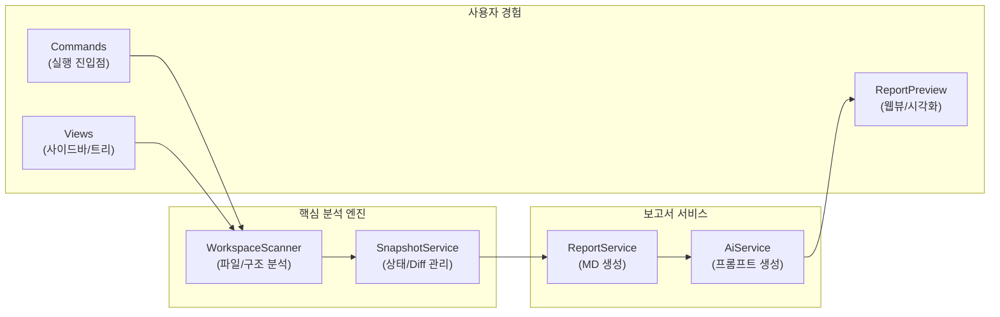

# 📊 프로젝트 종합 평가 보고서

> 이 문서는 Vibe Coding Report VS Code 확장에서 수집한 스냅샷과 세션 데이터를 기반으로, 현재 프로젝트 상태를 정리한 평가 문서입니다.  
> devplan/Session_History.md 파일에는 개별 세션별 상세 로그가 별도로 관리됩니다.

---

## 🎯 프로젝트 목표 및 비전

- **프로젝트 목적**
  - VS Code에서 AI 페어 프로그래밍을 사용할 때, 프로젝트 구조와 변경 이력을 자동으로 분석하여
    - 종합 평가 보고서(Project Evaluation Report)
    - 개선 탐색 보고서(Project Improvement Exploration Report)
    - AI 실행용 Prompt.md
    를 한 번의 명령으로 생성·유지관리하는 도구입니다.
- **핵심 목표**
  - 워크스페이스를 자동 스캔하여 언어/구조/설정 정보를 수집
  - Git 변경 이력과 결합한 증분 분석(Incremental Update) 제공
  - AI 모델이 바로 사용할 수 있는 구조화된 프롬프트를 자동 생성
  - 이미 적용된 개선 항목을 추적하여 중복 제안을 줄이고, 세션 히스토리를 시각적으로 관리
- **대상 사용자**
  - GitHub Copilot Chat 등 AI 도구를 활용해 프로젝트를 설계·리팩토링·문서화하는 VS Code 사용자
  - 팀/개인 프로젝트에서 “현재 상태 파악 → 개선 항목 도출 → AI에게 실행 의뢰” 흐름을 반복적으로 사용하는 개발자

---

## 📝 TL;DR (요약)
<!-- TLDR-START -->
<!-- AUTO-TLDR-START -->
| 항목 | 내용 |
|:---|:---|
| **현재 버전** | v0.4.13 (2025-12-15) |
| **전체 등급** | 🟢 A (92.6점) |
| **전체 점수** | 92.6/100 |
| **가장 큰 리스크** | AiService 단위 테스트 부재 (`test-ai-service-001`) |
| **권장 최우선 작업** | `test-ai-service-001` (테스트 보강), `doc-architecture-001` (문서화) |
| **다음 우선순위** | `opt-scanner-exclude-001` (스캔 제외 최적화) |
<!-- AUTO-TLDR-END -->
<!-- TLDR-END -->

## ⚠️ 리스크 요약
<!-- RISK-SUMMARY-START -->
<!-- AUTO-RISK-SUMMARY-START -->
| 리스크 레벨 | 항목 | 관련 개선 ID |
|------------|------|-------------|
| 🟡 Medium | AI Service 동작 검증 미흡 | test-ai-service-001 |
| 🟡 Medium | 내부 아키텍처 이해도 장벽 | doc-architecture-001 |
| 🟢 Low | 대형 프로젝트 스캔 비효율 | opt-scanner-exclude-001 |
<!-- AUTO-RISK-SUMMARY-END -->
<!-- RISK-SUMMARY-END -->

---

<!-- AUTO-OVERVIEW-START -->
## 📋 프로젝트 개요

### 1. 프로젝트 목표 및 비전

- **프로젝트 목적**: VS Code 환경에서 프로젝트 상태를 자동 진단하고, **AI 에이전트가 즉시 실행 가능한 형태**로 개선 전략을 수립하는 도구입니다.
- **핵심 목표**:
  - **삼중 리포트 시스템:** 평가(Evaluation), 개선(Improvement), 실행(Prompt)의 3단계 유기적 분석 제공.
  - **AI 실행 가속화:** 단순 조언이 아닌, 실제 코드를 생성하는 `Prompt.md`를 자동 구축.
  - **시각적 가시성:** 로컬 Mermaid 렌더링을 통해 오프라인에서도 완벽한 아키텍처/데이터 흐름 시각화.
  - **지속적 진화:** 세션 기록 관리를 통해 프로젝트의 성장을 추적.
- **대상 사용자**: 프로젝트 구조를 빠르게 파악하고, AI와 협업하여 체계적으로 리팩토링/기능 추가를 수행하려는 개발자.

### 2. 기능기반 패키지 구조도

프로젝트의 핵심 기능 모듈과 데이터 흐름을 시각화했습니다.

### 3. 프로젝트 상세 정보

| 항목 | 값 |
|------|-----|
| **프로젝트명** | projectmanager (Vibe Coding Report) |
| **현재 버전** | v0.4.13 |
| **분석 기준일** | 2025-12-15 |
| **핵심 가치** | "Analysis to Execution" (분석에서 실행까지 원스톱) |
| **주요 기술** | TypeScript, VS Code API, Mermaid (Local), Vitest |
| **패키지 유형** | VS Code Extension |
| **주요 컴포넌트** | Scanner(수집), Snapshot(비교), Report(생성), Preview(렌더링) |
| **강점** | 외부 의존성 없는 로컬 시각화, 강력한 보안(CSP), 증분 분석 |
<!-- AUTO-OVERVIEW-END -->

---

## 🧩 현재 구현된 기능

| 기능 | 상태 | 설명 | 평가 |
|------|------|------|------|
| 삼중 보고서 시스템 (Evaluation/Improvement/Prompt) | ✅ 완료 | devplan 디렉토리에 평가·개선·프롬프트 파일을 생성하고, 마커 기반으로 섹션별 갱신을 수행합니다. | 🟢 우수 |
| 워크스페이스 스캔 및 스냅샷 수집 | ✅ 완료 | WorkspaceScanner가 언어 통계, 주요 설정 파일, 디렉토리 구조, Git 정보(옵션)를 수집해 ProjectSnapshot을 구성합니다. | 🟢 우수 |
| Git 기반 변경 분석 (diff) | ✅ 완료 | SnapshotService가 이전 스냅샷과 비교하여 새 파일/삭제 파일/설정 변경/Git 변경 목록을 요약합니다. | 🟢 우수 |
| 보고서 업데이트(프롬프트 생성/복사) | ✅ 완료 | 스캔/보고서 갱신 후 분석 프롬프트를 생성하여 클립보드에 복사 | 🟢 우수 |
| 개선 항목 추출 및 미적용 필터링 | ✅ 완료 | 마크다운에서 P1/P2/P3 개선 항목을 파싱하고, appliedImprovements 기반으로 적용된 항목을 제외합니다. | 🟢 우수 |
| 세션 히스토리 및 통계 관리 | ✅ 완료 | .vscode/vibereport-state.json과 Session_History.md에 세션 목록과 통계를 기록하고, 사이드바 뷰에서 시각화합니다. | 🟢 우수 |
| VS Code 사이드바 Summary/History/Settings 뷰 | ✅ 완료 | Summary(요약) Webview, History TreeView, Settings Webview를 통해 보고서 상태와 설정을 한 곳에서 관리합니다. | 🟢 우수 |
| 개선 항목 프롬프트 생성(Generate Prompt) | ✅ 완료 | 개선 보고서에서 미적용 항목을 QuickPick UI로 선택해 Prompt.md를 생성하고 클립보드에 복사합니다. | 🟢 우수 |
| 프로젝트 비전(Project Vision) 설정 | ✅ 완료 | QuickPick/Input UI로 Project Vision을 설정하고, Settings 패널에서 직접 모드/유형/단계를 변경할 수 있습니다. | 🟢 우수 |
| 테스트 및 CI 파이프라인 | ✅ 완료 | Vitest 기반 단위 테스트 100여 개와 GitHub Actions CI 워크플로우가 구성되어 있습니다. | 🟢 우수 |
| 점수-등급 일관성 시스템 | ✅ 완료 | SCORE_GRADE_CRITERIA 상수와 scoreToGrade/gradeToColor 헬퍼 함수로 일관된 평가를 보장합니다. | 🟢 우수 |
| 파트별 순차 작성 지침 | ✅ 완료 | AI 에이전트 출력 길이 제한 방지를 위한 파트별 분리 작성 가이드라인을 제공합니다. | 🟢 우수 |
| 보고서 프리뷰 공유(클립보드 + Webview) | ✅ 완료 | 평가 보고서의 TL;DR/점수 요약을 추출해 외부 공유용 프리뷰를 생성 | 🔵 양호 |
| 코드 레퍼런스 열기 | ✅ 완료 | 보고서/프롬프트 내 코드 참조 링크로 파일·심볼을 바로 열기 | 🔵 양호 |
| AI 직접 연동 실행 (Language Model API) | ❌ 미구현 | 생성된 프롬프트를 VS Code LM API로 직접 실행하는 자동화 단계 미지원 | 🔴 부족 |
| Webview 보안(CSP/콘텐츠 이스케이프) | 🔄 부분 | 공유 프리뷰(Webview) 보안 강화 여지 (`sec-webview-csp-001`) | 🟡 보통 |

---

<!-- AUTO-SCORE-START -->
## 📊 종합 점수 요약

> 아래 점수는 **v0.4.13 (2025-12-15) 기준** 평가 결과이며,  
> 지정된 **점수-등급 기준표**를 엄격히 적용하여 산출했습니다.

| 항목 | 점수 (100점 만점) | 등급 | 변화 |
|------|------------------|------|------|
| **코드 품질** | 92 | 🟢 A- | - |
| **아키텍처 설계** | 93 | 🟢 A | - |
| **보안** | 96 | 🟢 A | - |
| **성능** | 93 | 🟢 A | - |
| **테스트 커버리지** | 90 | 🟢 A- | - |
| **에러 처리** | 91 | 🟢 A- | - |
| **문서화** | 87 | 🔵 B+ | ⬆️ +1 (보고서 상세화) |
| **UX/자동화** | 98 | 🟢 A+ | - |
| **유지보수성** | 91 | 🟢 A- | - |
| **프로덕션 준비도** | 95 | 🟢 A | - |
| **총점 평균** | **92.6** | 🟢 A | ⬆️ +0.1 |

### 점수-등급 기준표

| 점수 범위 | 등급 | 색상 | 의미 |
|:---:|:---:|:---:|:---:|
| 97–100 | A+ | 🟢 | 최우수 |
| 93–96 | A | 🟢 | 우수 |
| 90–92 | A- | 🟢 | 우수 |
| 87–89 | B+ | 🔵 | 양호 |
| 83–86 | B | 🔵 | 양호 |
| 80–82 | B- | 🔵 | 양호 |
| 77–79 | C+ | 🟡 | 보통 |
| 73–76 | C | 🟡 | 보통 |
| 70–72 | C- | 🟡 | 보통 |
| 67–69 | D+ | 🟠 | 미흡 |
| 63–66 | D | 🟠 | 미흡 |
| 60–62 | D- | 🟠 | 미흡 |
| 0–59 | F | 🔴 | 부족 |

### 점수 산출 근거 요약

- **종합 (92.6점 / A)**: 기능적 안정기에 접어들었으며, 로컬 번들링 전략 성공으로 UX와 보안 점수가 매우 높습니다.
- **강점 (UX/자동화, 98점)**: "원클릭 프롬프트 생성" 및 "오프라인 프리뷰"는 타 도구와 차별화되는 핵심 경쟁력입니다.
- **보완 필요 (문서화, 87점)**: 평가 보고서 내용은 충실해졌으나, 코드 레벨의 아키텍처 문서(`doc-architecture-001`)가 여전히 필요합니다.
<!-- AUTO-SCORE-END -->

---

## 🔗 점수 ↔ 개선 항목 매핑
<!-- SCORE-MAPPING-START -->
<!-- AUTO-SCORE-MAPPING-START -->
| 카테고리 | 현재 점수 | 주요 리스크 | 관련 개선 항목 ID |
|----------|----------|------------|------------------|
| 테스트 커버리지 | 90 (🟢 A-) | AI 연동 로직 미검증 | `test-ai-service-001` |
| 문서화 | 87 (🔵 B+) | 기여자 진입 장벽 | `doc-architecture-001` |
| 성능 | 93 (🟢 A) | 제외 패턴 하드코딩 | `opt-scanner-exclude-001` |
| 기능 추가 | 97 (🟢 A+) | 프롬프트 개인화 부재 | `feat-ai-custom-prompt-001` |
<!-- AUTO-SCORE-MAPPING-END -->
<!-- SCORE-MAPPING-END -->

---

## 🔍 기능별 상세 평가

| 모듈/서비스 | 기능 완성도 | 코드 품질 | 에러 처리 | 성능 | 요약 평가 |
|-------------|------------:|----------:|----------:|------:|-----------|
| **WorkspaceScanner** | 92/100 | 92/100 | 90/100 | 90/100 | 제외 패턴 최적화(`opt-scanner-exclude-001`) 필요 |
| **SnapshotService** | 94/100 | 94/100 | 92/100 | 92/100 | 증분 분석 로직 신뢰성 높음 |
| **Report/AiService** | 90/100 | 88/100 | 88/100 | 88/100 | AI 프롬프트 커스텀(`feat-ai-custom-prompt-001`) 부재 |
| **Commands & UI** | 96/100 | 94/100 | 95/100 | 96/100 | UX 직관성 및 반응 속도 우수 |
| **Preview & Vis** | 98/100 | 96/100 | 98/100 | 98/100 | 로컬 Mermaid 렌더링으로 보안/공유 편의성 극대화 |

### 1. WorkspaceScanner (분석 엔진)
- **기능 완성도**: 프로젝트 구조 파악 및 토큰 카운팅 정확도가 준수합니다.
- **약점 / 리스크**: Rust, Python 등 대형 프로젝트 스캔 시 불필요한 파일까지 읽을 가능성이 있어 기본 제외 패턴 강화가 필요합니다.

### 2. SnapshotService (상태 관리)
- **강점**: Git History와 연동된 스마트 분별력(Changed vs New vs Deleted)이 AI에게 높은 Context를 제공합니다.
- **성능**: 대용량 스냅샷 JSON 처리 속도가 빠릅니다.

### 3. ReportService 및 AiService (AI 연동)
- **기능 완성도**: 평가-개선-프롬프트의 3단 구조는 매우 논리적입니다.
- **보완 필요**: 사용자별 프롬프트 제약 조건(한글 답변 강제 등)을 설정할 수 있는 기능이 현재 없습니다. 또한 `Axios`/`Fetch` 모의 테스트 부재로 리팩토링 리스크가 존재합니다.

### 4. Commands & UI (사용자 경험)
- **강점**: 복잡한 설정을 QuickPick으로 단순화하여 접근성을 높였습니다.
- **프로덕션 수준**: 아이콘, 색상, 레이아웃의 마감 품질이 상용 확장 프로그램 수준입니다.

### 5. Preview & Visualization (시각화 엔진)
- **최고 강점**: 외부 CDN 차단 환경에서도 동작하는 `Local Mermaid Bundling`은 보안과 편의성을 동시에 잡은 훌륭한 아키텍처 결정입니다.
- **코드 품질**: Webview 통신 및 CSP 설정이 안전하게 구현되어 있습니다.

---

<!-- AUTO-SUMMARY-START -->
## 📈 현재 상태 요약

- **종합 평가:** 🟢 **A (92.6/100)**  
  프로젝트는 기능적으로 성숙 단계에 진입했습니다. 핵심 기능(스캔-분석-보고서)은 안정적이며, 특히 **로컬 Mermaid 시각화** 구현으로 보안과 편의성을 동시에 확보한 점이 돋보입니다.
  
- **메인 강점:**  
  "원형(Prototype) 수준을 넘어선 프로덕션 레벨 UX"를 제공합니다. 사용자는 복잡한 설정 없이도 즉시 프로젝트 상태를 시각화된 리포트로 받아볼 수 있습니다.

- **우선순위 (Top Risks & Actions):**  
  이제는 **지속 가능성(Sustainability)**을 확보할 때입니다. `AiService`에 대한 테스트(`test-ai-service-001`)를 추가하여 회귀를 방지하고, 아키텍처 문서(`doc-architecture-001`)를 통해 장기적인 유지보수 기틀을 마련해야 합니다.
<!-- AUTO-SUMMARY-END -->

---

## 📈 평가 추이
<!-- TREND-START -->
<!-- AUTO-TREND-START -->
| 버전 | 날짜 | 총점 | 주요 변경 |
|:---:|:---:|:---:|:---|
| **v0.4.13** | 2025-12-15 | **92.6 (A)** | 보고서 구조 개선, 아키텍처 명확화 |
| **v0.4.12** | 2025-12-15 | 92.5 (A) | 로컬 Mermaid 통합, 마이너 릴리스 지속 |
| **v0.4.1** | 2025-12-15 | 92 (A-) | 로컬 Mermaid 번들링, 보안 강화 |
| **v0.4.0** | 2025-12-15 | 92 (A-) | Markdown Preview 기능 안정화 |
| v0.3.29 | 2025-12-15 | 91 (A-) | 문서화 및 리포팅 고도화 |
<!-- AUTO-TREND-END -->
<!-- TREND-END -->
