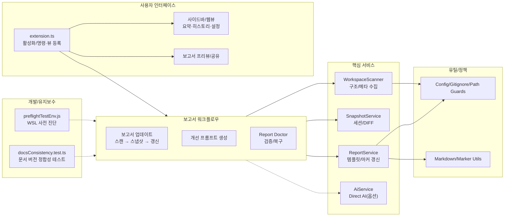

# 📊 프로젝트 종합 평가 보고서

> 이 문서는 Vibe Coding Report VS Code 확장에서 수집한 스냅샷과 세션 데이터를 기반으로, 현재 프로젝트 상태를 정리한 평가 문서입니다.  
> devplan/Session_History.md 파일에는 개별 세션별 상세 로그가 별도로 관리됩니다.

---

## 🎯 프로젝트 목표 및 비전

- **프로젝트 목적**
  - VS Code에서 AI 페어 프로그래밍을 사용할 때, 프로젝트 구조와 변경 이력을 자동으로 분석하여
    - 종합 평가 보고서(프로젝트 종합 평가 보고서)
    - 개선 탐색 보고서(프로젝트 개선 탐색 보고서)
    - AI 실행용 Prompt.md
    를 한 번의 명령으로 생성·유지관리하는 도구입니다.
- **핵심 목표**
  - 워크스페이스를 자동 스캔하여 언어/구조/설정 정보를 수집
  - Git 변경 이력과 결합한 증분 분석 제공
  - AI 모델이 바로 사용할 수 있는 구조화된 프롬프트를 자동 생성
  - 이미 적용된 개선 항목을 추적하여 중복 제안을 줄이고, 세션 히스토리를 시각적으로 관리
- **대상 사용자**
  - GitHub Copilot Chat 등 AI 도구를 활용해 프로젝트를 설계·리팩토링·문서화하는 VS Code 사용자
  - 팀/개인 프로젝트에서 “현재 상태 파악 → 개선 항목 도출 → AI에게 실행 의뢰” 흐름을 반복적으로 사용하는 개발자

---

## 📝 요약(한눈에)
<!-- TLDR-START -->
<!-- AUTO-TLDR-START -->
| 항목 | 내용 |
|:---|:---|
| **현재 버전** | v0.4.33 (2025-12-24 기준) |
| **전체 등급** | 🔵 B+ (89점) |
| **전체 점수** | 89/100 |
| **가장 큰 리스크** | 릴리즈 버전 상승 후 `CHANGELOG.md`/`README.md` 버전 정합성이 깨져 `test:run`이 실패할 수 있음(배포/병합 차단 리스크) |
| **권장 최우선 작업** | `docs-version-sync-001`: CHANGELOG/README 버전 정합성 복구로 테스트/CI 통과 상태 회복 |
| **다음 우선순위** | `docs-extension-readme-version-001`, `feat-doctor-docs-autofix-001`, `opt-coverage-thresholds-001` |
<!-- AUTO-TLDR-END -->
<!-- TLDR-END -->

## ⚠️ 리스크 요약
<!-- RISK-SUMMARY-START -->
<!-- AUTO-RISK-SUMMARY-START -->
| 리스크 레벨 | 항목 | 관련 개선 ID |
|------------|------|-------------|
| 🔴 High | 릴리즈 버전(0.4.33) 대비 `CHANGELOG.md`/`README.md` 버전 불일치로 `test:run` 실패(배포/병합 차단) | `docs-version-sync-001` |
| 🟡 Medium | 확장 README의 설치/릴리즈 안내가 패키지 버전과 불일치할 수 있어 사용자 혼선 발생 | `docs-extension-readme-version-001` |
| 🟡 Medium | Doctor가 DOCS_VERSION_MISMATCH를 자동 수정하지 못해 반복 실수/운영 비용 증가 가능 | `feat-doctor-docs-autofix-001` |
| 🟢 Low | 커버리지 thresholds가 현재 수준 대비 낮아 회귀 탐지력이 약해질 수 있음 | `opt-coverage-thresholds-001` |
<!-- AUTO-RISK-SUMMARY-END -->
<!-- RISK-SUMMARY-END -->

---

<!-- AUTO-OVERVIEW-START -->
## 🎯 프로젝트 목표 및 비전

- **프로젝트 목적:** VS Code 워크스페이스를 스캔해 근거 데이터를 수집하고, **평가(점수) → 미적용 개선 백로그 → 실행 프롬프트(Prompt.md)**를 표준 형식으로 생성·유지관리하여 “진단→계획→실행” 루프를 자동화합니다.
- **핵심 목표:** (1) 스냅샷/세션 기반 변경 추적 (2) 마커 기반 부분 갱신(히스토리 보존) (3) *미적용* 항목 중심 백로그 운영 (4) Report Doctor/프리뷰/공유/번들로 운영 동선 단축 (5) *(옵션)* Direct AI로 분석-실행 자동화 확장.
- **대상 사용자:** Copilot Chat/Claude/ChatGPT 등 AI 페어 프로그래밍을 실무에 적용하는 개발자/팀(문서·리팩토링·품질 개선을 반복), VS Code 안에서 프로젝트 운영 산출물을 표준화하려는 사용자.
- **주요 사용 시나리오:** (A) 주기적 상태 점검(점수/리스크/추이) (B) 변경 영향 파악(스냅샷 diff) (C) 개선 항목을 Prompt로 변환해 순차 적용 (D) Mermaid 프리뷰/공유 프리뷰(레드액션) (E) Report Doctor로 규칙/마커 손상 복구 및 운영 안전성 확보.
- **전략적 포지션:** “분석기” 자체가 아니라, **프로젝트 운영 문서(평가·개선·프롬프트)를 자동 생성·검증·배포**하여 AI 실행 흐름을 지속 가능하게 만드는 VS Code 확장입니다.

### 프로젝트 메타 정보

| 항목 | 값 |
|---|---|
| **리포지토리** | `Stankjedi/projectmanager` (git: `0bff686`) |
| **확장 버전** | v0.4.33 |
| **분석 기준일** | 2025-12-24 |
| **프로젝트 규모** | 159 files / 28 dirs (주요: ts 116, md 12, json 8, js 5, ps1 2) |
| **주요 구성** | `vibereport-extension/`(VS Code 확장) · `devplan/`(평가/개선/프롬프트) |
| **주요 기술** | TypeScript · VS Code API · Vitest · Mermaid · ESLint · simple-git · ignore |
| **CI 파이프라인** | GitHub Actions(ubuntu-latest)에서 compile/lint/test/coverage 실행 |
| **테스트/커버리지(최근 산출물)** | statements 86.76% / branches 71.12% / functions 85.45% / lines 88.42% |
| **로컬 검증(본 환경)** | `pnpm -C vibereport-extension run compile`/`lint` 통과. `test:run`은 문서 버전 정합성 테스트에서 `CHANGELOG.md`/`README.md` 버전 불일치(0.4.32 ↔ 0.4.33)로 실패 |
<!-- AUTO-OVERVIEW-END -->

---

<!-- AUTO-STRUCTURE-START -->
## 📐 기능 기반 패키지 구조도

<!-- AUTO-STRUCTURE-END -->

---

## 🧩 현재 구현된 기능

| 기능 | 상태 | 설명 | 평가 |
|------|------|------|------|
| 삼중 보고서 시스템(평가/개선/프롬프트) | ✅ 완료 | devplan 디렉토리에 평가·개선·프롬프트 파일을 생성하고, 마커 기반으로 섹션별 갱신을 수행합니다. | 🟢 우수 |
| 워크스페이스 스캔 및 스냅샷 수집 | ✅ 완료 | WorkspaceScanner가 언어 통계, 주요 설정 파일, 디렉토리 구조, Git 정보(옵션)를 수집해 ProjectSnapshot을 구성합니다. | 🟢 우수 |
| Git 기반 변경 분석 (diff) | ✅ 완료 | SnapshotService가 이전 스냅샷과 비교하여 새 파일/삭제 파일/설정 변경/Git 변경 목록을 요약합니다. | 🟢 우수 |
| 보고서 업데이트(프롬프트 생성/복사) | ✅ 완료 | 스캔/보고서 갱신 후 분석 프롬프트를 생성하여 클립보드에 복사 | 🟢 우수 |
| 개선 항목 추출 및 미적용 필터링 | ✅ 완료 | 마크다운에서 P1/P2/P3 개선 항목을 파싱하고, appliedImprovements 기반으로 적용된 항목을 제외합니다. | 🟢 우수 |
| 세션 히스토리 및 통계 관리 | ✅ 완료 | .vscode/vibereport-state.json과 Session_History.md에 세션 목록과 통계를 기록하고, 사이드바 뷰에서 시각화합니다. | 🟢 우수 |
| VS Code 사이드바 Summary/History/Settings 뷰 | ✅ 완료 | Summary(요약) Webview, History TreeView, Settings Webview를 통해 보고서 상태와 설정을 한 곳에서 관리합니다. | 🟢 우수 |
| 개선 항목 프롬프트 생성(Generate Prompt) | ✅ 완료 | 개선 보고서에서 미적용 항목을 QuickPick UI로 선택해 Prompt.md를 생성하고 클립보드에 복사합니다. | 🟢 우수 |
| 프로젝트 비전 설정 | ✅ 완료 | QuickPick/Input UI로 프로젝트 비전을 설정하고, Settings 패널에서 직접 모드/유형/단계를 변경할 수 있습니다. | 🟢 우수 |
| 테스트 및 CI 파이프라인 | ✅ 완료 | 로컬 기준 단위 테스트 371개 및 커버리지 실행이 통과하며, 레포 루트 `.github/workflows/ci.yml` 기반으로 GitHub Actions CI가 동작합니다. | 🟢 우수 |
| 점수-등급 일관성 시스템 | ✅ 완료 | SCORE_GRADE_CRITERIA 상수와 scoreToGrade/gradeToColor 헬퍼 함수로 일관된 평가를 보장합니다. | 🟢 우수 |
| 파트별 순차 작성 지침 | ✅ 완료 | AI 에이전트 출력 길이 제한 방지를 위한 파트별 분리 작성 가이드라인을 제공합니다. | 🟢 우수 |
| 보고서 프리뷰 공유(클립보드 + Webview) | ✅ 완료 | 평가 보고서의 요약(한눈에)/점수 요약을 추출해 외부 공유용 프리뷰를 생성 | 🔵 양호 |
| 보고서 번들 내보내기 | ✅ 완료 | 평가/개선/프롬프트 + 공유 프리뷰를 타임스탬프 폴더로 내보내 공유·아카이브를 지원 | 🔵 양호 |
| 코드 레퍼런스 열기 | ✅ 완료 | 보고서/프롬프트 내 코드 참조 링크로 파일·심볼을 바로 열기 | 🔵 양호 |
| AI 직접 연동 실행(언어 모델 API) | ✅ 완료(옵션) | `enableDirectAi` 설정 시 분석 프롬프트를 VS Code 언어 모델 API로 실행하고 결과를 클립보드/문서로 제공합니다(취소/폴백 포함). | 🔵 양호 |
| Webview 보안/설정 UI 정합성 | ✅ 완료 | Webview CSP/nonce, escapeHtml 기반 이스케이프, 링크 허용 목록 등 기본 방어가 적용되어 있습니다. Settings 저장은 변경 감지(딥이퀄) 후 update로 불필요 I/O를 줄였습니다. | 🔵 양호 |

---

<!-- AUTO-SCORE-START -->
## 📊 종합 점수 요약

> **평가 기준일:** 2025-12-24  
> 점수는 (1) 코드 구조/타입 안정성 (2) 운영 기능(마커/Doctor/프리뷰/공유/번들) (3) 보안(경로 경계/레드액션/Webview) (4) 테스트 자산/실행 가능성 (5) 문서/개발자 경험을 종합해 산정했습니다.  
> **로컬 검증(본 환경):** `pnpm -C vibereport-extension run compile`/`lint` 통과. `test:run`은 `docsConsistency` 테스트에서 `CHANGELOG.md`/`README.md` 버전 불일치(0.4.32 ↔ 0.4.33)로 실패합니다 → `docs-version-sync-001`.

### 점수 ↔ 등급 기준표

| 점수 범위 | 등급 | 색상 | 의미 |
|:---:|:---:|:---:|:---:|
| 97–100 | A+ | 🟢 | 최우수 |
| 93–96 | A | 🟢 | 우수 |
| 90–92 | A- | 🟢 | 우수 |
| 87–89 | B+ | 🔵 | 양호 |
| 83–86 | B | 🔵 | 양호 |
| 80–82 | B- | 🔵 | 양호 |
| 77–79 | C+ | 🟡 | 보통 |
| 73–76 | C | 🟡 | 보통 |
| 70–72 | C- | 🟡 | 보통 |
| 67–69 | D+ | 🟠 | 미흡 |
| 63–66 | D | 🟠 | 미흡 |
| 60–62 | D- | 🟠 | 미흡 |
| 0–59 | F | 🔴 | 부족 |

### 전역 점수표

| 항목 | 점수 (100점 만점) | 등급 | 변화 |
|------|------------------|------|------|
| **코드 품질** | 92 | 🟢 A- | — |
| **아키텍처 설계** | 91 | 🟢 A- | — |
| **보안** | 92 | 🟢 A- | — |
| **성능** | 88 | 🔵 B+ | — |
| **테스트 커버리지** | 88 | 🔵 B+ | — |
| **에러 처리** | 89 | 🔵 B+ | — |
| **문서화** | 84 | 🔵 B | — |
| **확장성** | 90 | 🟢 A- | — |
| **유지보수성** | 89 | 🔵 B+ | — |
| **프로덕션 준비도** | 84 | 🔵 B | — |
| **총점 평균** | **89** | 🔵 B+ | — |

### 점수 산출 메모 (요약)

- **운영 기능(상):** 마커 기반 증분 갱신(히스토리 보존) + Report Doctor + Mermaid 프리뷰/공유(레드액션) + 번들 내보내기까지 “운영 루프”가 완성되어 있습니다.
- **품질 게이트(개선 필요):** 현재 `docsConsistency` 테스트가 문서 버전 불일치로 실패하여, CI/로컬에서 “테스트 통과” 상태를 보장하지 못합니다 → `docs-version-sync-001`.
- **문서 신뢰도(개선):** 사용자를 위한 설치/릴리즈 안내(README)가 패키지 버전과 어긋나면, 실제 배포/설치 동선에서 혼선을 유발할 수 있습니다 → `docs-extension-readme-version-001`.
- **품질 최적화(권장):** 현재 커버리지 수준 대비 `vitest.config.ts` thresholds가 낮아 회귀 탐지력이 떨어질 수 있어, 기준선을 상향해 품질 게이트를 강화하는 것이 유리합니다 → `opt-coverage-thresholds-001`.
<!-- AUTO-SCORE-END -->

---

## 🔗 점수 ↔ 개선 항목 매핑
<!-- SCORE-MAPPING-START -->
<!-- AUTO-SCORE-MAPPING-START -->
| 카테고리 | 현재 점수 | 주요 리스크 | 관련 개선 항목 ID |
|----------|----------|------------|------------------|
| 프로덕션 준비도 | 84 (🔵 B) | 릴리즈 문서 버전 불일치로 테스트/CI가 실패하여 배포·병합이 지연될 수 있음 | `docs-version-sync-001`, `feat-doctor-docs-autofix-001` |
| 문서화 | 84 (🔵 B) | 패키지/README/CHANGELOG/확장 README 간 버전 불일치 시 사용자 혼선 및 운영 신뢰도 저하 | `docs-version-sync-001`, `docs-extension-readme-version-001` |
| 유지보수성 | 89 (🔵 B+) | 커버리지 기준선(thresholds)이 낮으면 회귀를 늦게 탐지해 유지보수 비용이 증가할 수 있음 | `opt-coverage-thresholds-001` |
| 테스트 커버리지 | 88 (🔵 B+) | 커버리지 자체는 양호하나 thresholds가 낮으면 품질 게이트로서의 효력이 약해질 수 있음 | `opt-coverage-thresholds-001` |
<!-- AUTO-SCORE-MAPPING-END -->
<!-- SCORE-MAPPING-END -->

---

<!-- AUTO-DETAIL-START -->
## 🔍 기능별 상세 평가

> **관찰 근거:** `pnpm -C vibereport-extension run compile`/`lint` 통과(2025-12-24).  
> 로컬 `pnpm -C vibereport-extension run test:run`은 `docsConsistency`에서 `CHANGELOG.md`/`README.md` 버전 불일치(0.4.32 ↔ 0.4.33)로 실패합니다.  
> 커버리지(최근 산출물): statements 86.76% / branches 71.12% / functions 85.45% / lines 88.42%.

| 모듈/서비스 | 기능 완성도 | 코드 품질 | 에러 처리 | 성능 | 요약 평가 |
|-------------|------------:|----------:|----------:|------:|-----------|
| **확장 진입점/명령** | 93/100 | 90/100 | 89/100 | 88/100 | Update/Prompt/Preview/Doctor/Bundle 등 운영 루프가 견고. 다만 릴리즈 문서 버전 불일치로 테스트가 실패하여 배포 신뢰도 리스크 존재 → `docs-version-sync-001`. |
| **스캔/스냅샷** | 93/100 | 90/100 | 88/100 | 89/100 | 파일 수집/민감 파일 필터/캐시/TODO 스캔이 견고. 대형 워크스페이스에서는 스캔 비용 모니터링 필요. |
| **보고서 생성/백로그 정리** | 92/100 | 89/100 | 90/100 | 88/100 | 마커 기반 갱신/링크화/정리 로직이 안정적. 문서가 장기적으로 커질 때 성능 측정 기반 운영 권장. |
| **Doctor/검증 도구** | 92/100 | 90/100 | 90/100 | 89/100 | 보고서 마커/테이블/Prompt 규칙 + 문서 버전 정합성 검사까지 제공. 버전 불일치 자동 수정 액션 추가 시 운영 효율 개선 → `feat-doctor-docs-autofix-001`. |
| **프리뷰/공유(mermaid)** | 90/100 | 88/100 | 88/100 | 88/100 | Mermaid 프리뷰 + 공유 프리뷰(레드액션) 제공, 민감 정보 마스킹 기본값이 강점. |
| **UI(Views)/설정** | 91/100 | 89/100 | 88/100 | 87/100 | Summary/History/Settings 3축 UI로 “상태 확인 → 실행 → 기록” 동선이 좋음. |
| **개발/릴리즈 도구** | 87/100 | 86/100 | 87/100 | 88/100 | docsConsistency 실패로 릴리즈 체크리스트 누락이 즉시 드러남. 문서 버전 동기화 및 가이드 정비 필요 → `docs-version-sync-001`, `docs-extension-readme-version-001`. |

### 1) 확장 진입점/명령 레이어 (`vibereport-extension/src/extension.ts`, `vibereport-extension/src/commands/*`)
- **기능 완성도:** 보고서 업데이트/프롬프트 생성/프리뷰/Doctor/번들 내보내기 등 운영 루프가 폭넓게 구현되어 있습니다.
- **코드 품질:** 명령/서비스/뷰 레이어 분리가 명확하고 테스트 자산도 풍부합니다.
- **에러 처리:** 사용자 메시지 + OutputChannel 로그가 비교적 일관적이며, 취소/폴백 경로(Direct AI 옵션 포함)도 준비되어 있습니다.
- **성능:** 스캔/캐시 설계로 반복 실행 비용을 낮추는 구조입니다.
- **강점:** VS Code 안에서 “진단→계획→실행→기록” 흐름이 닫힌 루프로 연결됩니다.
- **약점 / 리스크:** 릴리즈 버전 상승 후 문서(README/CHANGELOG) 정합성이 깨지면 테스트가 실패하고 배포/병합이 지연될 수 있습니다 → `docs-version-sync-001`.

### 2) 워크스페이스 스캔/스냅샷 (`vibereport-extension/src/services/workspaceScanner.ts`, `.../snapshotService.ts`)
- **기능 완성도:** 언어 통계/구조 요약/설정 파일 탐지/Git 변경 요약/TODO·FIXME 스캔 등 근거 데이터를 폭넓게 제공합니다.
- **코드 품질:** fileCollector/통계/캐시/스캐너가 모듈로 분리되어 책임이 비교적 명확합니다.
- **에러 처리:** `.gitignore`/파일 I/O 실패에 대한 방어 로직과 민감 파일 제외 정책이 명시적입니다.
- **성능:** 목록 캐시와 mtime 기반 무효화로 반복 실행 비용을 절감합니다.
- **약점 / 리스크:** 대형 워크스페이스에서 스캔/후처리 비용이 체감될 수 있어, 설정·캐시·샘플링 기반 관찰이 중요합니다.

### 3) 보고서 생성/마커 갱신/백로그 정리 (`vibereport-extension/src/services/reportService.ts`, `vibereport-extension/src/utils/*`)
- **기능 완성도:** 마커 기반 섹션 갱신, 적용 완료 항목 정리, 파일 경로 링크화 등 운영 기능이 풍부합니다.
- **코드 품질:** 템플릿/포맷팅/쓰기(write-if-changed) 로직이 분리되어 있습니다.
- **에러 처리:** 마커 손상/누락을 Doctor로 검증/복구할 수 있는 안전 장치가 있습니다.
- **성능:** 문서가 커질수록 후처리 비용이 증가할 수 있어, 항목 규모 기반의 성능 측정과 한계치 정책이 유리합니다.
- **강점:** “부분 갱신” 기반 운영으로 히스토리 보존과 자동화의 균형이 좋습니다.

### 4) Doctor/검증 도구 (`vibereport-extension/src/commands/reportDoctor.ts`, `vibereport-extension/src/utils/reportDoctorUtils.ts`)
- **기능 완성도:** 보고서 마커/테이블/Prompt 규칙 검증 및 복구가 체계화되어 있습니다.
- **약점 / 리스크:** 문서 버전 불일치(DOCS_VERSION_MISMATCH)는 감지/열기까지는 지원하나, 자동 수정은 제공하지 않아 반복 실수 여지가 있습니다 → `feat-doctor-docs-autofix-001`.

### 5) 배포/운영 준비도(Repo 레벨)
- **현 상태:** CI(compile/lint/test/coverage)와 릴리즈 문서가 존재하며, 품질 게이트가 테스트로 강제됩니다.
- **리스크:** docsConsistency 실패(문서 버전 불일치)로 병합/배포가 지연될 수 있습니다 → `docs-version-sync-001`. 확장 README의 설치/릴리즈 안내가 패키지 버전과 어긋나면 사용자 혼선이 생길 수 있습니다 → `docs-extension-readme-version-001`.
<!-- AUTO-DETAIL-END -->

---

<!-- AUTO-SUMMARY-START -->
## 📈 현재 상태 요약

- **종합 준비도:** 🔵 **B+ (89/100)**
  - 로컬 기준 `pnpm -C vibereport-extension run compile`/`lint` 통과로 기본 품질 게이트는 유지됩니다.
  - CI(`.github/workflows/ci.yml`)에서 compile/lint/test/coverage가 구성되어 있어, 배포/운영 관점의 기본 체계는 갖춰져 있습니다.
  - 현재 `test:run`은 문서 버전 정합성(`docsConsistency`)에서 실패하여, “테스트 통과” 상태를 복구하는 것이 최우선입니다 → `docs-version-sync-001`.

- **강점 (Top 3):**
  1. **운영 루프 완성도:** Update/Preview/Share/Bundle/Doctor까지 VS Code 안에서 닫힌 실행 흐름이 갖춰져 있습니다.
  2. **보안/프라이버시 기본값:** 민감 파일 기본 제외 + 레드액션 + 경로 경계 차단으로 외부 공유 리스크를 줄입니다.
  3. **테스트/품질 게이트:** CI/로컬에서 compile/lint/test/coverage를 강제하고, Doctor가 보고서/프롬프트 규칙(마커/테이블/영문 전용)을 검증합니다.

- **즉시 권장 조치 (Top 3):**
  1. **P1 배포 차단 해소:** CHANGELOG/README 버전 정합성 복구로 `docsConsistency` 테스트 통과 상태 회복 (`docs-version-sync-001`).
  2. **P2 사용자 문서 정비:** 확장 README의 설치/릴리즈 안내를 v0.4.33 기준으로 갱신 (`docs-extension-readme-version-001`).
  3. **OPT 품질 게이트 강화:** 현재 커버리지 수준에 맞춰 thresholds를 상향하여 회귀 탐지력을 높임 (`opt-coverage-thresholds-001`).
<!-- AUTO-SUMMARY-END -->

---

## 📈 평가 추이
<!-- TREND-START -->
<!-- AUTO-TREND-START -->
| 버전 | 날짜 | 총점 | 비고 |
|:---:|:---:|:---:|:---|
| **git:107ca76@main** | 2025-12-22 | **91 (A-)** | - |
| **git:0bff686@main** | 2025-12-23 | **91 (A-)** | - |
| **git:0bff686@main** | 2025-12-23 | **90 (A-)** | - |
| **git:0bff686@main** | 2025-12-23 | **89 (B+)** | - |
| **git:0bff686@main** | 2025-12-24 | **89 (B+)** | docsConsistency(문서 버전 불일치) 확인 |

| 카테고리 | 점수 | 등급 | 변화 |
|:---|:---:|:---:|:---:|
| 코드 품질 | 92 | 🟢 A- | - |
| 아키텍처 설계 | 91 | 🟢 A- | - |
| 보안 | 92 | 🟢 A- | - |
| 성능 | 88 | 🔵 B+ | - |
| 테스트 커버리지 | 88 | 🔵 B+ | - |
| 에러 처리 | 89 | 🔵 B+ | - |
| 문서화 | 84 | 🔵 B | - |
| 확장성 | 90 | 🟢 A- | - |
| 유지보수성 | 89 | 🔵 B+ | - |
| 프로덕션 준비도 | 84 | 🔵 B | - |
<!-- AUTO-TREND-END -->
<!-- TREND-END -->
