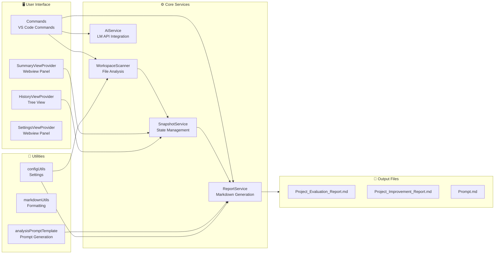
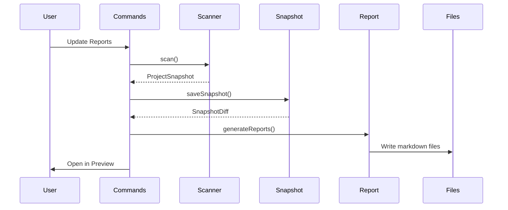

# System Architecture

This document describes the internal architecture of the Vibe Coding Report extension.

## System Map



## Core Components

### WorkspaceScanner
Scans the workspace to collect project metadata:
- File counts and language statistics
- Package.json analysis
- Important file detection
- Git repository status

### SnapshotService
Manages project state snapshots:
- Creates point-in-time snapshots
- Computes diffs between snapshots
- Tracks applied improvements
- Persists state to `.vscode/vibereport-state.json`

### ReportService
Generates markdown reports:
- Evaluation Report (Korean)
- Improvement Report (Korean)
- Prompt.md (English)
- Uses marker-based section updates

### AiService
Integrates with VS Code Language Model API:
- Checks model availability
- Sends analysis prompts directly to AI
- Falls back to clipboard mode on error

## Report Generation Flow

The extension follows a 3-step reporting process:

1. **Scan** - WorkspaceScanner analyzes the workspace
2. **Snapshot** - SnapshotService creates/updates project state
3. **Generate** - ReportService produces/updates markdown files



## Preview Architecture

### Local Mermaid Bundling

The extension bundles Mermaid.js locally instead of loading from CDN:

**Why local bundling:**
- **Security**: Avoids loading external scripts
- **Offline Support**: Works without internet connection
- **Performance**: No network latency for diagram rendering
- **CSP Compliance**: Strict Content Security Policy enforcement

### Webview Content Security Policy

The preview uses a strict CSP:

```
default-src 'none';
style-src ${webview.cspSource} 'unsafe-inline';
script-src 'nonce-${nonce}';
img-src ${webview.cspSource} data:;
font-src ${webview.cspSource};
```

This ensures:
- Only extension-bundled scripts execute
- No external resource loading
- Secure rendering of user content

## File Structure

```
src/
├── extension.ts           # Entry point
├── commands/              # Command handlers
│   ├── updateReports.ts   # Core workflow
│   └── ...
├── services/              # Business logic
│   ├── workspaceScanner.ts
│   ├── snapshotService.ts
│   ├── reportService.ts
│   ├── aiService.ts
│   └── __tests__/
├── views/                 # UI components
│   ├── SummaryViewProvider.ts
│   ├── HistoryViewProvider.ts
│   └── __tests__/
├── models/                # Type definitions
│   ├── types.ts
│   └── constants.ts
└── utils/                 # Utilities
    ├── configUtils.ts
    ├── markdownUtils.ts
    └── analysisPromptTemplate.ts
```
